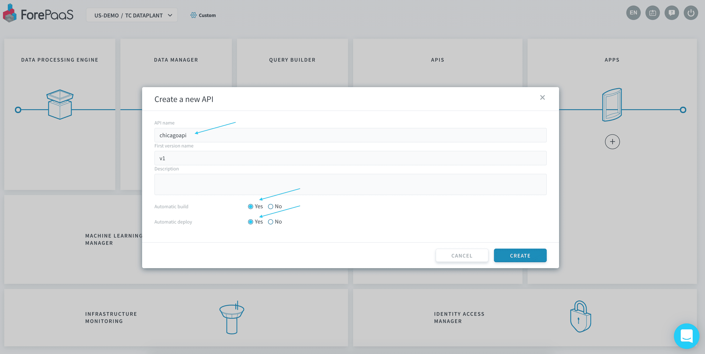

# 最初のAPIのデプロイ

このチュートリアルでは、ForePaaSストアからAPIをデプロイする方法について学習します。  

APIは外部環境（すなわち対象のアプリケーション）とそれ以外のデータプラント（Data Managerやクエリ）との間のインターフェースになるもので、非常に重要です。次の最後のチュートリアルでアプリケーションをビルドする際には、このAPIを呼び出す必要があります。

---
## APIの新規作成

データプラントのホームページで、APIモジュール内の「**+**」をクリックします。 

内部の[*ForePaaSストア*](/jp/product/dataplant/marketplace)にある**既存のAPIテンプレート**を使用するか、Gitリポジトリとリンクして**独自のコードをインポート**することができます。

ここでは、初めて利用する方のために簡単なNodeJSのテンプレートを用意しています。表示されているテンプレート「*API NodeJS*」を選択して次に進みます。

APIの名前を指定し、「**Automatic build（自動ビルド）**」および「**Automatic deploy（自動デプロイ）**」の各オプションを有効にします。こうすることで、APIのソースコードがダウンロードされ、自動的にビルドとデプロイが行われます。

APIの作成には少し時間がかかることがあるため、ここで少し待ちます。APIのビルドが行われている間に一息入れてください☕。

> ForePaaSでは、**[ブルーグリーン](https://en.wikipedia.org/wiki/Blue-green_deployment)デプロイ手法**を利用してデータの100%の可用性を確保しています。このため、ダウンタイムが発生するリスクなしに、シームレスに新しいバージョンのAPIを作成してデプロイできます。

デプロイが完了すると、「**Open（開く）**」ボタンが表示されます。

APIを開くと、下の画面が表示され、APIが正常に機能していることを確認できます。おつかれさまでした🎉！

{データプラントのAPIの詳細を確認する}(#/jp/technical/sdk/api/index.md)

次の最後のステップでは、ForePaaS上に最初のアプリケーションを5分程度で作成してデプロイします。

{最初のアプリケーションを作成する}(#/jp/getting-started/app-init/app-manager.md)