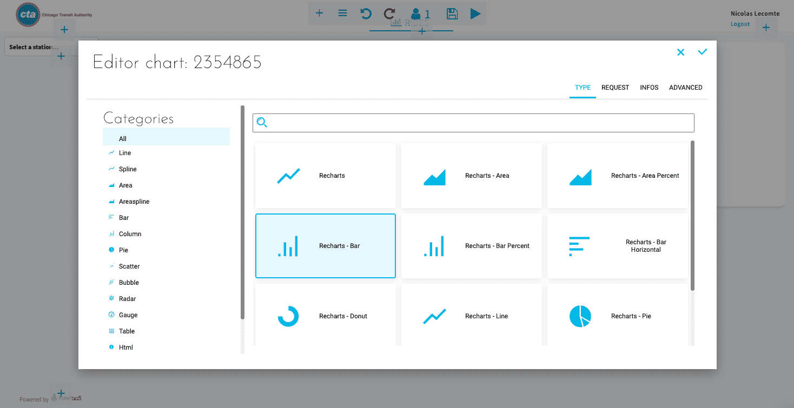

# フロントエンドアプリケーションのビルドとデプロイ

このチュートリアルでは、**最初のアプリケーションをビルドしてデプロイする方法を学習**します。一からすべてを作成する必要はありません。用意されたテンプレートを利用し、あらかじめ作成されたグラフを使って素早くアプリケーションを作成できます。

App Managerの「**+**」をクリックして、アプリケーションを開始します。  

ストアからテンプレート「*ReactJS - Getting Started*」を選択します。このテンプレートを利用することで、見映えの良いダッシュボードをすぐに作成できます。

下のスクリーンショットに示された各フィールドに入力し、「**Confirm（確認）**」をクリックします。

「**Confirm（確認）**」をクリックすると、アプリケーションが自動的にビルドされデプロイされます。この処理には数分かかりますので⏳、その間に以下の前提条件をご確認ください。

---

## 前提条件

入門編ガイドのこれまでの各ステップを完了している必要があります。

- APIが稼働していること
- Query Builderのクエリでデータウェアハウスが正しく要求されていること
- Data Managerに適切に作成された論理スキーマが表示されており、仮想属性が作成され、テーブルがリンクされていること
- Data Processing Engineのワークフローが正しく実行されていること

このチュートリアルの所要時間は5～10分です。以下のステップに沿って、ForePaaSプラットフォーム上に簡単なアプリケーションを作成してデプロイします。

- [キャンバスのセットアップ](/jp/getting-started/app-init/app-manager?id=set-up-your-canvas)
  - [ヘッダーの追加](/jp/getting-started/app-init/app-manager?id=set-up-a-header)
  - [動的パラメータの追加](/jp/getting-started/app-init/app-manager?id=set-up-a-dynamic-parameter)
- [グラフのセットアップ](/jp/getting-started/app-init/app-manager?id=set-up-a-chart)
  - [1. パネルの追加](/jp/getting-started/app-init/app-manager?id=step-1-create-a-panel)
  - [2. グラフのタイトルの指定](/jp/getting-started/app-init/app-manager?id=step-2-give-a-title-to-your-chart)
  - [3. グラフの作成](/jp/getting-started/app-init/app-manager?id=step-3-generate-your-chart)
- [アプリケーションの新規バージョンのビルドとデプロイ](/jp/getting-started/app-init/app-manager?id=build-and-deploy-the-new-version-of-your-app)

最初のダッシュボードを作成する準備はできましたか。では始めましょう🏄🏻。

---
## キャンバスのセットアップ

「**Dashboard（ダッシュボード）**」メニューをクリックします。App Managerでは、ダッシュボードはアプリケーションのページです。  

最初のダッシュボード「*Rides Analytics*」は、最初にテンプレートを選択したときにデフォルトで追加されています。これには複数のスタイルとロゴが付属しています。

### ヘッダーのセットアップ

「**Menus（メニュー）**」メニューに移動します。これはアプリケーション全体のリンクやフィルターなどのアイテムを定義するためのページです。アプリケーションを開始する際にテンプレートを使用したため、複数のページとアイテムがあらかじめ読み込まれています。   

ヘッダーページが表示されているはずです。このため、ここで追加するアイテムはすべてアプリケーションのヘッダー（アプリケーションの上部）に埋め込まれます。右上隅の部分で、サイドバーページに切り替えることができます（サイドバーページでは、アプリケーションの左側のサイドバーにアイテムが埋め込まれます）。  

ヘッダーページに戻ります。「**tabs（タブ）**」を展開してコンテナのアイテムを参照します。「*Add an item（アイテムを追加）*」をクリックして、ヘッダーにタブを追加します。「**Link（リンク）**」を選択します。

以下に示すように、各フィールドに入力します。また、アプリケーションのヘッダー用のロゴアイコンを定義することもできます。

### 動的パラメータのセットアップ
動的パラメータは、**ページ上のデータをフィルター処理**するためのウィジェットです。ここでは、日付でフィルター処理する動的パラメータを1つ追加します。

右上隅の「**Sidebar（サイドバー）**」をクリックし、コンテナを作成します。

?> [コンテナ](jp/product/app-manager/menu?id=introduction)のことをよくご存じない方は、アイテムのフォルダーだと考えてください。

新しいコンテナをフッターより上にドラッグします（フッターが一番下になるようにします）。 

コンテナを開いて、アイテムを追加し、「**Parameters（パラメータ）**」を選択します。 

「_Select box（セレクトボックス）_」のパラメータを選択し、新しいパラメータの「**Options（オプション）**」に移動します。

下のスクリーンショットに示すように、オプションを入力します。

「**Infos（情報）**」タブで、*select_stations*と名前を付け、「Confirm（確認）」をクリックします。

?> 日付の選択やセレクトボックスなどの動的パラメータはすべてカスタマイズできます。詳しい方法については、アプリケーションコンポーネントの技術ドキュメントを参照してください。  
[動的パラメータの詳細を確認する](jp/technical/sdk/app/dynamic_parameters/index)

キャンバスの構成はこれで完了です。✅ 続いて、メニューとフィルターを使用してグラフを作成します。

---
## グラフのセットアップ

「**Dashboard（ダッシュボード）**」タブに移動し、「*Ride Analytics*」ダッシュボードの**編集**アイコンをクリックします。
先ほど作成したメニューとフィルターが適切にセットアップされていることが分かります。

#### ステップ1：パネルの作成

➕アイコンをクリックしてパネルを作成します（**「Containers（コンテナ）」>「Panel（パネル）」**）。 

パネルが作成されたら、パネルのサイズを変更して画面全体に広げます。

#### ステップ2：グラフのタイトルの指定

パネル内で➕アイコンをクリックし、**「Basic UI（基本UI）」>「HTML」**を選択します。

名前を*Rides history*と付け、「H」ボタンをクリックしてH1スタイルを適用します。

#### ステップ3：グラフの生成

パネル内で➕アイコンをクリックし、「**Chart（グラフ）**」を選択します。「*Recharts - Bar（Recharts - 棒グラフ）*」タイプを選択します。

「**Request（要求）**」をクリックし、「**Query selector（クエリセレクター）**」を選択してQuery Builderで作成した*rides_per_month*クエリを選択します。

セットアップを完了するには、このグラフを作成済みのフィルターに関連付ける必要があります。「**Infos（情報）**」タブに移動し、「**Linked dynamic parameters（リンクされた動的パラメータ）**」セクションで、「*select_stations*」を追加します。

次に、フィルターが正しく機能するかどうかをテストします。**再生**アイコンをクリックして読み取り専用モードにし、日付や休日タイプを変更してデータがどのように変化するかを確認します。これで最初のグラフは完了です。

忘れずにダッシュボードを**保存**して、編集内容を保存するようにしてください（💾アイコンは上部中央のバー内にあります）。

?> この時点で、最初のダッシュボードはほぼ完成ですが、さらに見映えを良くすることもできます🧑🏼‍🎨。*発展編ガイドシリーズ*では、この他にもチュートリアルを用意しています。[こちらをクリックしてApp Managerの機能の詳細を確認してください](/jp/getting-further/app-manager/index)。

---
## アプリケーションの新規バージョンのビルドとデプロイ

もう少しで完了です。最後のステップでは、作成したダッシュボードを本番運用に移行します。 

このためには、必ず保存💾を行ってから、Application Managerの「**Overview（概要）**」タブに戻ります。最初に、現在デプロイされているアプリケーションを**Stop（停止）**します。 

アプリケーションが停止したらすぐに、「**Build（ビルド）**」をクリックしてから「**Deploy（デプロイ）**」をクリックします。

> 通常、**ビルド**プロセスには数分かかります。どのような処理が行われているのかに興味がある場合や、ビルドに失敗した場合は、バージョンパネルを展開してログコンソールを開き、ログを調べます。トラブルシューティングの方法がよく分からない場合は、弊社のサポートチーム💁💁‍♂️まで遠慮なくログを送付してください。

これでアプリケーションが**稼働**し、オンラインでアクセスできるようになりました。  
リンクを取得するには、「Overview（概要）」タブで「**Open（開く）**」をクリックします。

---

<b>おつかれさまでした！🎉🎊</b>

**ForePaaSの入門編チュートリアルは完了です。**これでプラットフォーム上でアプリケーションを動かし、各自で検討を行い、独自のプロジェクトに取り組むことができるようになりました。

> [こちらの簡単なアンケート](https://forms.office.com/Pages/ResponsePage.aspx?id=nDWzgpGTfE2g8oFnUal2QTTUCIkDw9dBkuMh8LM8xBBUOVpZT1RUMFBRUk5BWjNLSzBCNVhDSVgyNS4u)（所要時間は約3分⌛）にご記入をお願いします。いただいたご意見を参考に良かった点や改善点を確認し🧐、チュートリアルのさらなる改善を図っていきます。

ご存知のように、このチュートリアルはいつでもご利用いただけます。必要に応じて他のドキュメントを参照し、製品の個別のコンポーネントの詳細を確認するようにしてください。

また、何かあった際には遠慮なく**ご連絡ください**。弊社のサポートチームと製品チームは、寄せられたAIアプリケーションのアイデアを迅速に実現できるように全力で支援を行います。

{ロードマップで意見を述べる🚀}(https://hq.forepaas.io/#/features) {サポートに質問を送る🤔}(https://support.forepaas.com/hc/en-us/requests)

---

<b> もっと続けたい方 </b>

最初のチュートリアルはいかがでしたか。もちろん、チュートリアルはこれで終わりではありません。最初のアプリケーションを発展させ、機械学習パイプラインを使用したAI予測を追加していくことができます。

{AIモデルを新規に作成する🤖}(#/jp/getting-started/ml/index)
