# データソースとの接続とデータモデルの構築

このステップでは、**最初のデータソース**をデータプラントに接続し、データ間の関係が一目で分かる一貫した形でデータソースの**分析**と**体系化**を行う方法について学習します。 

**Data Manager**は、データプラントで作業を始める際に最初に使用するコンポーネントです。このコンポーネントは、以下を制御します。
* データソースの収集
* データ分析およびモデル化
* データストレージ

Data Managerコンポーネントでは、次の2つの異なるストレージシステムを利用できます。
* 構造化データセット用の*データウェアハウス*
* 画像や映像などの非構造化データ用のS3準拠の[*データストア*](jp/product/data-manager/datastore/index.md)

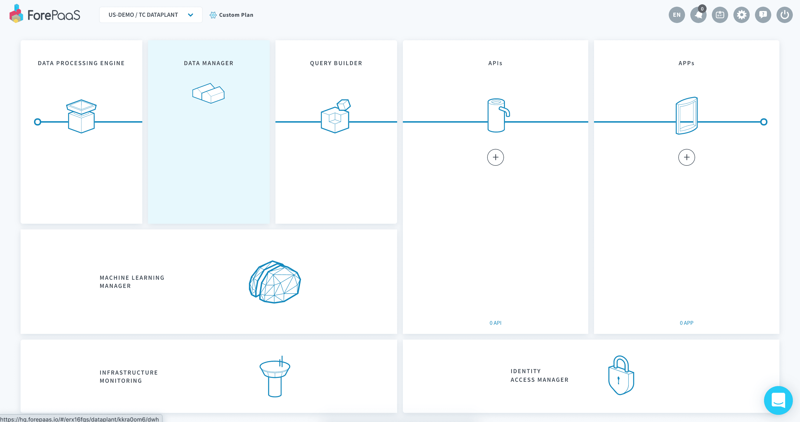

このデータソースは、シカゴの天候と公共交通に関するデータを含む2つのCSVファイルで構成されています。 

このチュートリアルでは、次のステップについて説明します。
* [最初のソースの接続](/jp/getting-started/app-init/data-manager?id=connect-your-first-source)
* [データの分析](/jp/getting-started/app-init/data-manager?id=analyze-your-data)
* [データの体系化](/jp/getting-started/app-init/data-manager?id=organize-your-data)
* [スキーマの作成](/jp/getting-started/app-init/data-manager?id=create-your-schema-in-the-prim)
* [仮想属性の作成](/jp/getting-started/app-init/data-manager?id=create-virtual-attributes)
* [集計テーブルの作成](/jp/getting-started/app-init/data-manager?id=create-your-aggregate-table-in-the-mart)
* [Data Processing Engineのアクションの生成](/jp/getting-started/app-init/data-manager?id=generate-dpe-actions)

---

## 最初のソースの接続

まず、データを取得しましょう。

> データを取得するには、[**こちらから**](https://www.dropbox.com/s/y9v061r0qar8kcw/chicago_files.zip?dl=1)以下のファイルをダウンロードします。ファイルは圧縮されていますので、お好みの解凍ツールを使って解凍してください。

Data Manager内で、「**Collect（収集）**」メニュー（1）に移動し、右上隅にある「**New Source（新規ソース）**」ボタン（2）をクリックして最初のデータソースに接続します。

解凍すると、次の2つの.csvファイルが展開されます。

* *chicago_calendar_full.csv*
* *stations_rides.csv*

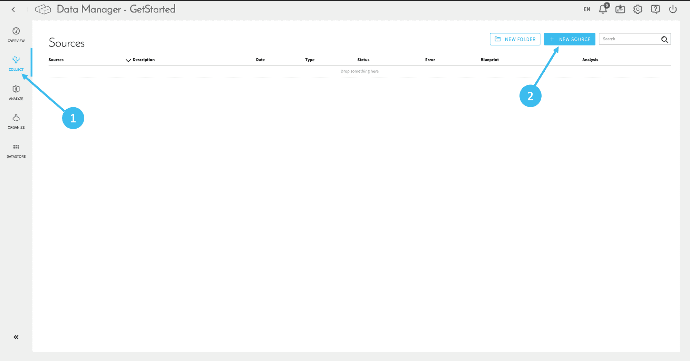

ForePaaSプラットフォームでは数多くのコネクターがサポートされています。このチュートリアルでは、シンプルなファイルアップロードを使用します。  
検索バーで*File Upload*を検索します。ソースに名前を付け（例：*chicago_files*）、「Next（次へ）」をクリックします。 

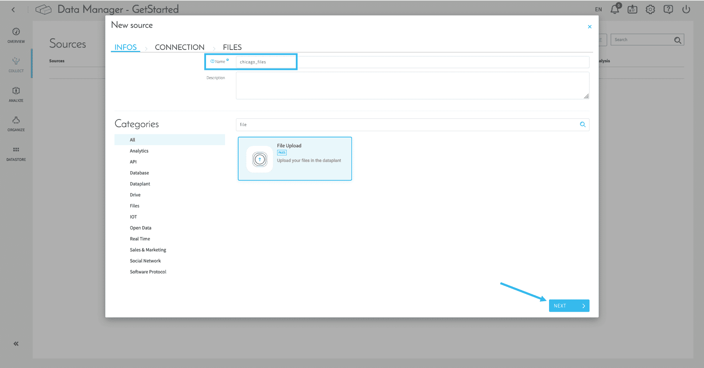

以下に示すように、用意した**2つのファイルをドラッグアンドドロップしてアップロードし**、**「Confirm（確認）」をクリック**します。 

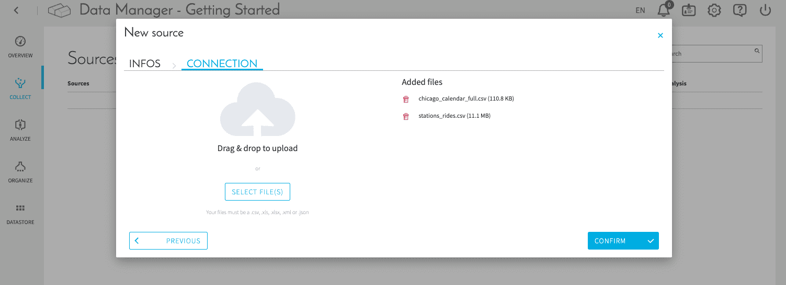

ファイルが[データストア](jp/product/data-manager/datastore/index.md)にロードされました。

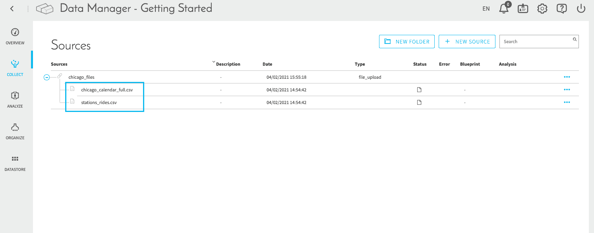

続いて、データ分析に進みます。 

---
## データの分析

引き続き、Data Managerコンポーネントで作業を行います。左側のメニューで「**Analyze（分析）**」をクリックします。ここでは、データを適切に表示するため、データソースからメタデータ（データに関する情報）を抽出します。 

先ほどアップロードした2つのソースファイルが「Sources（ソース）」セクションの下に表示されています。これらのファイルを表示するには、（chicago_filesの横にある）「Sources（ソース）」セクションの**+**アイコンをクリックします。

ファイルからメタデータを抽出するには、該当するファイルをクリックします。ファイルを1つずつ順にクリックすると、ForePaaSによって自動的にメタデータの抽出が行われます。

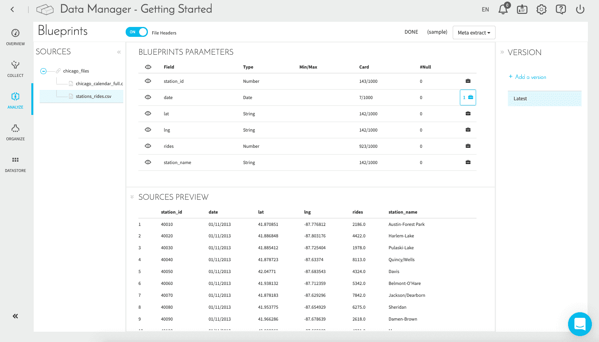

メタデータの抽出には約30秒かかります。

?> 「Analyze（分析）」ページでは、ルールの追加を行うこともできます（💼アイコンをクリック）。ForePaaSでは、日付の書式変換が自動的に適用され、標準的な*yyyy-mm-dd*の書式で日付がセットされます。  
[「Analyze（分析）」ページの詳細を確認する](jp/product/data-manager/analyze/index)

---
## データの体系化
### Primでのスキーマの作成
#### データモデルへのテーブルの追加

メタデータの抽出が済んだら、「Organize（体系化）」ダッシュボードに移動します。ここでは、**すべてのデータのクエリ可能な統合ビューを作成**します。 

空の「Organize（体系化）」画面は、次のようになっています。 

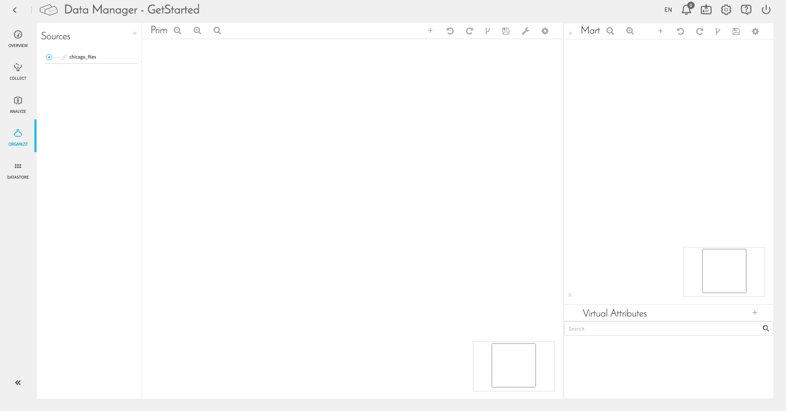

「Organize（体系化）」ダッシュボードには、2つのパネルが存在します。「**Prim**」（*Primary*の略）パネルはデータの主テーブルとそれぞれの属性を作成および体系化するのに使用し、「**Mart**」パネルは集計テーブルとそれぞれの属性を作成および管理するのに使用します。集計テーブルの作成方法については、このチュートリアルで後ほど説明します。これは、さまざまなテーブルの属性をグループ化してクエリの実行ランタイムを最適化する場合などに特に役立ちます。

ここではまず、主テーブルとそれぞれの属性の作成について説明します。Data Managerによって大半の作業が自動的に処理されるため、この作業は簡単です。

!> データモデルにドラッグアンドドロップする前に、前のステップで両方の.csvファイルの分析を完了しておく必要があります。ForePaaSは分析ステップで取得されたメタデータ情報を利用して、自動的にテーブルを作成し、属性の名前とタイプの割り当てを行います。

まず、ソースの➕アイコンをクリックしてすべてのソースの一覧を参照し、2つの.csvファイルを「**Prim**」ウィンドウにドラッグします。新規オブジェクトを確認する画面が表示されたら、✅アイコンをクリックします。 

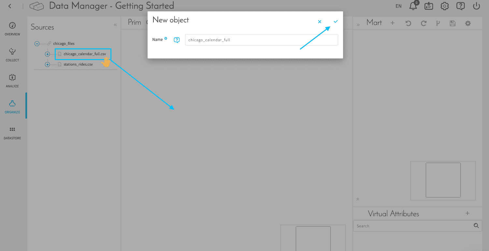

2つの.csvファイルに対応する2つの新規テーブルの作成が済んだら、⚙️アイコンをクリックして**保存とビルド**を行います。この操作はモデルを編集するたびに行う必要があります。

>  モデルを💾 *保存*すると、Data Manager内のビジュアル構成が保存されます。ただし、変更内容がデータプラントの他のモジュールで表示されるようにするには、⚙️*保存とビルド*をクリックする必要があります。

この段階で、「Organize（体系化）」ダッシュボードは次のようになります。 

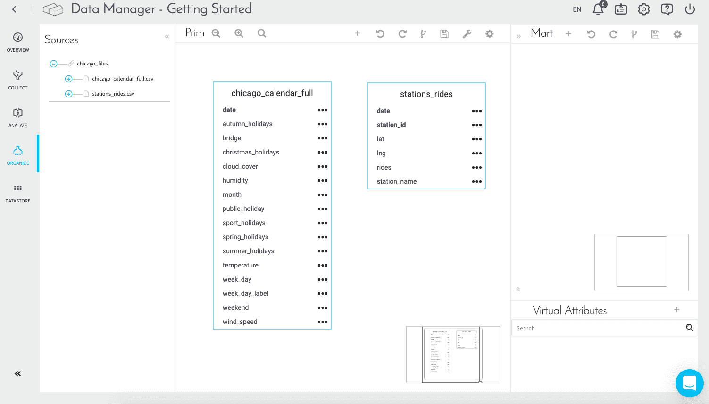

ご覧の通り、テーブル内の一部の属性が**太字**になっています。これらは**主キー**（テーブル内の各データ行を一意に識別するのに使用される属性（または属性のセット））であることがForePaaSによって自動的に検出されたものです。 

> テーブルの主キーを手動で変更するには、**星印**⭐アイコンをクリックします。

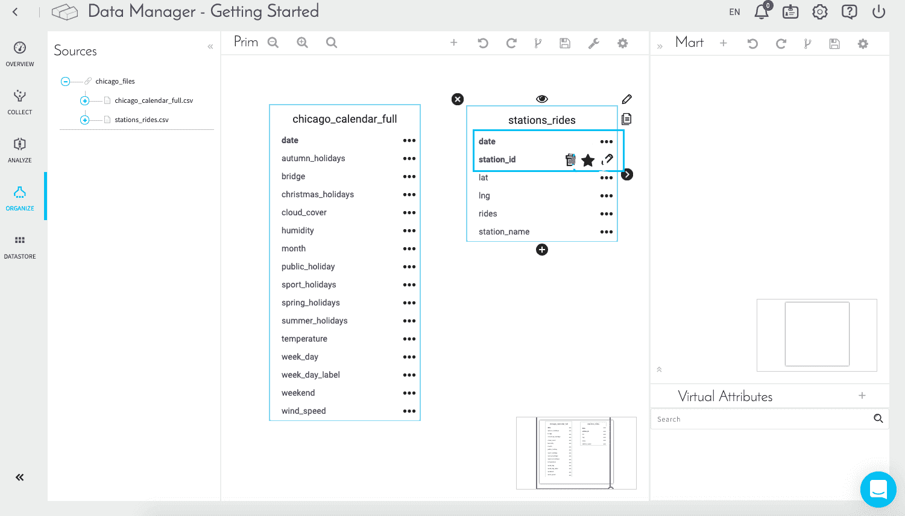

#### テーブルの結合

Data Managerでテーブル間の関連付けを指定する必要があります。テーブルの結合は簡単で楽しい作業です。では、実際にやってみましょう。

親／子の関係のあるテーブルを結合します。**親**テーブルは特定のサブジェクトに関する詳細情報を含むテーブルです（例：特定の日のシカゴの天候）。**子**テーブルは複数の親テーブルを参照します。子テーブルは親テーブルから値を継承するという見方をすることもできます（実際の子どもに似ていますが、1つの子に3つ以上の親が存在し得る点が異なります）。

テーブル*stations_rides*は子テーブルです。このテーブルには、日付別および駅別の乗客数情報が含まれていますが、複数の日に関する詳細情報は含まれていません。どちらのテーブルでも、*date*が主キーです。そのため、親テーブル*chicago_calendar_full*を子テーブル*stations_rides*に関連付けると、その年の日々の乗客数に天候情報が自動的に追加されます。 

親テーブル「*chicago_calendar_full*」を1回クリックして選択した後に、そのテーブルの右側の矢印をクリックしたままドラッグし、子テーブル「*stations_rides*」にドロップ（マウスボタンを解放）します。 

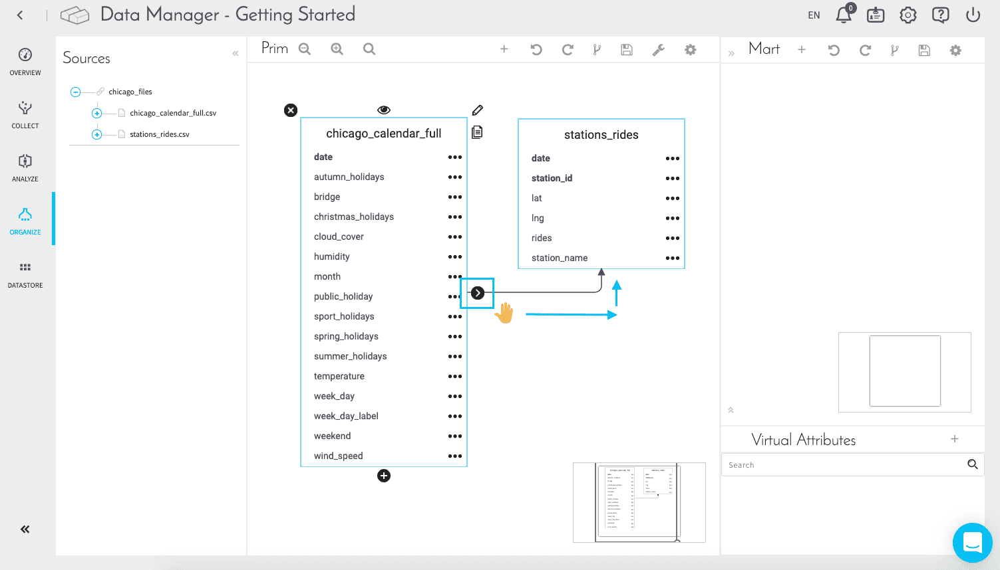

!> テーブル内で何らかの変更を行ったときには、💾*保存*または⚙️*保存とビルド*をクリックするのを忘れないようにしてください。💾アイコンは「Mart」ウィンドウと「Prim」ウィンドウのそれぞれにあります。「Prim」を編集したときには「Prim」の💾アイコンをクリックし、「Mart」を編集したときには「Mart」の💾アイコンをクリックする必要があります。 

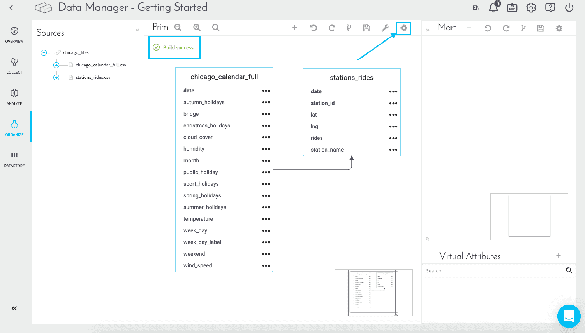

これで、データを収容するための体系化および構造化された領域の準備ができました。 	

[「Organize（体系化）」の詳細を確認する](jp/product/data-manager/organize)
       
### 仮想属性の作成

仮想属性では、新しい属性の計算または作成を行うことができます。これらの属性は**オンザフライで処理され**、データベースには保存されません。仮想属性は最終的なダッシュボードのクエリやグラフで使用できます。

> 💡 仮想属性の追加や編集を行う際に、スキーマを作成し直す必要はありません。  

「**Virtual Attributes（仮想属性）**」セクションにある➕アイコンをクリックします。

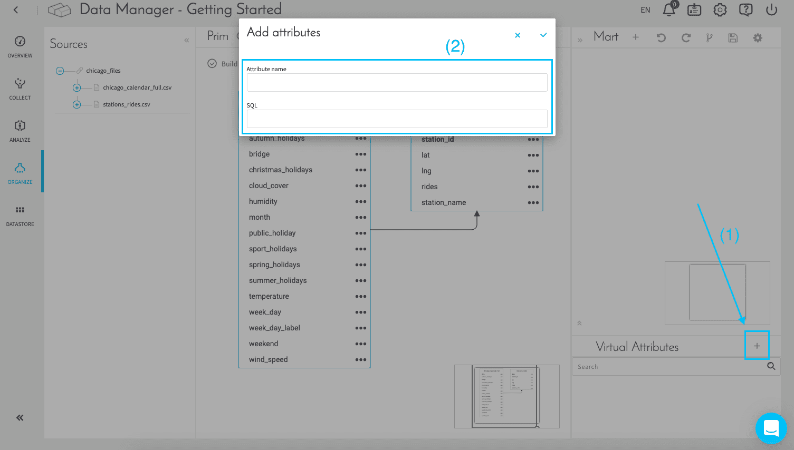

次の2つの属性とそれぞれのSQLコードを追加します。

|              属性名               | SQL              | 
| :------------------------------: | -------------------------- | 
|           avg_rides_per_day_per_station     | SUM(rides)/COUNT(DISTINCT date,station_id)                |
|             yearmonth           | LEFT (date,7)                      | 

**avg_rides_per_day_per_station**は、1日ごとおよび駅ごとの平均乗客数を表し、クエリやダッシュボードで使用されます。

**yearmonth**は、*yyyy-mm*の形式で年月を表します。

### Martでの集計テーブルの作成

「**Mart**」ウィンドウの➕アイコンをクリックし、*dataset_history*という名前のテーブルを新規に作成します。これは、1つの固有のテーブルにすべての重要な情報（乗客数、日付、気温など）を集計するためのものです。

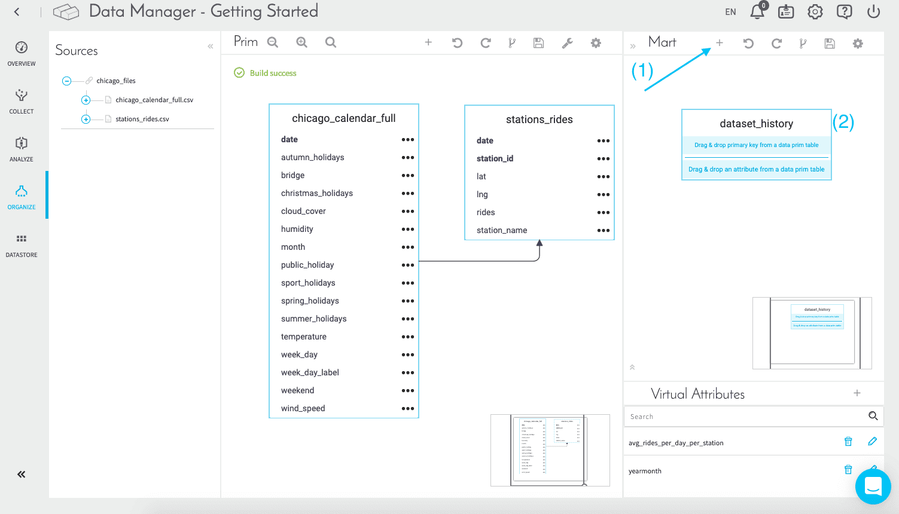

次に、「Prim」の**stations_rides**テーブルから*date*と*station_id*を「Mart」の*dataset_history*の主キー部分にドラッグアンドドロップします。

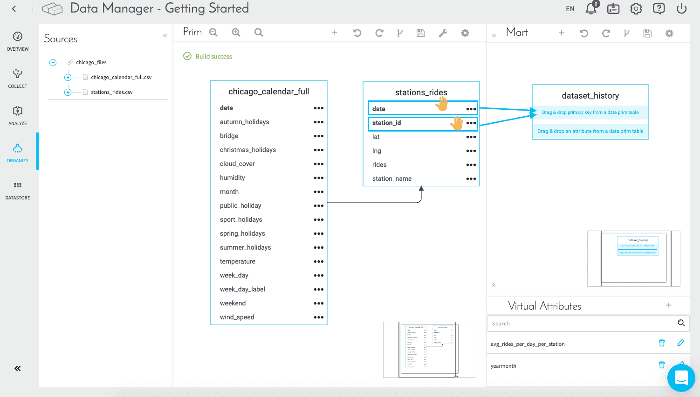

以下の属性を通常の属性として*dataset_history*に移動します。

|        元のテーブル           | ドラッグアンドドロップする属性      |
| :------------------------------: | -------------------------- | 
|    **stations_rides**       |  *lat* / *lng* / *rides* / *station_name*   | 
|    **chicago_calendar_full**     |  *month* / *temperature* / *week_day* / *week_day_label* / *weekend* /     |

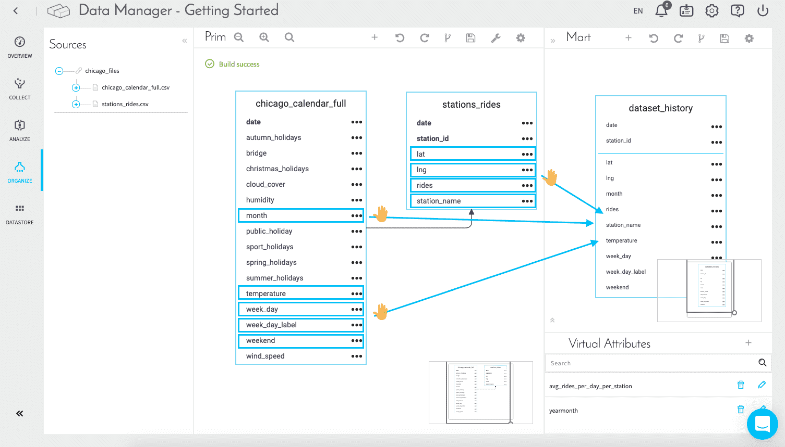

最後に、気温の数値データを分かりやすいカテゴリ（寒い、暑い、など）に変換するための属性を新規に作成する必要があります。これは、最終的なダッシュボードで特定の数値ではなくカテゴリに基づいてデータをフィルタリングするのに役立ちます。 

まず、*dataset_history*テーブルをクリックしたときに、このテーブルの下部に表示される➕アイコンをクリックします。続いて、テーブル内で属性を作成または編集します。

次のように属性を定義します。

|                属性名               | タイプ               | 種類                  | マッピング                  | 
| :------------------------------: | ----------- | ------------------- | ------------------ | 
|  **cat_temperature**            | String（文字列）                             | Dimension（ディメンション）                     | オフ                     | 

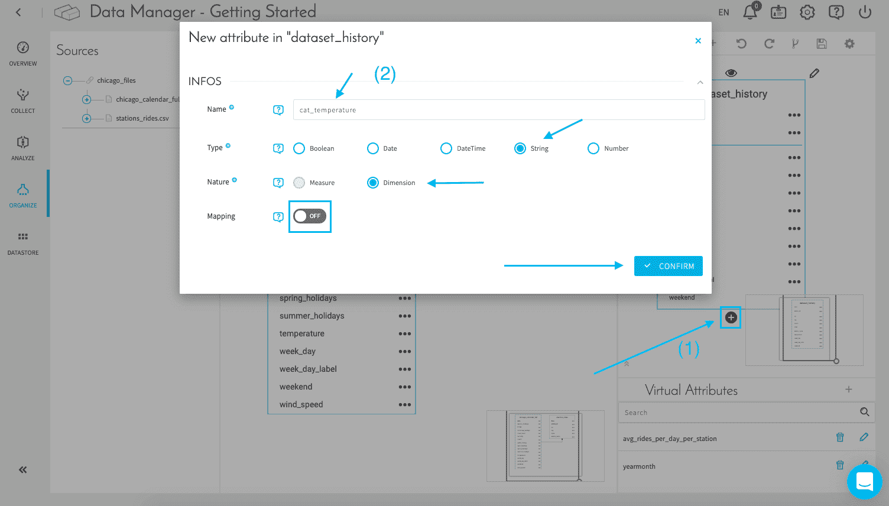

> ここでは、この属性は実際に指定されていませんが、心配は無用です。次のコンポーネント（Data Processing Engine）でこの後すぐに指定されます。

必ず⚙️アイコンをクリックして、Martスキーマの保存とビルドを行ってください。

?> ここでは、Data Managerで新しい属性を作成するのに、**仮想属性**と**Martテーブルへの属性の追加**という2種類の異なる方法を使用していることに注意してください。  
🔘 仮想属性は素早く簡単に作成できますが、スケーリング時に変更が必要な場合、管理が難しくなる可能性があります。  
🔘 Martに属性を追加する場合はストレージが必要で、DPEで属性を物理的に定義する必要がありますが、データモデル全体を変更することなくDPEの指定内容を編集することができ、属性をより厳密なものにすることができます。新しく追加した物理属性は、[インデックス](/jp/product/data-manager/organize?id=creating-and-editing-an-object)として使用することもできます。

### DPEのアクションの生成

データモデルセットアップの最後のステップに進む前に、「Prim」と「Mart」の⚙️アイコンをクリックしてビルドを保存します。

!> もう一度確認してください✋！次のステップに進む前に、**作成したデータモデルがスクリーンショットに表示された通りになっていること**を再度確認してください。正しく設定されていない属性があると、この後のステップの作業を行うことができなくなります。

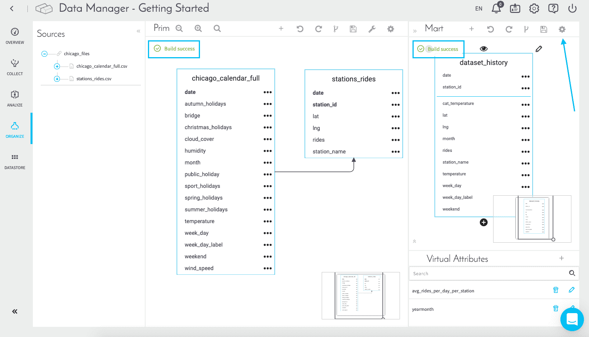

🔧アイコンをクリックすると、Prim内のテーブルごとに**Data Processing Engineのアクションが自動的に生成**されます。*デフォルトリポジトリ*と*v1 version*を選択し、両方のテーブルが自動的に選択されているのを確認したら、「**Yes（はい）**」をクリックします。 

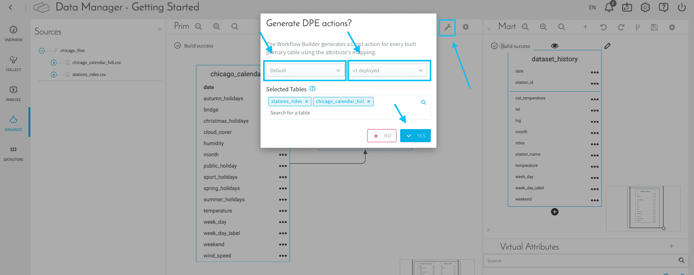

Data Processing Engineに移動し、次のステップに進んでください。 

{Data Processing Engineを使用してデータパイプラインを準備する}(#/jp/getting-started/app-init/dpe)
