# データのインポートおよび変換の構成

DPEは、**ローソース（未処理のソース）からForePaaS内のストレージシステムへのデータパイプラインを作成**するためのコンポーネントです。管理、デプロイ、拡張などのすべての機能が自動化されているため、ユーザーは周辺環境の運用に時間を取られることなく、データプロジェクトのビジネスロジックに専念できます。

Data Managerでは、**概念レベル**でデータ構造を詳細に定義し、Data Processing Engineでは、アクションを実行して**データに物理的に影響**を及ぼします。

このチュートリアルでは、次のステップについて説明します。
* [アクション](/jp/getting-started/app-init/dpe?id=actions)
* [追加アクションの作成](/jp/getting-started/app-init/dpe?id=create-more-actions)
* [ワークフロー](/jp/getting-started/app-init/dpe?id=workflows)
* [ジョブ](/jp/getting-started/app-init/dpe?id=jobs)

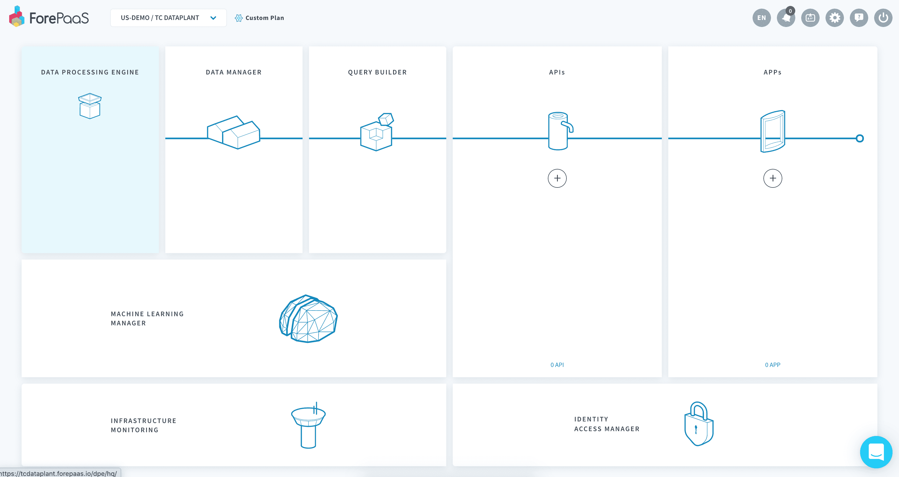


---
## アクション
[アクション](/jp/product/dpe/actions/index)はデータに対する1つのまとまった物理的操作です。複数のアクションをまとめてステージを構成することで、[ワークフロー](/jp/product/dpe/workflows/index)と呼ばれる自動化されたデータ処理パイプラインを実現します。

Data Processing Engine（DPE）の「**Actions（アクション）**」メニューをクリックします。前の項目（Data Managerの「Organize（体系化）」セクション）で作成された2つの「*Load（ロード）*」アクションが表示されているはずです。 

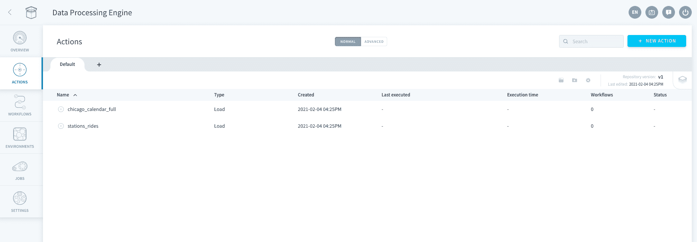

これらの「Load（ロード）」アクションはソースからデータを物理的に抽出し、Data Managerで指定されたスキーマに従って、データをデータウェアハウスにロードします。

### 追加アクションの作成

?> 弊社のマーケットプレイスでは、*ロード*アクション、*集計*アクション、*削除*アクションなどの、データ処理プロジェクトに役立つ一連のアクションを提供しています。カタログの中に必要なアクションがない場合は、*カスタム*アクションを使用して、データパイプラインの中で**Python 3+コードを実行**することができます。  
[カスタムアクションの詳細を確認する](/jp/product/dpe/actions/custom/index)

このチュートリアルでは、前の項目で作成した*dataset_history*テーブルにデータを集計するためのアクションを作成します。

「**New action（新規アクション）**」をクリックし、ForePaaSストアから*「Aggregate（集計）」アクション*を選択します。

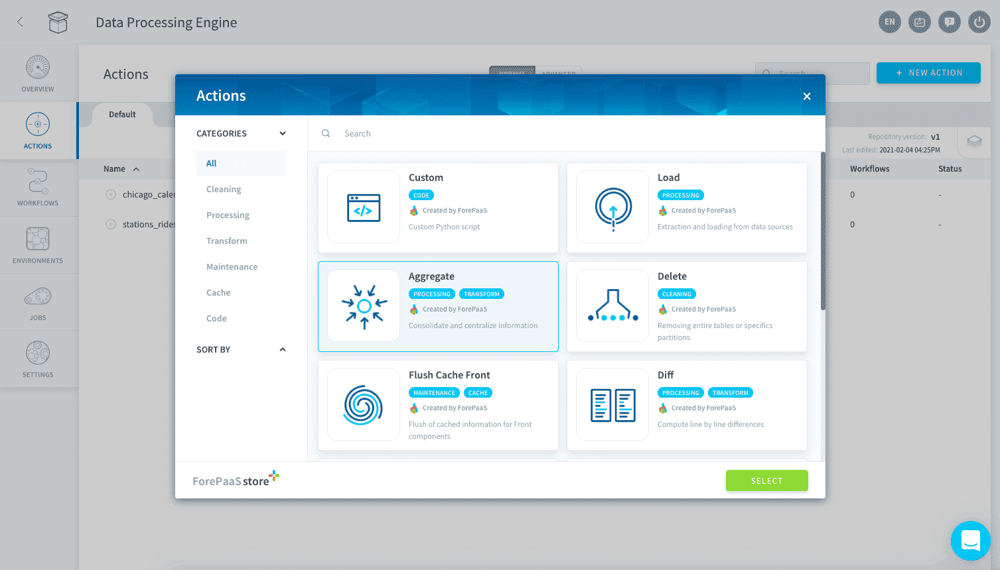

この集計アクションは、3つのシンプルなステップで構成されます。
* **（1）**ソーステーブル：*stations_rides*を選択します。
* **（2）**宛先テーブル：*dataset_history*を選択します。 

数秒後、Data Processing Engineによって必要なすべての結合条件が自動的に検出され、属性がマッピングされます。

ドロップダウンメニューを使用して、結合条件を「*INNER join（内部結合）*」に変更します。こうすることで、dataset_historyテーブルのレコードにnullフィールドが含まれないようにすることができます。 

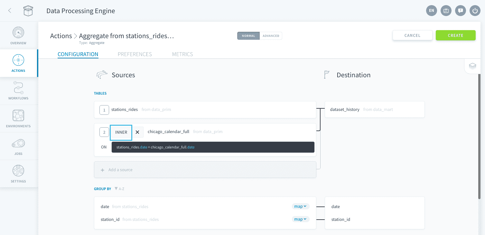

属性は自動的にマッピングされています。*rides*属性には**SUM**を指定し、それ以外の属性は**MAX**のままにします。

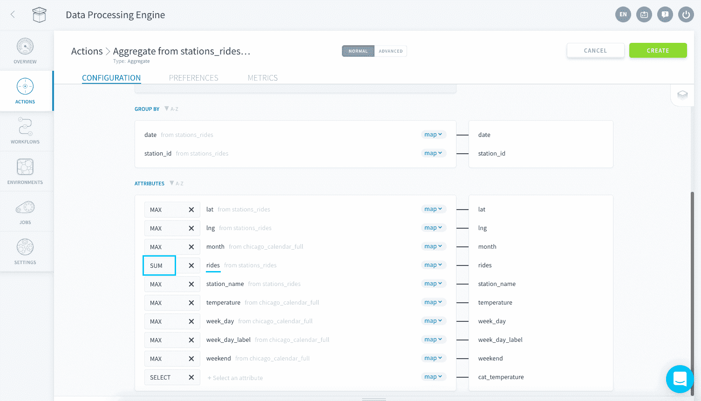

最後に、以前に作成したカテゴリ属性*cat_temperature*を定義しましょう。以下に示すように、青色のドロップダウンメニューで「**< map >**」（「マッピング」の略）をクリックし、「**< sql >**」に変更します。 

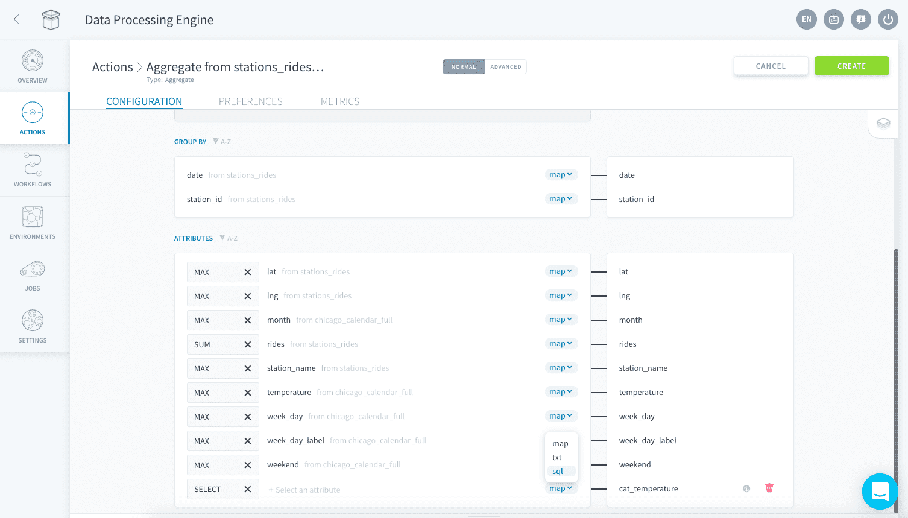

以下のSQLコマンドをコピーして貼り付けます。

```
CASE 
WHEN MAX(chicago_calendar_full.temperature)<40 THEN 'very cold'
WHEN MAX(chicago_calendar_full.temperature)<48 THEN 'cold'
WHEN MAX(chicago_calendar_full.temperature)<55 THEN 'medium'
WHEN MAX(chicago_calendar_full.temperature)<62 THEN 'hot'
ELSE 'very hot'
END
```

!> **集計アクションの設定でマッピングされていない宛先属性があると、アクションを実行したときにエラーになります**。宛先属性を空欄のままにする場合は、マッピングされた属性の一覧からその属性を削除してください。

{集計アクションの詳細を確認する}(jp/product/dpe/actions/aggregate/index.md)

右上にある「**Create（作成）**」をクリックします。

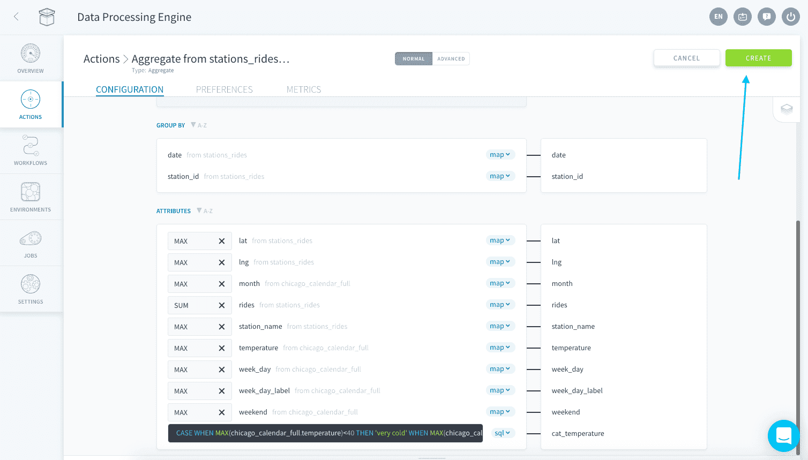

お疲れさまでした💪！このチュートリアルで使用する**すべてのアクションの作成が完了**しました。 

?> 実際のプロジェクトではおそらく、3つよりも多くのアクションが使用されるはずです。アクションはフォルダーにまとめ、必要に応じて名前を変更することができます。また、チームメイトと協力して作業する場合は、複数のリポジトリを使用することもできます。アクションのリポジトリはバージョン管理が可能で、外部のGitリポジトリと同期することもできます。詳しい方法については、[専用の製品ドキュメント](jp/product/dpe/actions/index?id=overview)を確認してください。

{製品ドキュメントでアクションの詳細を確認する}(jp/product/dpe/actions/index)

---
## ワークフロー
ワークフローはアクションを実際に動かすための映画の台本のようなものです。🎬    

各ワークフローでは、連続する複数のステージにアクションがまとめられます。ステージは常に1つずつ順番に実行されますが、各ステージ内ではすべてのアクションが並行して実行されます。同じワークフロー内で同じアクションを何度も使用できます。ワークフローは、アクションと同様に、手動で実行することも、スケジュールに沿って実行するように設定することも、API呼び出しを通じてトリガーすることもできます。

> **1ステージは定義された順序で1つずつ実行**されますが、**各ステージに含まれるアクションは順序に関係なくすべて同時に実行**されることを忘れないようにしてください。つまり、ワークフロー内のステージの順序には意味がありますが、各ステージ内のアクションの順序に意味はありません。 

最初のワークフローを作成するには、「*Workflow（ワークフロー）*」タブに移動し、「**New Workflow（新規ワークフロー）**」をクリックします。「Preferences（基本設定）」に移動するかヘッダー名をダブルクリックして、名前を*Import Chicago Data*と設定します。 

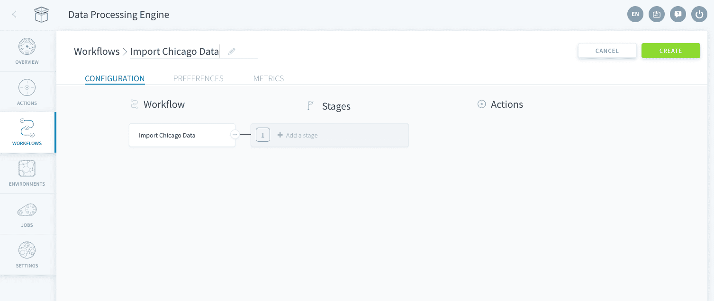

まず、「**Add a stage（ステージを追加）**」をクリックして、2つのステージを定義します。次に、ドロップダウンの検索セレクターを使用して、スクリーンショットの各ステージの表示を参照しながら、各ステージにアクションを追加します。

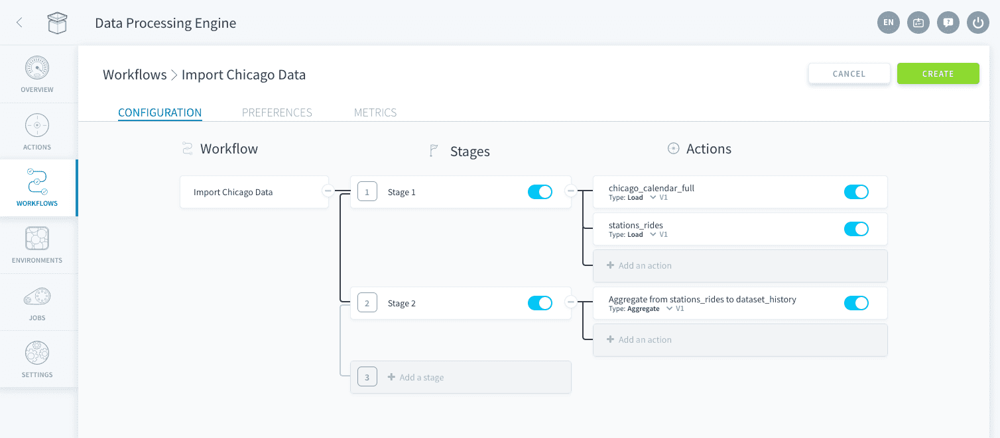

ワークフローの作成が済んだら、「**Play（再生）**」をクリックします。

> ワークフローを初めて使用する場合、ワークフローの実行に数分⏳かかることがあります。ワークフローの実行の合計時間が10分を超えないようにする必要があります。10分を超える場合はサポートチームまでご連絡ください。

ワークフローが実行されている間に、トリガーを使用してワークフローを**毎日実行するようにスケジュールを設定**します。

ワークフローの「*Preferences（基本設定）*」タブに移動し、左下にある「Triggers（トリガー）」ウィジェットまでスクロールします。「**+Add（+追加）**」をクリックします。 

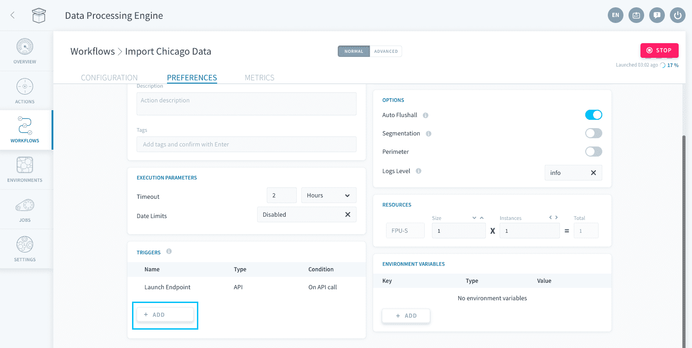

トリガータイプに「*CRON*」を選択し、モードに「*Complete（完了）*」を選択します。「**Daily（毎日）**」タブに移動し、下の図に示すように、オプションのリストから「*Every 1 day(s)（1日1回）*」を選択します。

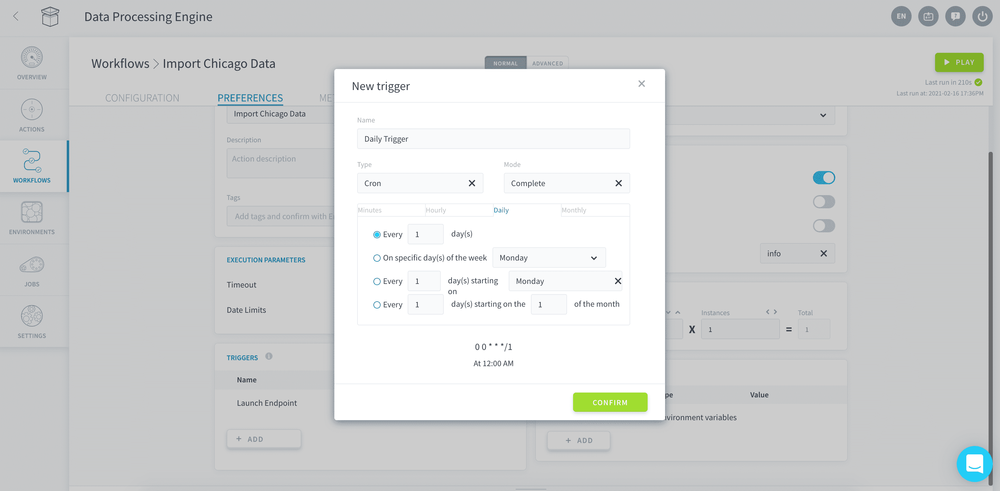

「**Confirm（確認）**」ボタンをクリックして、お好きな名前で新しいトリガーイベントを作成します。作成されたトリガーイベントはトリガーイベントテーブルにデフォルトで存在する「*Launch Endpoint*」の下に追加されます。

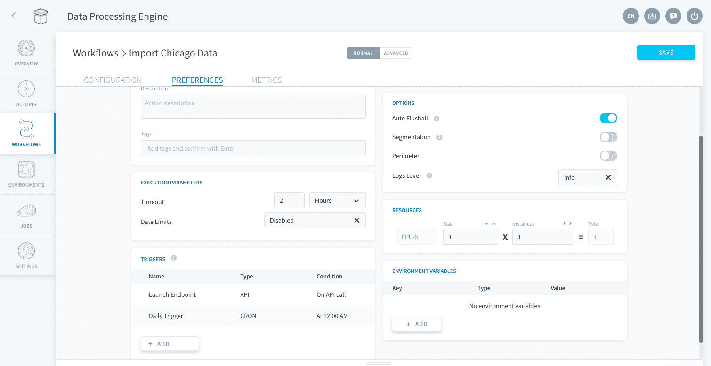

?> ワークフローの基本設定では、他にもさまざまな設定を行うことができます。具体的には、[ワークフローへのコンピューティングリソースの追加割り当て](/jp/product/billing/resources/index)や、[ワークロードのセグメント化](/jp/getting-further/segmentation/index)によるデータ処理の高速化を行うことができます。また、「[Environements（環境）](/jp/product/dpe/environments/index)」によりこれらすべての設定を保存して繰り返し利用することもできます。  
[製品ドキュメントで詳細を確認する](/jp/product/dpe/index)

!> ワークフローに変更を加えるごとに、画面の右上にある「**Save（保存）**」ボタンをクリックするようにしてください。アクションはリポジトリに保存されるためバージョン管理が可能ですが、これはワークフローや環境には当てはまりません。このため、ワークフローと環境では*自動保存*は無効になっています。


---
## ジョブ

このセクションの最後に、Data Processing Engineコンポーネントの「Jobs（ジョブ）」タブについて簡単に説明します。

「Jobs（ジョブ）」タブには、**Data Processing Engineでトリガーされたすべてのジョブの実行**がまとめられ、高度なメトリクスレポートが含まれています。ジョブは、実行中、待機中、過去に実行されたジョブの3つのメインカテゴリに分けて記載されます。最後に実行されたジョブを確認すると、先ほど実行したワークフローのステータスを確認できます。 

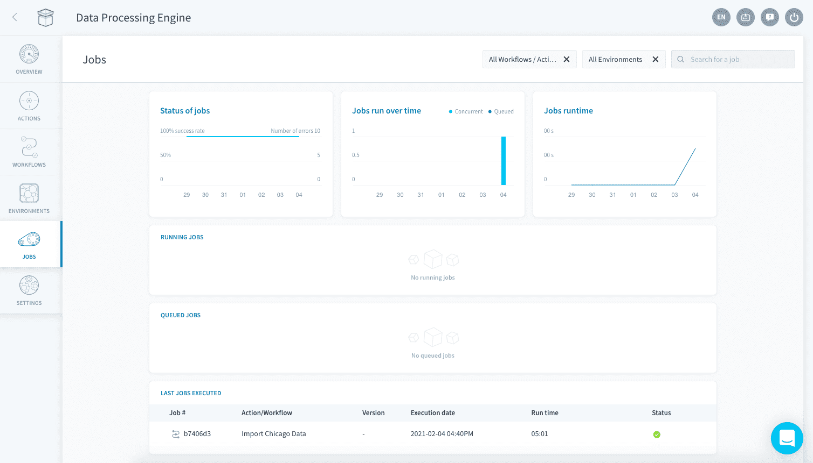

ForePaaSでのリソース割り当ては、**[FPU](/jp/product/billing/resources/index)と呼ばれる独自のForePaaSユニット**を介して行われます。特定のアクションやワークフローに専用に割り当てられるFPUの量は基本設定で変更できます。

---

これで、*入門編*チュートリアル🌟のData Processing Engineのセクションは終了です。  
実際のケースでは、わずかな数のアクションとワークフローだけで済むことはまずありません。何らかの問題が発生した場合、またはデータパイプラインの高速化やパフォーマンスの最適化を行うのに、特殊なカスタムデータソースを追加したり、カスタムスクリプトを作成したりする必要がある場合には、遠慮なくご連絡ください。

続いて、次のコンポーネントであるQuery Builderに進みましょう🚶‍♂️。 

{Query Builderを使用して分析用のクエリを作成する}(#/jp/getting-started/app-init/query-builder)