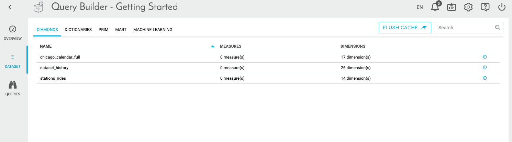

# データに対するクエリの作成

Query Builderでは、**ローコードアプローチ**により、ビジネスKPIに合わせたクエリの作成と一元化を行うことができます。クエリの作成は、データベースに関係なく、まったく同じです。 

---
## 前提条件

前もって、プロジェクトのこれまでのすべてのステップがうまく機能することを確認しておく必要があります。Data Managerのスキーマが正しく作成され、ワークフローがスムーズに実行されている必要があります。 

このチュートリアルでは、次のステップについて説明します。
* [データセットの確認](/jp/getting-started/app-init/query-builder?id=explore-your-datasets)
* [最初のクエリの作成](/jp/getting-started/app-init/query-builder?id=build-your-first-queries)

---

## データセットの確認

まず、左側のサイドバーで「**Dataset（データセット）**」を開きます。一連のタブが表示されます。

?> 「*Diamonds（ダイヤモンド）*」および「*Dictionary（ディクショナリ）*」サブセクションの詳細を確認したい方は、[こちらのリンク](/jp/product/query-builder/dataset)を参照してください。これらの2つのセクションは、データセットと属性について詳しく理解するのに役立ちますが、このチュートリアルでは使用しません。

 
データが正しくロードされていることを確認するには、**「Prim」タブ**を確認するのが便利です。特に、ここにはスキーマの「Prim」セクションの各テーブルに読み込まれた行数が表示されます。データが正しくロードされていない場合、「Number of Rows（行数）」列にゼロと表示されるため、プロジェクトが適切に設定されているかどうかを確認するのに便利です。

**「Mart」タブ**には、「Prim」タブと同じ情報が表示されます。ただし、「Mart」内のテーブルの情報のみです。「**Machine Learning（機械学習）**」タブについても同様です。

---
## 最初のクエリの作成

ここでは、データを視覚化するための準備として、次のクエリを作成します。
* *rides_per_month*：毎月の平均乗客数を把握するためのクエリで、最初のグラフを作成するのに使用します。
* *rides_per_cat_temperature*：気温に応じた平均乗客数を把握するためのクエリです。

### 1つ目のクエリの作成

サイドバーの「**Queries（クエリ）**」を開き、「**New Query（新規クエリ）**」をクリックします。ここでは、クエリに名前を付け、データやスケールのパラメータ設定を行うことができます。  

> このチュートリアルでは、ユーザーインターフェースを使用した簡単なクエリの作成のみを行います。クエリは「Advanced（詳細）モード」を使用してさらに詳細にカスタマイズできるようになっており、製品ドキュメントにはさまざまなパラメータが記載されています。  
[クエリの詳細を確認する](jp/product/query-builder/queries/advanced-mode)

まず、クエリに`rides_per_month`と名前を付けます。 

次に、検索バーに「avg_」と入力し、「*avg_rides_per_day_per_station*」属性をクリックします。

以下に示すように、コンピュートモードから「**Select（選択）**」を選択して、確認します。

次に、「**Scale（スケール）**」タブをクリックします。ここでは、**毎月**の日付ごとの平均乗客数を表示させる必要があるので、スケールには「*yearmonth*」を選択します。

次に、右上隅にある「**Save（保存）**」をクリックします。クエリの結果が視覚化されます。表示形式は変更可能で、表、JSON、折れ線グラフ、棒グラフ、面グラフ、円グラフから選択できます。

?> Query Builderでクエリを作成する場合、テーブル名を指定する必要はありません。ForePaaSのQuery Builderは、**最適なテーブルを自動的に選択**します。  
[Query Builderの機能の詳細を確認する](/jp/product/query-builder/index.md?id=automated-multi-base-engine)

### 2つ目のクエリの作成

クエリはダッシュボードのみで使用するものではなく、データを分析する簡便な手段としても利用できます。

次のように、クエリを新規に作成します。
* クエリに`rides_per_cat_temperature`と名前を付けます。
* 「*avg_rides_per_day_per_station*」を選択し、コンピュートモードには「**Select*」を指定します。
* スケールには「*cat_temperature*」を選択します。

!> *avg_rides_per_day_per_station*は、このチュートリアルの前のステップ（データの収集）で設定した仮想属性です。仮想属性では**Select**以外のコンピュートモードを使用できません。Select以外のコンピュートモードには、SQL関数が含まれる場合が多いためです。**Sum**を追加した場合、SQL関数が2回実行されてエラーになります。

下のスクリーンショットのように、「**Column（棒グラフ）**」をクリックすると、データは自動的に棒グラフとして表示されます。 

次に進む前に、必ず💾「**Save（保存）**」をクリックしてください。

**おつかれさまでした！**これで、Query Builderを使用して2つのクエリを作成できました。続いて、APIのステップに進みます。数回のクリック操作でAPIを作成してデプロイし、最終的なアプリケーションでデータを公開します。 

{APIをデプロイしてデータを公開する}(#/jp/getting-started/app-init/api-manager.md)