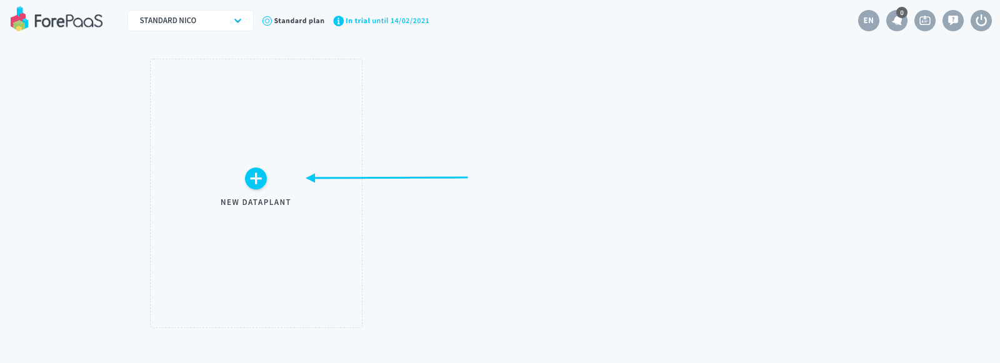
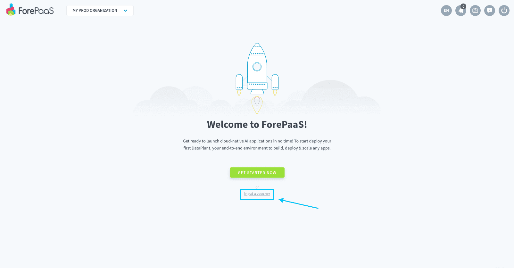
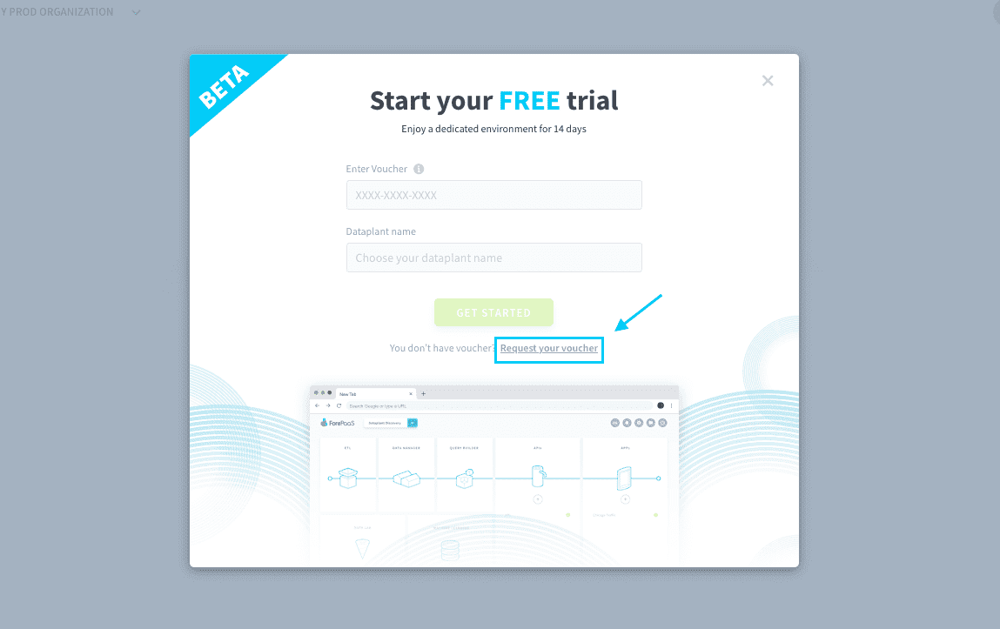
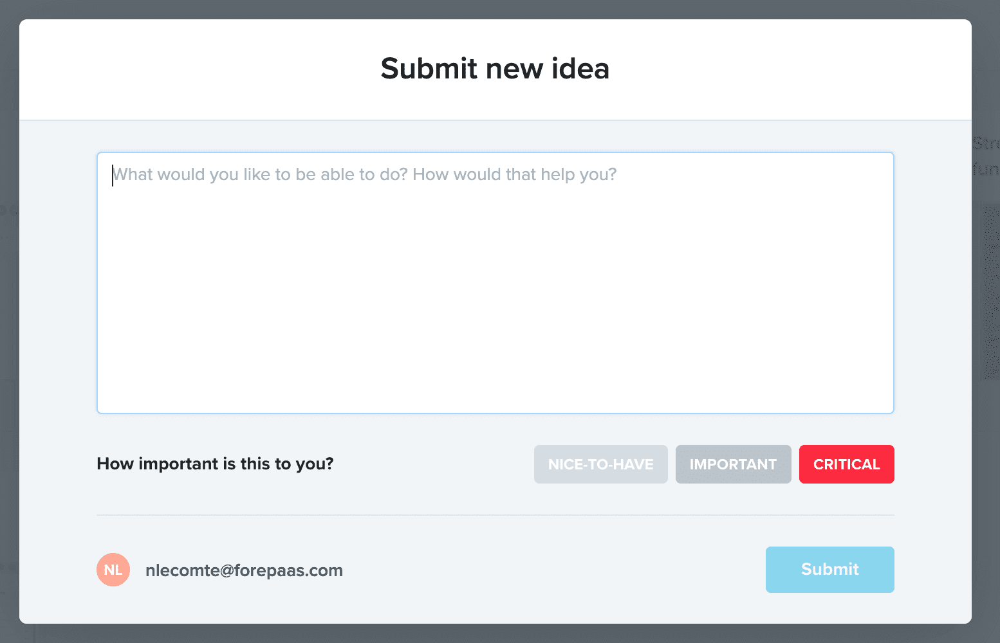
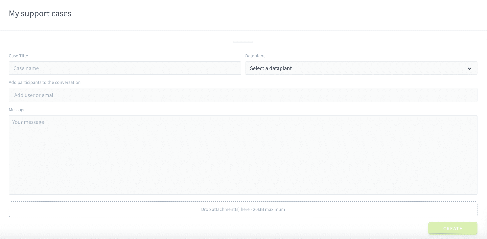

# 入門編：クラウドAIアプリケーションの作成

**入門編へようこそ👣。**

この入門編ガイドでは、具体的な事例とベストプラクティスを利用して、**ForePaaSプラットフォームでAIプロジェクトを作成する方法**について学習します。このチュートリアルを終了すると、各自でAIプロジェクトを作成し、高度なデータ処理と機械学習予測を用いてカスタマイズした独自のAIアプリケーションを作成してデプロイできるようになります。

このガイドでは、サンプルデータを使用し、シカゴ市内の地下鉄の乗客数を天候変数と1年のうちの時期に関連付けて予測分析を行うAIアプリケーションを作成する方法について説明します。

この入門編ガイドは、2つのチュートリアルで構成されています。1つ目のチュートリアルでは、ForePaaSプラットフォームを使用して最初のアプリケーションを作成する方法について説明します。2つ目のチュートリアルでは、AIアプリケーションにスマートレコメンデーションを追加するため、過去のデータを利用して機械学習モデルのセットアップと学習を行う方法について説明します。

興味を持っていいただけそうでしょうか。それでは始めましょう。各チュートリアルの所要時間は**約30分**⏱️です。

?> ブラウザは**Chrome**を使用することを推奨します。別のブラウザを使用していて問題が発生した場合は、サポートポータルのリンクを通じてご連絡ください。

---
## 環境のセットアップ

チュートリアルを始める前に、作業環境をセットアップする必要があります。作業環境はデータプラントと呼ばれます。データプラントには、AIアプリケーションを作成するのに必要な専用のコンピュートリソースとストレージリソースがすべて含まれています。

**ForePaaSの有効なサブスクリプションまたは無料のトライアルバウチャーをお持ちの場合は**、ホームページで[データプラントを作成](/jp/product/dataplant/create-dataplant)することができます。

**ForePaaSの有効なサブスクリプションをお持ちでない場合は**、無料でトライアル版データプラントをデプロイするためのバウチャーを申請できます。弊社のサポートチーム（support@forepaas.com）までメールでご連絡ください。

---
## 目次

{チュートリアル1：最初の分析アプリケーションを新規に作成する📊}(#/jp/getting-started/app-init/index)

{チュートリアル2：最初のAIモデルを新規に作成する🤖}(#/jp/getting-started/app-init/index)

---
## ご意見をお寄せください！🗣️

ForePaaSプラットフォームをご利用いただきありがとうございます。弊社のサポートチームと製品チームは、皆さまにサービスを円滑にご利用いただけるよう全力で取り組んでいます。このためには、**皆さまに気兼ねなくご連絡いただき**、**皆さまの正直な声を聞かせていただく**ことが必要です。うまく機能している部分とそうでない部分を把握することで、サービスの改善に役立てていくことができます。

以下の2つのチャネルからご意見をお寄せください。

### アイデアをお持ちの場合💡

> [「Roadmap（ロードマップ）」タブ](https://hq.forepaas.io/#/features)で**計画されている機能について賛成票を投じたり**、**各自の要望やアイデア**を送信したりすることができます。

{ロードマップで意見を述べる🚀}(https://hq.forepaas.io/#/features)

###  サポートが必要な場合🆘

> サポートの依頼が必要な場合は、いつでもプラットフォームの「*Support（サポート）*」タブから直接依頼を送信することができます。また、support@forepaas.com宛にメールを送付することもできます。

{サポートに質問を送付する🤔}(https://support.forepaas.com/hc/en-us/requests)