# 機械学習用のデータの準備

あなたは[シカゴ交通局](https://www.transitchicago.com/about/)で働いており、AIを導入してシカゴ市内の一時的な環境要因に基づいて**地下鉄の駅の混雑状況を予測**するシステムを立ち上げたいと考えています。 

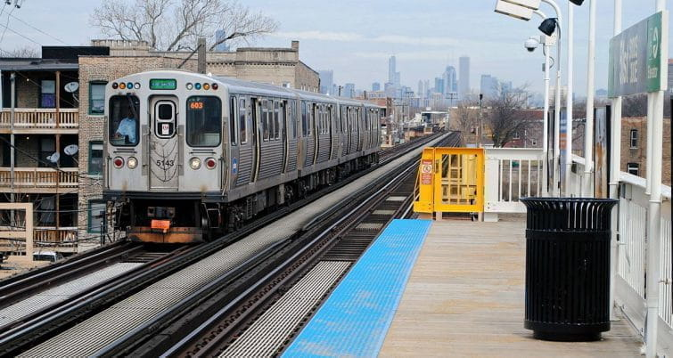

このチュートリアルでは、次の内容について学習します。
* [最初のパイプラインの作成](jp/getting-started/ml/dataset.md?id=build-your-first-pipeline)
* [データセットの準備](jp/getting-started/ml/dataset.md?id=prepare-your-datasets)
  * [ソーステーブルの定義](jp/getting-started/ml/dataset.md?id=define-the-source-tables)
  * [特徴量の定義](jp/getting-started/ml/dataset.md?id=define-the-features)
  * [前処理](jp/getting-started/ml/dataset.md?id=pre-processing)
  
---
## 前提条件

このチュートリアルを始める前に、以下の操作を実行しておきます。 

* このガイドで使用する2つのデータファイル（*ml_dataset.csv*および*ml_sample.csv*）を含む[zipファイル](https://www.dropbox.com/s/ebiforzq20tjos0/ml-data-csv.zip?dl=1)をダウンロードします。
* 次の手順に従って、この2つのファイルをData Managerにロードします。
  * ファイルをData Managerの**「Collect（収集）」タブ**にロードします。
  * **「Analyze（分析）」タブ**でこれらのファイルのメタデータを抽出します。
  * 両方のテーブル（それぞれに*ml_dataset*と*ml_sample*という名前を付ける）を**「Organize（体系化）」タブ**の「Prim」セクションにロードします。
  * *date*と*station_id*が両方のテーブルの主キーに設定されていることを確認します。
  * ⚙️アイコンをクリックしてモデルの保存とビルドを行います。
  * 🔧アイコンをクリックしてDPEで対応する「Load（ロード）」アクションを作成します。
* 次の手順に従って、Data Processing Engine（DPE）で物理データを処理します。
  * DPEを開き、**「Workflows（ワークフロー）」タブ**に移動します。
  * 作成した2つのロードアクションを含むワークフローを作成します。
  * このワークフローを実行し、ジョブが完了するまで数分待機します。
  * **「Dataset（データセット）」タブのQuery Builder**に移動します。
  * 「Prim」で両方のテーブルにデータが入力されていることを確認します。

以上で準備は完了です。これから作成する機械学習モデルでは、先に作成したサンプル・データモデルを使用します。

では、始めましょう。🏃

---
## 最初のパイプラインの作成
**Machine Learning Manager**を開きます。

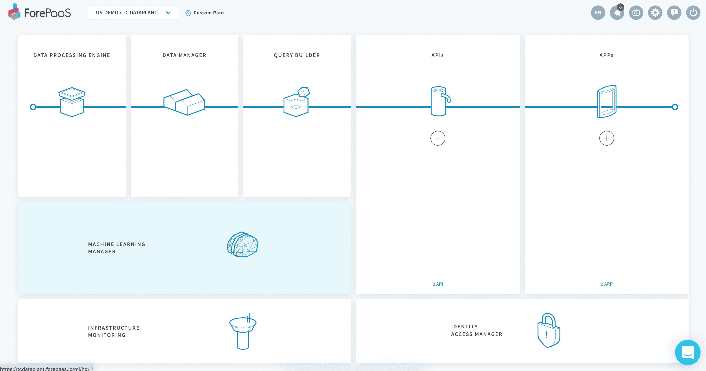

最初に表示されるウェルカムページの内容を確認し、準備ができたら「**New Project（新規プロジェクト）**」をクリックします。

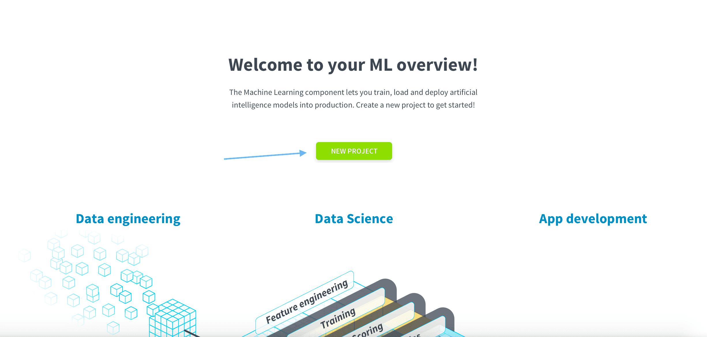

機械学習（ML）のファイルはすべて（*Default*という）ForePaaSのリポジトリに保存されるため、実運用に対応したバージョン管理を行うことができます。また、独自のGitリポジトリに接続することもできます。詳細については、[製品ドキュメント](/jp/product/ml/pipelines/index.md?id=pipeline-repositories)を参照してください。

次の画面では、Machine Learning Managerを使用して行う作業を選択する必要があります。ForePaaS内で予測モデルを新規に作成することがこのガイドの目的ですので、「**Pipeline（パイプライン）**」をクリックしてから、「**Get Started（開始する）**」をクリックします。 

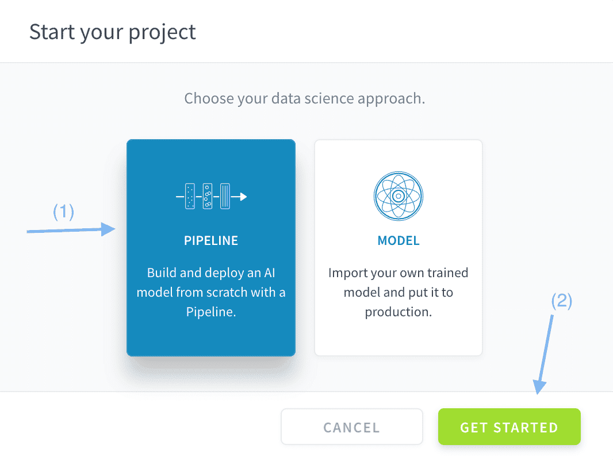

これで、ForePaaSに最初のMLパイプラインが作成されました。次に、このパイプラインを構成します。🔩   

ヘッダー部分にあるパイプライン名をダブルクリックして、パイプライン名を*Chicago ML Pipeline*に変更します。

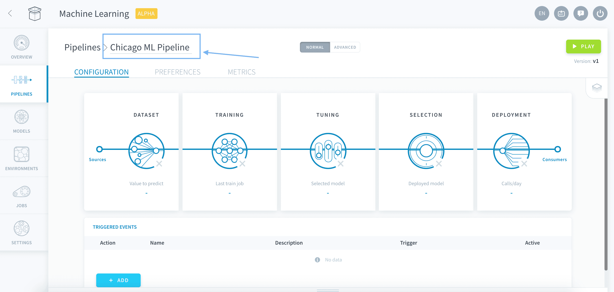

ここに表示されているように、ForePaaSのパイプラインは、データの前処理やデプロイなどの**5つのステップ**で構成されています。この**機械学習に関する入門編**シリーズの各ガイドは、これらの5つのステップに対応したものになっているため、すぐに機械学習の利用を始める準備ができます。

---
## データセットの準備
### ソーステーブルの定義
「**Dataset（データセット）**」パネルを開きます。

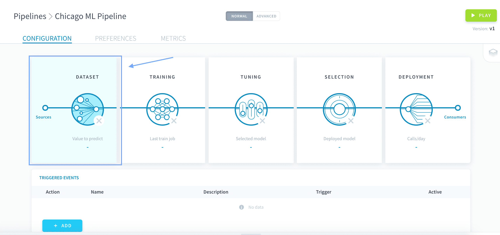

「Input Type（入力タイプ）」には「**Tables（テーブル）**」を選択します。こうすることで、Data Managerからデータを直接取得することができます。

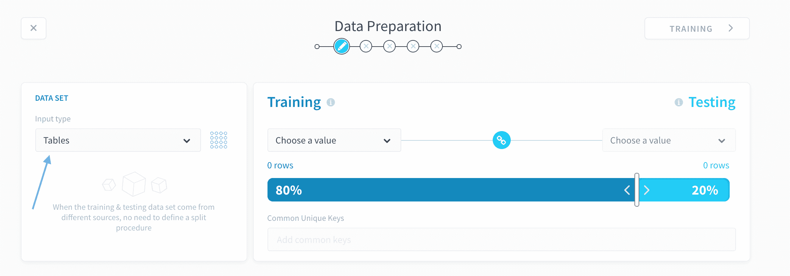

次に、学習とテストの分離を行います。「Training（学習）」で「*ml_dataset*」を選択します。これが学習用データのソースになります。 

このテーブルをテスト用データのソースとしても使用する場合は、「Training（学習）」と「Testing（テスト）」の間の**リンク🔗**アイコンがアクティブになっていることを確認します。リンクアイコンをクリックすると、この設定を切り替えることができます。

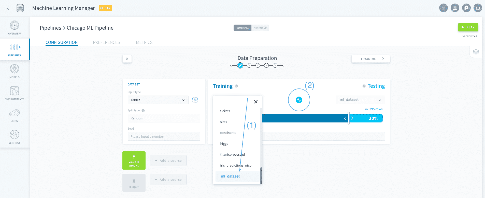

分割スライダーを動かして、データの*85%*が「**Training（学習）**」に、データの*15%*が「**Testing（テスト）**」になるようにします。

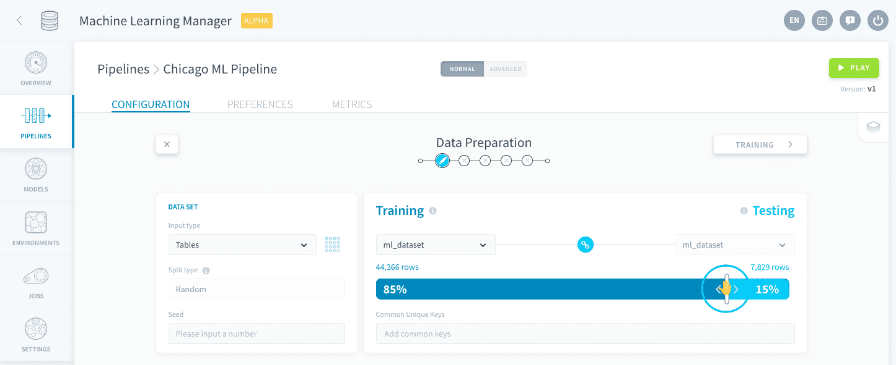

「*Tables（テーブル）*」の下に表示されているように、分割は入力テーブルの行に対してランダムに行われます。このチュートリアルとまったく同じ結果を得るためには、「**Seed（シード）**」を使用して分割の再現性を制御します。シードには*27062020*を指定します。

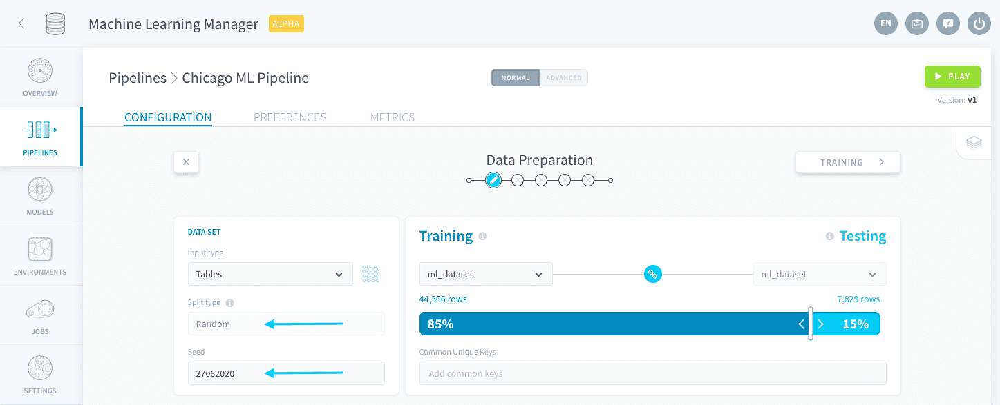

> パイプラインは自動保存されます💾。パイプラインの構成はいつ終了しても、再開できます。

### 特徴量の定義
次のステップでは、XとYの変数を選択します。Yは予測対象の値で、Xはこの予測に役立つと考えられる特徴量のセットです。このケースでは、利用可能なデータを用いて、シカゴの地下鉄駅が特定の日に混雑するかどうかを予測します。 

Yの横にある「**Add a source（ソースを追加）**」をクリックします。

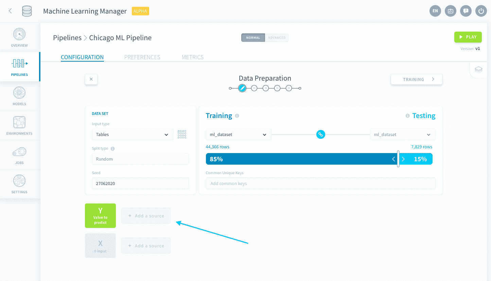

次に、「*is_overcrowded from ml_dataset*」を選択します。選択内容に関する説明を記入して「**Save（保存）**」をクリックします。 

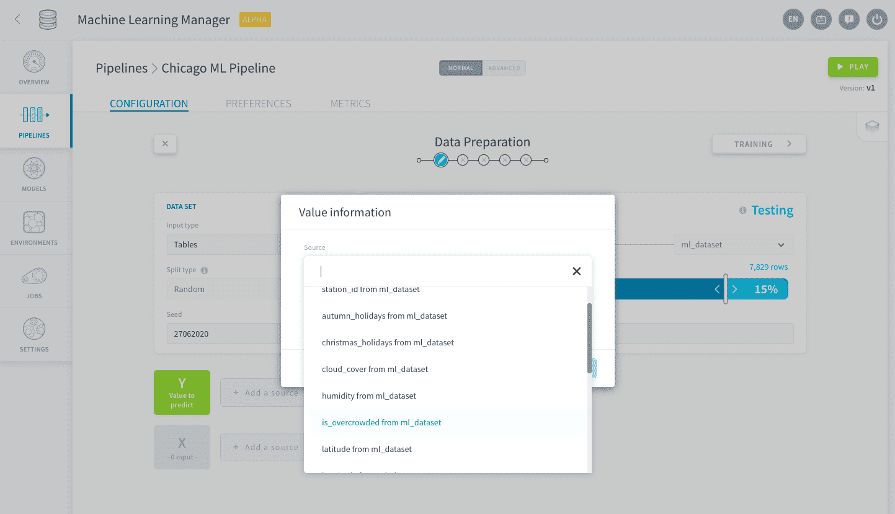

次に、Xの特徴量を追加します。Xの横にある「**Add a source（ソースを追加）**」をクリックします。

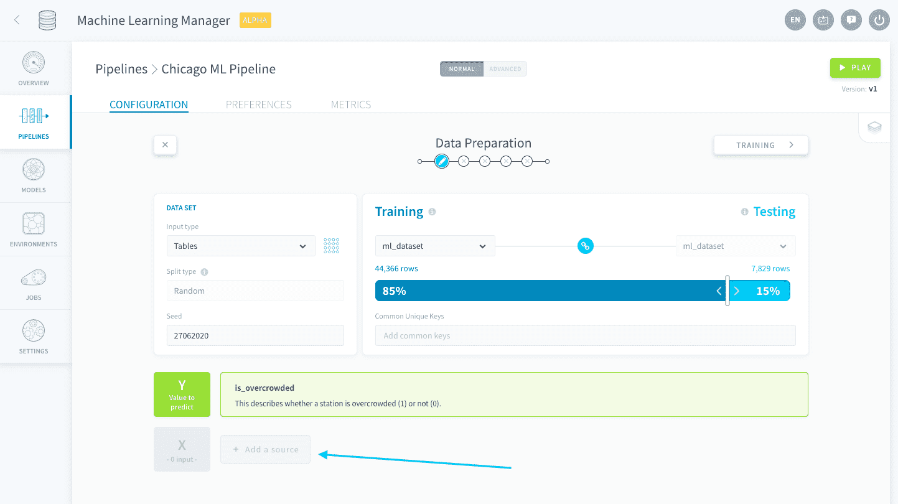

「*Add all variables（すべての変数を追加）*」をクリックします。この操作でYの予測対象の値がXに追加されることはないため、重複について心配する必要はありません。✨

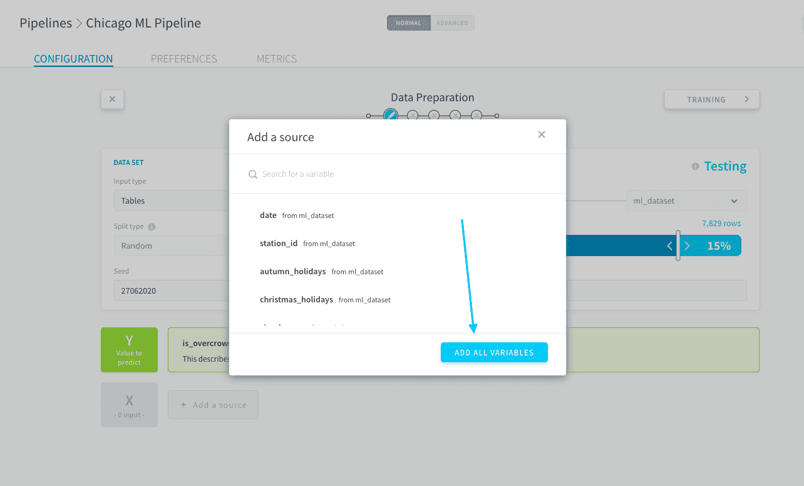

変数は一括で追加できるようになっているため、変数を1つずつ手作業で追加する必要はありません。ただし、機械学習の問題については、各特徴量について検討し、いくつかの事柄について確認することを強くお勧めします。👀

### 前処理
特に、*ml_dataset*テーブル内の変数の一部は重複しているため、予測に悪影響を及ぼす可能性があります。変数を削除するには、右側にある**ごみ箱🗑️アイコン**をクリックします。Xから以下の変数を削除します。

|                変数                                 | 削除する理由         | 
| :------------------------------: | -------------------------- | 
|             **date**      | holidays変数と重複している                     | 
|            **latitude**              | *station_id*と重複している                             | 
|            **longitude**  | *station_id*と重複している                             |
|            **station_name**               | *station_id*と重複している                     | 

これで、データセットが適切に構成され、🤖機械学習で利用する準備ができました。  
次のステップでは、学習プロシージャの選択と構成を行います。

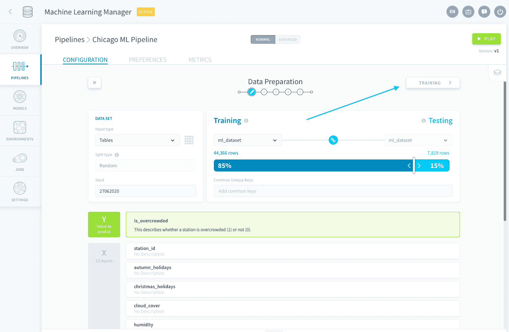

{ステップ2：学習}(#/jp/getting-started/ml/training.md)