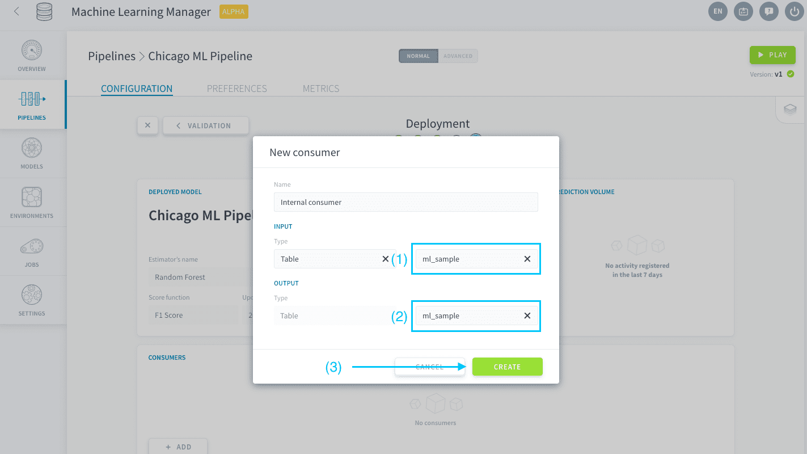

# モデルのデプロイオプションの設定

デプロイステップでは、パイプラインのすべての出力オプションを構成できます。つまり、このステップでは、作成したモデルを運用環境に移行して予測のフローを稼働できるようにします。

まず、「Deployment（デプロイ）」ページを開きます。

この機械学習の最後のチュートリアルでは、次の内容について学習します。

* [モデルのコンシューマーの管理](jp/getting-started/ml/deployment.md?id=manage-consumers)
* [最初の予測の実施](jp/getting-started/ml/deployment.md?id=make-your-first-prediction)

---
## コンシューマーの管理

コンシューマーは、モデルを利用して供給されたデータに対して予測を行うエンティティです。ForePaaSには、Data Managerで記述する方法やAPI呼び出しなど、このためのオプションが複数用意されています。ここでは、簡単な方法として😌、ForePaaSのテーブルを使用します。  

「Consumers（コンシューマー）」パネルで「**Add（追加）**」をクリックします。

*Internal consumer*と名前を付け、「Input（入力）」には「*Table（テーブル）*」を選択します（このとき、「*Table（テーブル）*」が自動的に出力としても選択されます）。

入力と出力の両方でテーブルとして「*ml_sample*」を選択し、「**Create（作成）**」をクリックします。

---
## 最初の予測の実施

いよいよ、予測をする時が来ました。ビジネスニーズは、シカゴの地下鉄駅の乗客数を正確に予測するAIモデルを作成することでした。 

作成した機械学習モデルは、コンシューマーを作成したときに、新しい「Predict（予測）」アクションの形で、Data Processing Engineに組み込まれています。「Actions（アクション）」タブでDPEに移動します。「**Machine Learning（機械学習）**」リポジトリを選択します。ここには、DPEの新しい「Predict（予測）」アクションが存在します。 

アクションを開きます。下側のパネルでは、モデルの入力と出力を選択します。「*Select an attribute（属性を選択）*」をクリックして右側の出力を編集します。

*predictions*に変更します。この列は現在空欄になっており、予測が入力されます。

予測が目的の場所に書き込まれるようにするには、アクションで考慮する主キーを指定する必要があります。「**Direct Loading（ダイレクトロード）**」をオンにします。

ダイレクトロードを使用すると、モデル（通常、行インデックス）を経由することなく、入力データを出力テーブルに容易にコピーできます。また、ここでは主キーを指定することもできます。左側の列で「*date*」を選択します。

右側の列で「*date*」を選択します。

*station_id*でも同様の操作を繰り返します。これは*ml_sample*の2番目の主キーです。

以上で準備は完了です。この「Predict（予測）」アクションでは、*date*および*station_id*の主キーで識別された正しい行に予測が自動的に書き込まれます。アクションを実行します。

サンプルデータがデプロイ済みのMLインスタンスを呼び出して予測を収集するのをしばらく待ちます。DPEの「*Jobs（ジョブ）*」タブがクリアされると完了です。

最後に、すべてが円滑に処理されていることを確認します。Query Builderに移動し、「Dataset（データセット）」で「Prim」タブを開いて*ml_sample*を見つけます。

ml_sampleを開きます。ご覧のように、*predictions*列にデータが入力されています。この列を*real_values_to_predict*列と比較すると、このモデルのパフォーマンスを評価することができます。real_values_to_predict列には、「is_overcrowded」ラベルに対する真の値が含まれています。

---

<b>おつかれさまでした！🎉🎊</b>

**これで、ForePaaSの機械学習🤖の入門編チュートリアルは完了です。**お疲れさまでした。最初の機械学習モデルの学習と運用環境へのデプロイが完了しました。また、簡単な予測も行いました。

機械学習に関する発展的な課題に挑戦したい方は、🥊[機械学習の発展編ガイド](/jp/getting-further/ml/index)で、数日先までのリアルタイム予測を行い、AIアプリケーションに表示する方法を学習することができます。

> チュートリアルに取り組む中で難しく感じた点や分かりにくい点🧐があったかもしれません。弊社では、製品の改善を図り、より良いものにしていくことに全力で取り組んでいますが、そのためには皆さまからのフィードバックが必要です。[こちらの簡単なアンケート](https://forms.office.com/Pages/ResponsePage.aspx?id=nDWzgpGTfE2g8oFnUal2QQ9d-P8xWc5AgNsykYKKK71UOVpZT1RUMFBRUk5BWjNLSzBCNVhDSVgyNSQlQCN0PWcu)（所要時間は約3分⌛）にご記入をお願いします。

ご存知のように、このチュートリアルはいつでもご利用いただけます。必要に応じて[他のドキュメント](jp/product/ml/index)も参照するようにしてください。

また、何かあった際には遠慮なく**ご連絡ください**。弊社のサポートチームと製品チームは、寄せられたAIアプリケーションのアイデアを迅速に実現できるように全力で支援を行います。 

{ロードマップで意見を述べる🚀}(https://hq.forepaas.io/#/features)
{サポートに質問を送る🤔}(https://support.forepaas.com/hc/en-us/requests)