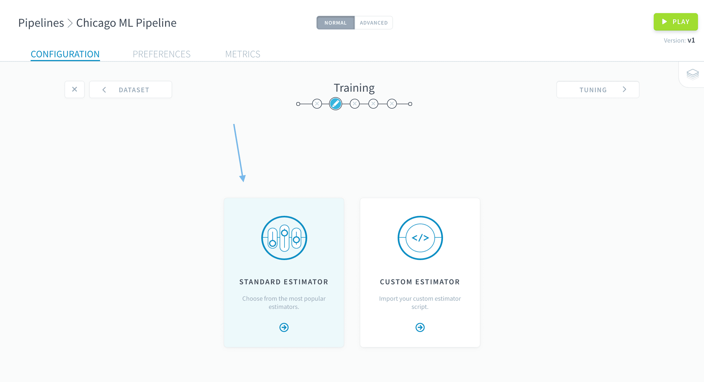
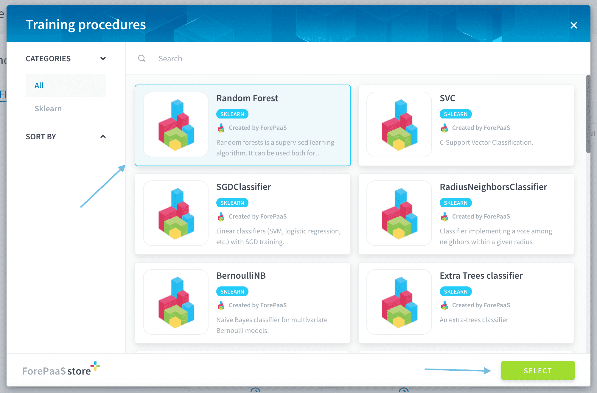
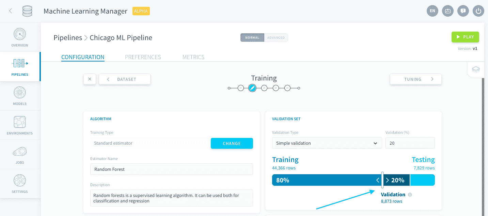
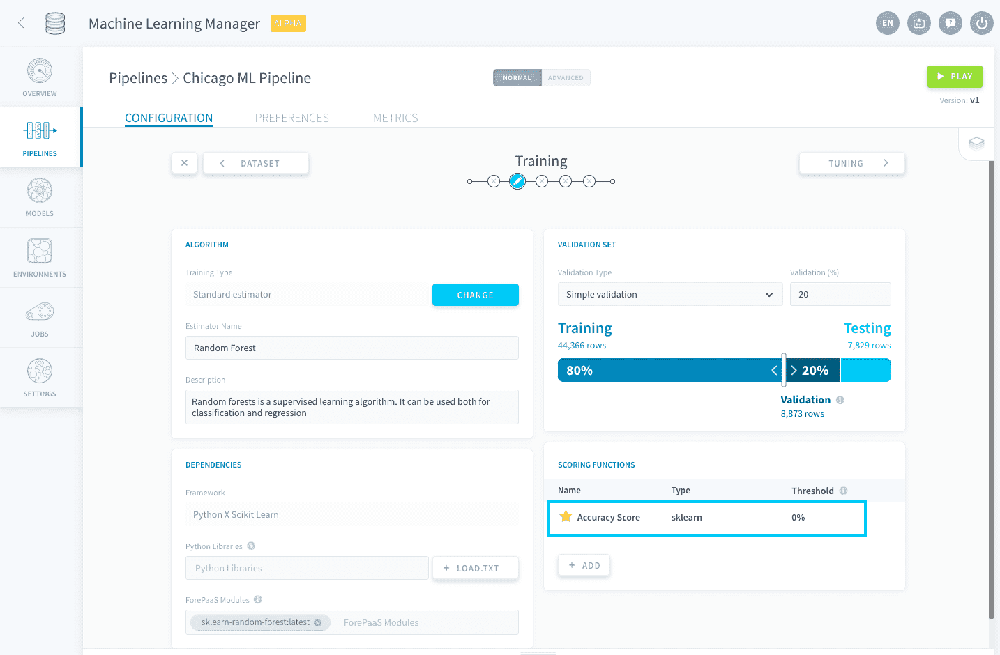
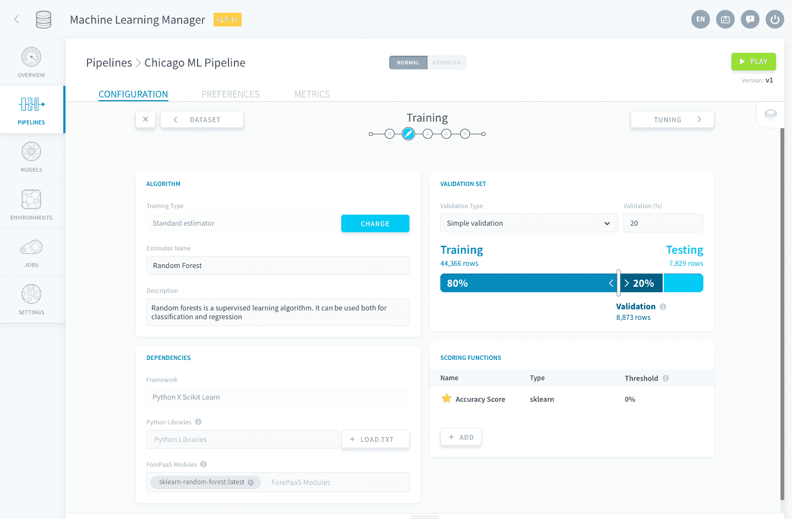

# 学習プロシージャの選択

パイプラインの構築の次のステップに進み、機械学習モデルの核心である学習プロシージャの構成を行います。 

このチュートリアルでは、次の内容について学習します。
* [アルゴリズムの選択](jp/getting-started/ml/training.md?id=choose-an-algorithm)
* [スコア評価と検証の構成](jp/getting-started/ml/training.md?id=configure-scoring-and-validation)

---
## アルゴリズムの選択

次の画面で、「**Standard Estimator（標準推定器）**」を選択します。

ForePaaSには、主要なライブラリ（Scikit Learnなど）の最も一般的なMLアルゴリズムが組み込まれています。これは、ドキュメントを参照する面倒な手間を省いて、ビジネスニーズに専念できるようにするためです。 

この問題には[決定木のランダムフォレスト](https://en.wikipedia.org/wiki/Random_forest)を使用しましょう。[決定木](https://en.wikipedia.org/wiki/Decision_tree_learning)は、数値変数の集合から分類ラベル（真／偽ラベルなど）を予測するのに使用する最も主流のアルゴリズムの1つです。また、これらは理解、実装、解釈が容易です。このため、シカゴの乗客数の問題には最適といえます。

Scikit Learnの「**Random Forest**」を選択し、「**Select（選択）**」をクリックします。

「Algorithm（アルゴリズム）」パネルと「Dependencies（依存関係）」パネルは、選択した内容を反映して自動的に構成されています。ライブラリ要件の扱いに苦慮する必要はなく、システムによって自動的に処理されます。

!> 「Dependencies（依存関係）」ボックスで事前にインポートされたライブラリやモジュールを消去しないように注意してください。消去するとパイプラインが機能しなくなります。

---
## スコア評価と検証の構成
まず、このチュートリアルで重要💡になるいくつかの概念について説明しましょう。

基本アルゴリズムは選択済みですが、まだ微調整が必要です。このためには、モデルのパフォーマンスを評価できるようにする必要があります。今はまだ学習フェーズですので、テストセットを使用することはできません。代わりに、ベストプラクティスに沿って**検証セット**🕵️‍♂️を定義することをお勧めします。  
検証セットは、モデルの微調整時にモデルをスコア評価するのに使用する定義済みの学習セットのサブセットです。これに対し、テストセットは、現実の新たなデータに対して最終的なモデルがどの程度適切に機能するかを評価するのに使用します。 

> つまり、パイプラインを実行するたびに、最初のデータから次の3つのテーブルが作成されることになります。  
**学習セット**：モデルの学習（フィッティング）に使用します。  
**検証セット**：学習フェーズ中にモデルフィッティングの公正な評価を行うのに使用します。  
**テストセット**：学習済みモデルの公正な評価を行うのに使用します。  

重要な概念の説明に続いて、スコア評価の設定を行いましょう。ForePaaSでは、交差検証または単純検証のいずれかを行うことができます。ここでは単純検証を使用します。スライダーバーを使用して、検証セットが元の学習セットの**20%**になるようにします。

> この段階では、テストセットのサイズは変更できなくなっています。このサイズは[最初のステップ](/jp/getting-started/ml/dataset.md?id=define-the-source-tables)で設定しておく必要があります。

また、お使いの環境に**必要な数のスコア評価関数を追加**するオプションも用意されています。先ほどと同じように、標準推定器の使用を選択した場合は、ForePaaSで自動的に基本的なスコア評価関数（この場合は「[*Accuracy（正解率）*](https://en.wikipedia.org/wiki/Accuracy_and_precision)」）が追加されています。 

また、ForePaaSでは自動的に**しきい値**が0%に設定されます。この値は、モデルを保存するのに、パイプライン内のモデルが（検証セットとテストセットの両方で）到達しなければならない最小スコアを表しています。スコアが増えてもそれぞれのしきい値に到達しないモデルは破棄されます。 

正解率スコアはこのモデルを評価するのに最適です。次のステップに進む前に、画面が次のようになっていることを確認します。

パイプラインでモデルの学習とスコア評価を効率的に行うための、すべての準備が整いました。次のステップでは、選択したランダムフォレスト・アルゴリズムのハイパーパラメータの微調整🕹を行います。 

{ステップ3：ハイパーパラメータの調整}(#/jp/getting-started/ml/tuning.md)