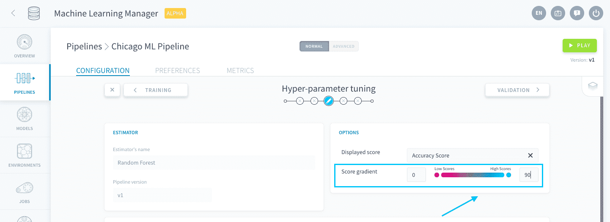
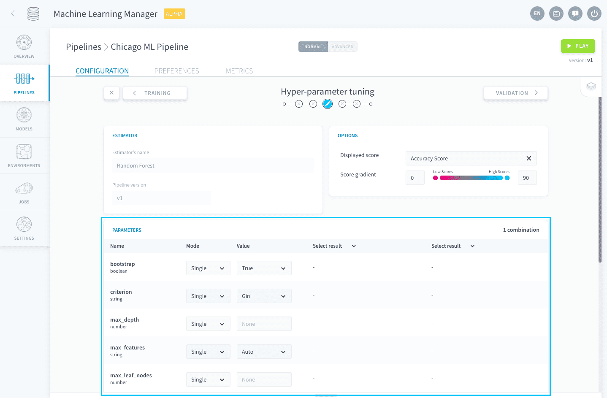
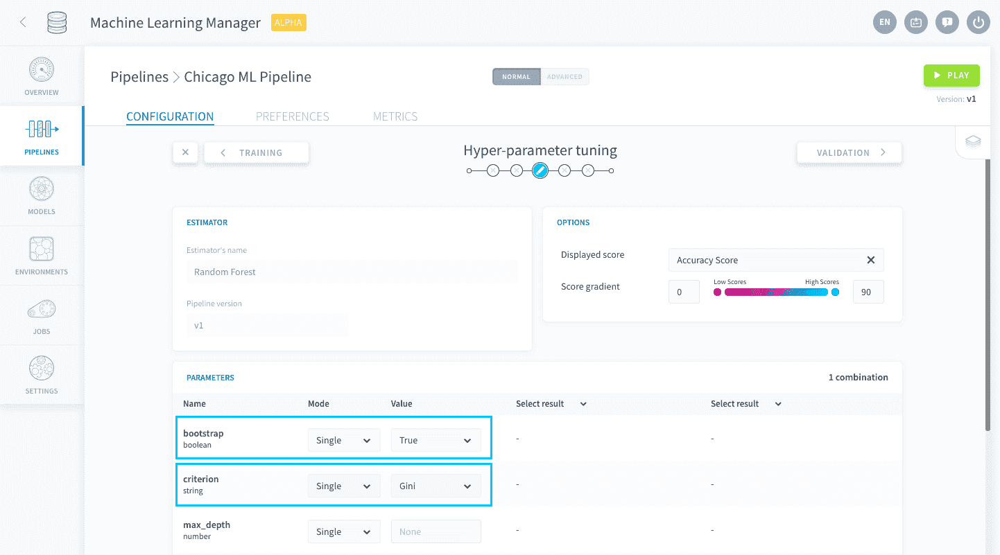
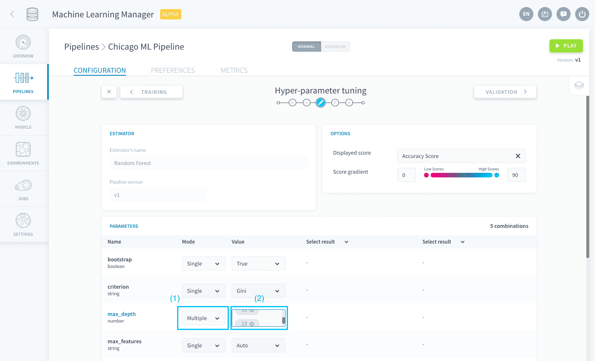
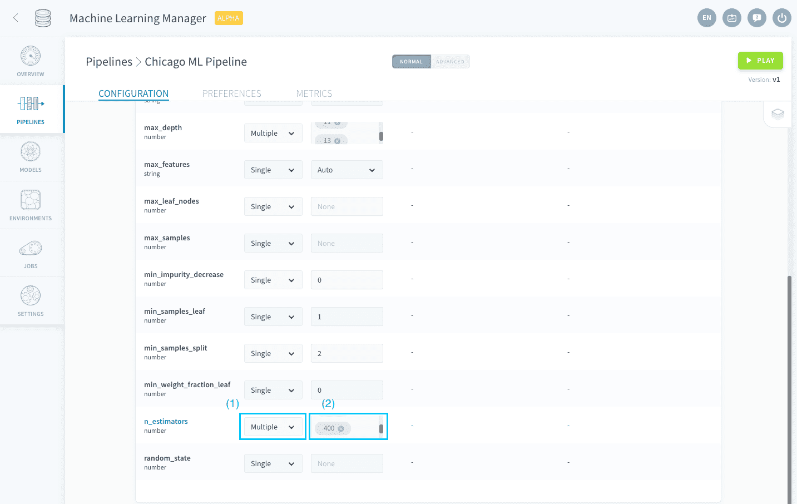
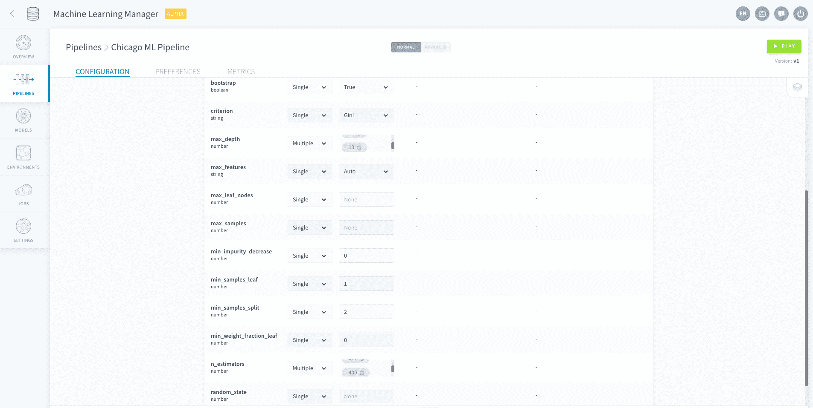
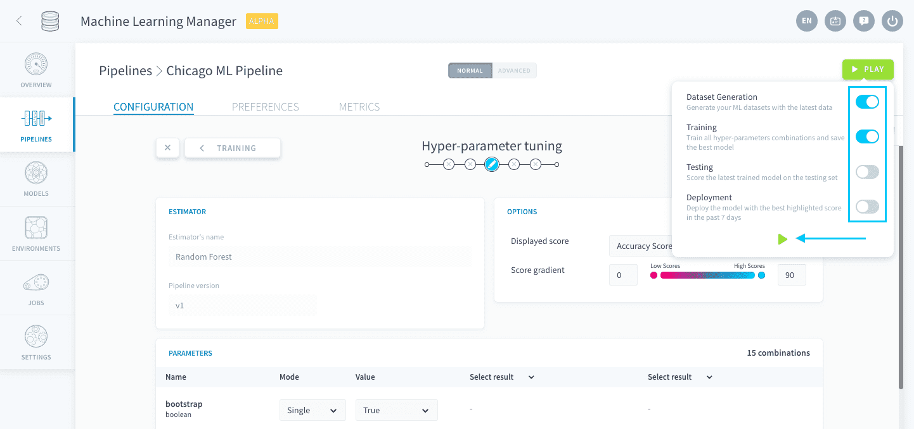

# モデルのハイパーパラメータの微調整

このチュートリアルでは、ランダムフォレスト・アルゴリズムのハイパーパラメータの設定を行い、最後に学習ジョブとスコア評価ジョブを実行します。 

?> データサイエンスに詳しくない方のために説明すると、ハイパーパラメータはデータサイエンティストが学習プロセスの前に設定する機械学習アルゴリズムの主要な変数です。料理を作る前にオーブンで温度と調理時間を設定するようなものだと考えてください。これと同じように、ハイパーパラメータを設定することは、学習に使用する数理モデルそのものを具体的に設定することを意味します。  
[Wikipediaでハイパーパラメータの詳細を確認する](https://en.wikipedia.org/wiki/Hyperparameter_optimization)

ここでは、次の内容について学習します。
* [最初のパラメータ探索の実行](jp/getting-started/ml/tuning.md?id=make-a-first-search-of-parameters)

---
## 最初のパラメータ探索の実行

ここでは、ハイパーパラメータの調整を行います。まだ何も情報が存在しないように見えますが🙇‍♂️、すぐに有益な分析情報を得ることができます。 

上部の2つのパネルには、これまでに選択した内容がまとめられています。モデル間のスコアの違いをさらに分かりやすく視覚化する必要がある場合は、スコア勾配を変更できます。

ハイパーパラメータのリストに注目してください。ここには、ランダムフォレスト・アルゴリズムを構成するすべてのパラメータが列挙されています。

このハイパーパラメータの調整画面では、学習とスコア評価を行う複数の構成を生成できます。これにより、ハイパーパラメータの最適な組み合わせを分析し、いずれかの組み合わせに帰結したり、さらに探索を繰り返して精度を高めたりすることができます。デフォルトでは、**探索を繰り返すたびにスコアが最高のモデルのみを1つだけ保存して、次のステップで使用できます**。

リストの最初の2つのパラメータ「**bootstrap**」と「**criterion**」は、「Mode（モード）」を「*Single*」、「Value（値）」をそれぞれデフォルトの「*True*」および「*Gini*」にします。 

> 💡 すべてのパラメータに、アルゴリズムによって定義されたデフォルト値が存在します。 

リストの3つ目のパラメータは**max_depth**です。このパラメータは、フォレスト内で可能な[個々の決定木の最大限の深さ](https://en.wikipedia.org/wiki/Tree-depth)を表します。 

> 💡 ハイパーパラメータ名の上にマウスカーソルを合わせると、それぞれのハイパーパラメータの説明が表示されます。

このパラメータでは、複数の値について調べます。「**Mode（モード）**」を「*Multiple*」に設定し、「**Value（値）**」フィールドで「*None*」値タグを削除して、代わりに*5*、*7*、*9*、*11*、*13*を入力します。 

次に、リスト内からパラメータ**n_estimators**を探し、使用する決定木の数を定義します。  
一般にスコアは決定木の数が多いほど向上しますが、その分だけ学習に要する時間も長くなります。「**Mode（モード）**」を「*Multiple*」に設定し、「**Value（値）**」フィールドで*100*値タグを削除して、代わりに*50*、*200*、*400*を入力します。

最後に、すべてのパラメータの設定が次のようになっていることを確認します。

|        ハイパーパラメータ      |       Mode（モード）       |      Value（値）      | 
| :-------------------------: | ---------------- | --------------- | 
|    **max_features**         | Single           | 'Auto'          | 
|    **max_leaf_node**        | Single           | None            | 
|    **max_samples**.         | Single           | None            | 
| **min_impurity_decrease**   | Single           | 0               | 
|    **min_samples_leaf**     | Single           | 1               | 
|    **min_samples_split**    | Single           | 2               | 
|**min_weight_fraction_leaf** | Single           | 0               | 
|    **random_state**         | Single           | None            | 

パラメータ探索を行う準備ができました。パラメータリストの右上に表示されているように、生成される組み合わせは15種類あります。 

「**Play（再生）**」をクリックします。「*Dataset Generation（データセット生成）*」と「*Training（学習）*」のみをアクティブ化して、パイプラインを実行します。

ここで一息入れてください。☕️その間に、ForePaaSが自動的にインスタンスを導入してデータセットを生成し、指定した組み合わせのスコアを評価します。 

5分後には、すべてのジョブの実行が完了していますので、次のステップに進んで最良のモデルのデプロイを行います。

{ステップ4：モデルの選択}(#/jp/getting-started/ml/validation.md)