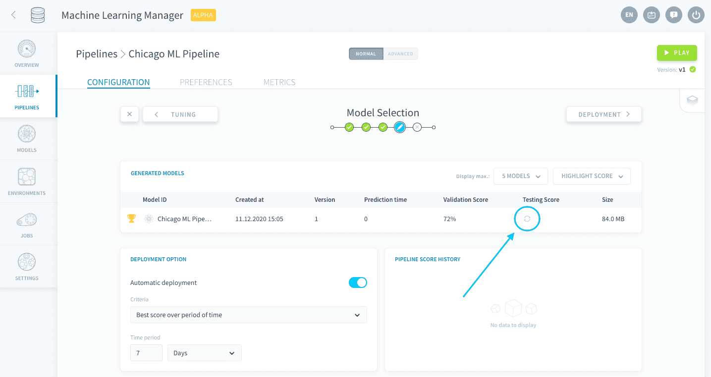
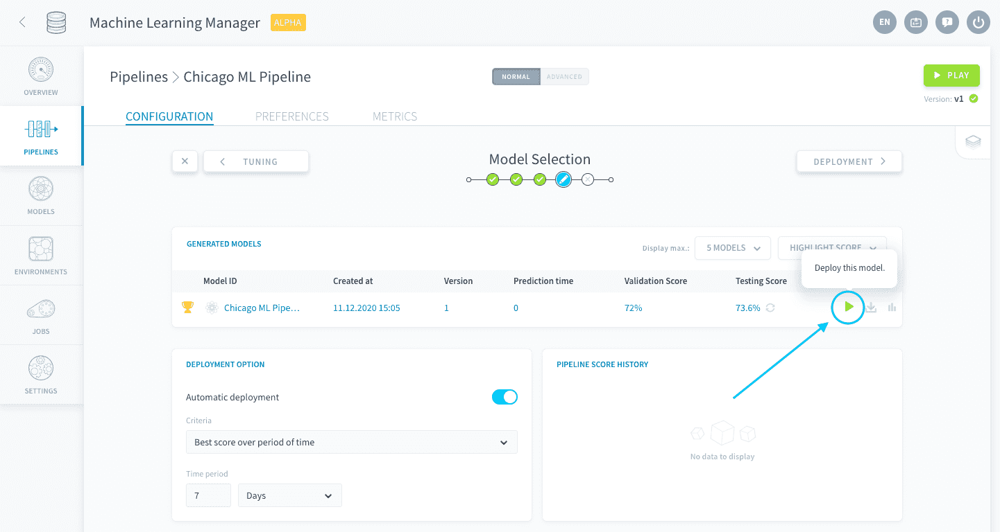
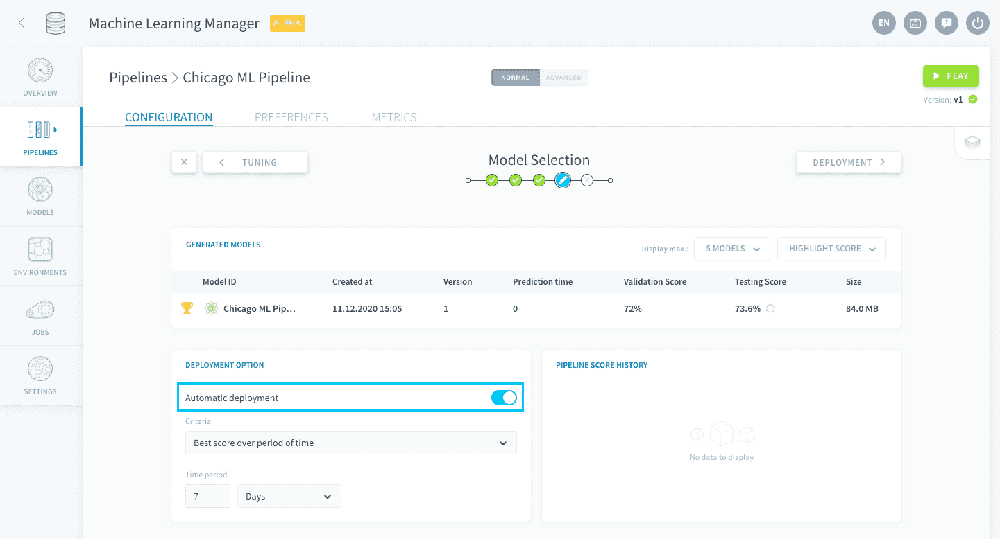
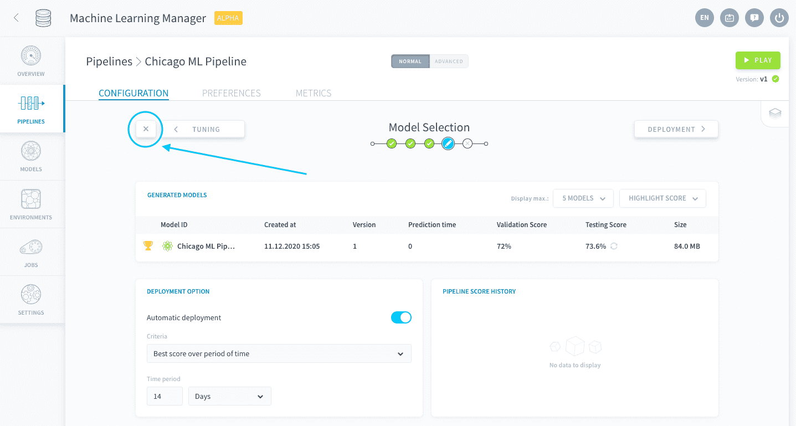
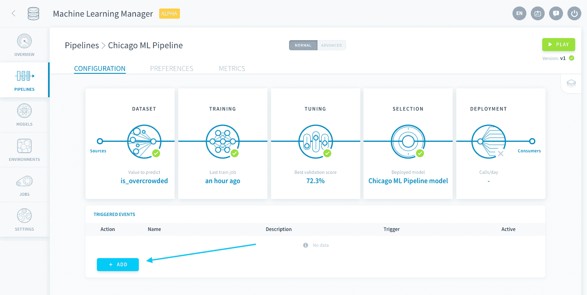
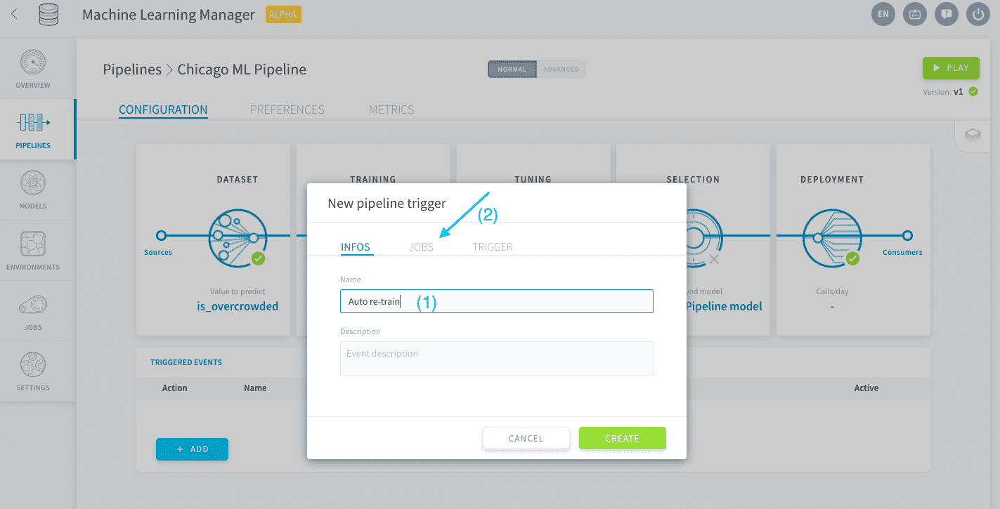
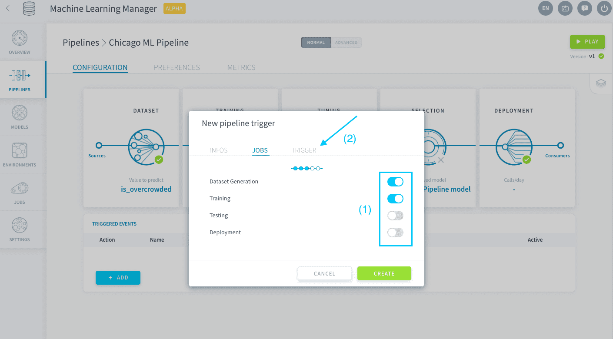
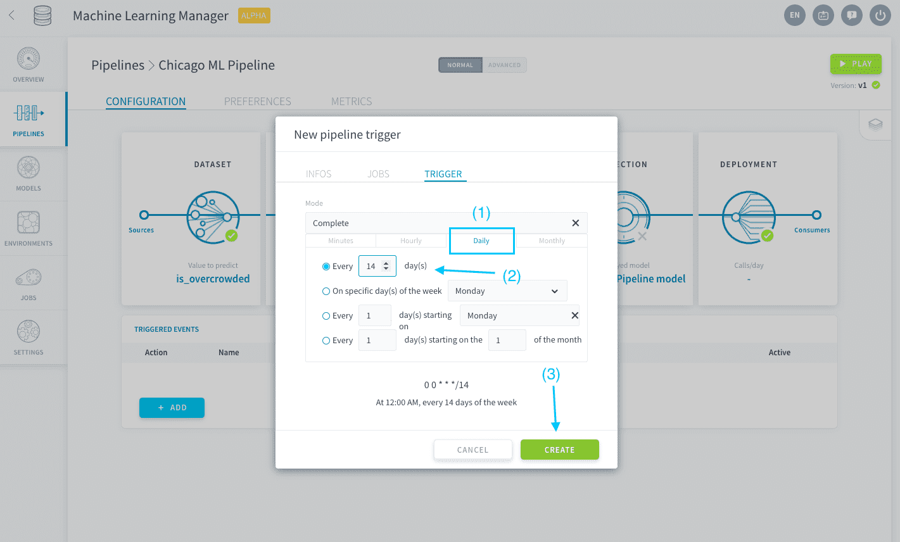

# モデルの選択の確認とデプロイ

モデルの選択ステップでは、**これまでに作成されたすべてのモデルを制御できます**。パイプラインは、新しいデータが供給され、継続的な学習が行われるのに合わせて進化していくように設計されています。モデルのバージョンとスコアドリフトを追跡することは、AIアプリケーションの運用を行う上で不可欠です。

ここでは、次の内容について学習します。
* [手動でのモデルのデプロイ](jp/getting-started/ml/validation.md?id=manually-deploy-a-model)
* [自動管理オプションの設定](jp/getting-started/ml/validation.md?id=set-automatic-management-options)
  * [自動デプロイの構成](jp/getting-started/ml/validation.md?id=configure-auto-deployment)
  * [トリガーの構成](jp/getting-started/ml/validation.md?id=configure-triggers)

---
## 手動でのモデルのデプロイ

「*Generated Models（生成済みモデル）*」テーブルには、パイプラインの作成後に**学習と保存が行われたすべてのモデル**が表示されます。今のところ、表示されているモデルは1つだけです。これは前のステップのハイパーパラメータ探索で返されたモデルです。

ForePaaSでは、リソースを無駄に使用しないようにするため、テストセットに対してモデルの自動評価が行われることはありません。パイプラインの「Play（再生）」ボタンで3つ目のオプション「*Testing（テスト）*」を選択するか、特定のモデルで**更新🔄アイコン**をクリックします。

次に、モデルをデプロイします🚀。このためには、モデル行の末尾にある**再生▶️アイコン**をクリックします。

非常に簡単です。緑色の原子アイコンが表示されると、作成したモデルのデプロイが完了し、予測に使用できるようになります。

---
## 自動管理オプションの設定

### 自動デプロイの構成

この一連のチュートリアルの最後のデプロイオプションの構成に進む前に、ForePaaSのもう1つの重要な機能であるパイプラインの自動化について簡単に説明しましょう。利用できる主要な自動化として、自動デプロイオプションがあります。自動化を行うと、その後はパイプラインを開く必要がなくなります。  

「**Automatic deployment（自動デプロイ）**」をオンにします。

デプロイのデフォルトの条件は、「*Best score over period of time（一定期間における最良スコア）*」です。この設定をそのまま使用します。もしスコアのみを優先するのではなく、学習や予測に要する時間も最適化したい場合は、このタブで設定することができます。

「Time period（期間）」を「**14 days（14日間）**」に設定します。 

これで、パイプラインが14日ごとに自動的にデプロイするようになります。当然ですが、この機能はモデルの自動再学習と組み合わせて使用する必要があります。そうしないと、デプロイ済みのモデルは変更されません。

### トリガーの構成

再学習などのその他の自動化オプションは、**トリガー**を使用して設定します。左上にある「**X**」をクリックして、パイプラインのメインページに移動します。

> パイプラインは自動保存されます💾。パイプラインの構成はいつ終了しても、再開できます。

下に表示されているように、トリガーイベントはまだ存在しません。「**Add（追加）**」をクリックします。

トリガーに*Auto re-train*と名前を付け、説明を記入して、「**Jobs（ジョブ）**」をクリックします。

「*Dataset Generation（データセット生成）*」および「*Training（学習）*」の各スライダーをオンにします。こうすることでパイプラインでは、MLの学習用およびテスト用データセットがテーブル内の最新データに更新され、新しいモデルの学習が行われます。続いて、「**Trigger（トリガー）**」をクリックします。

「*Daily（毎日）*」を選択し、「*Every 14 days（14日ごと）*」を選択します。「**Create（作成）**」をクリックしてウィンドウを閉じます。

パイプラインでは、新しいデータをすべて取り込んで14日ごとに学習とスコア評価が行われるだけでなく、新しいモデルを学習してスコアの最も良いモデルが自動的にデプロイされます。

簡単なパイプラインの自動化の設定が完了しましたので、最後にデプロイオプションの設定に進みます。 

{ステップ5：デプロイオプション}(#/jp/getting-started/ml/deployment.md)