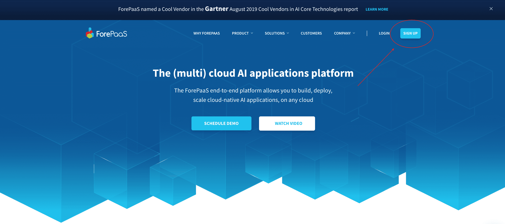
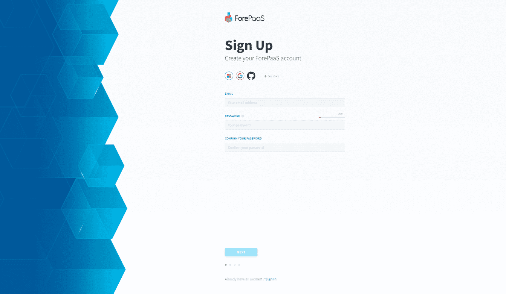
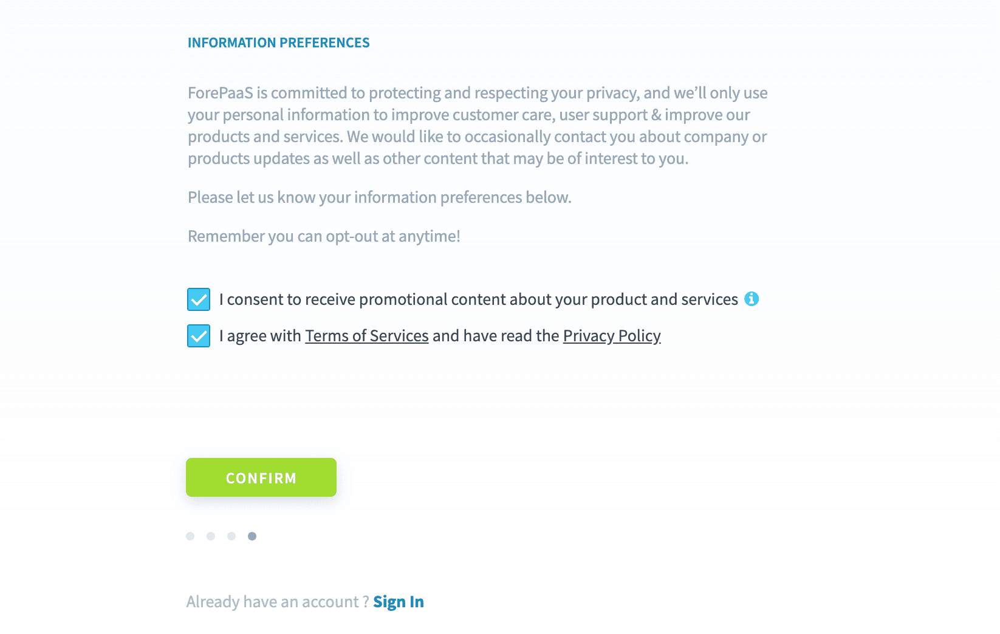
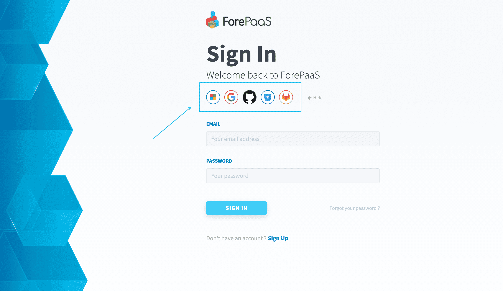
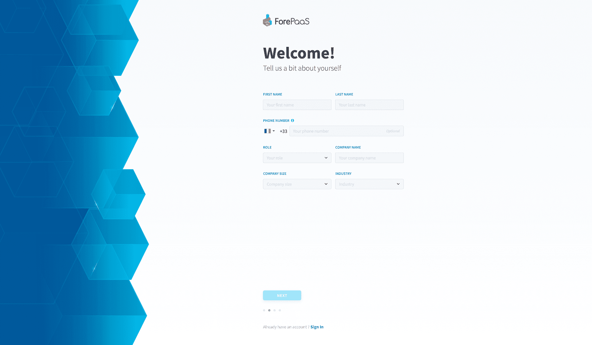
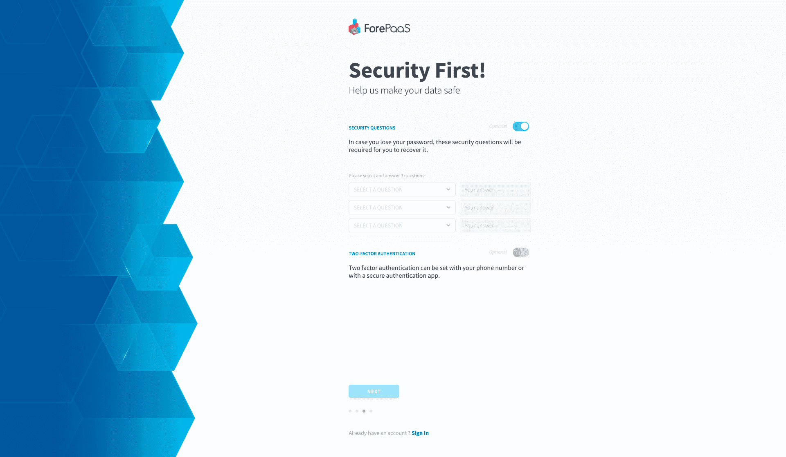

# ]ForePaaSアカウントの作成

ForePaaSプラットフォームをご利用いただきありがとうございます。まず最初に、ユーザープロファイルを作成します👥。

[プラットフォーム](https://hq.forepaas.io)に直接アクセスするか、[forepaas.com](https://www.forepaas.com)にアクセスし、画面の右上にある「**SIGN UP（サインアップ）**」ボタンをクリックします。

---
## サインアップオプション

アカウントを作成する方法は2つあります。[**メールアドレス**](/jp/product/account-setup/create-account.md?id=sign-up-with-an-email-address)を入力してサインアップを行う方法と、Microsoftアカウント、Gmailアカウント、またはその他の[**シングルサインオンオプション**](/jp/product/account-setup/create-account.md?id=sign-up-using-single-sign-on)を利用する方法です。

### メールアドレスを使用したサインアップ
メールアドレスを使用する場合は、メールアドレスとパスワードを入力します。

登録作業の最後に、入力したメールアドレス宛に確認用のメールが送信されます。確認用のリンクをクリックして、アカウントを有効にします。

### シングルサインオンを使用したサインアップ

ForePaaSは、次のようなSSOアカウント提供者と連携しています。
* Microsoft
* Google
* Github
* Bitbucket
* Gitlab

使用するアカウント提供者を選択し、表示された画面の指示に従います。

---
## プロファイル情報の入力

メールアドレスまたはSSOアカウントを入力したら、基本的なプロファイル情報を入力する必要があります。

次に、セキュリティオプションとして**秘密の質問**と**多要素認証**を設定できます。これらはいずれも省略できます。

秘密の質問を設定すると、パスワードを忘れた場合にアカウントを回復できます。 

多要素認証では、サインインする際に別の方式の認証を追加で要求することで、アカウントのセキュリティを強化できます。サポートされている認証要素：
* スマートフォンへのSMSコードの送信
* 任意の2FAアプリケーション（*Google Authenticator*など）
* Yubikey

最後に、アカウントの詳細を確かめた後に、プロファイルの作成を確認します。