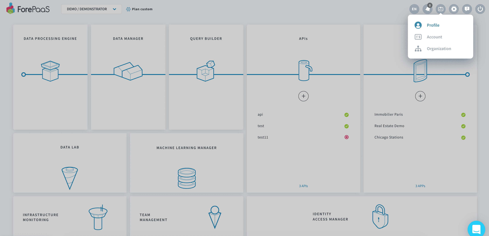
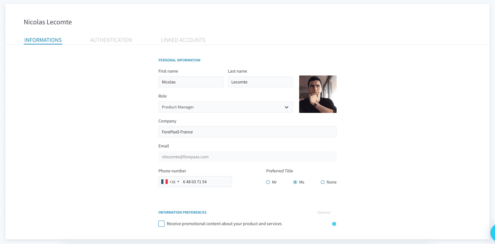
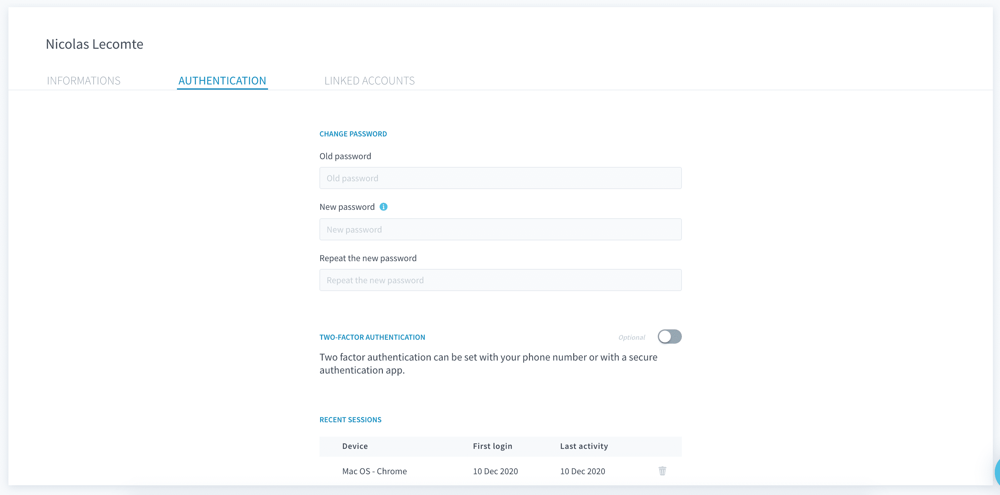
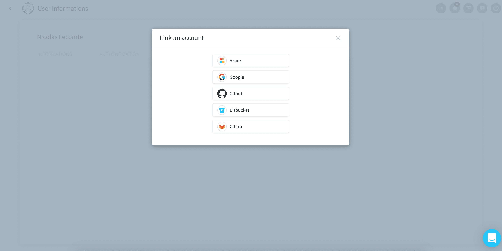

# ForePaaSアカウントの編集

右上の「[Profile（プロファイル）](https://hq.forepaas.io/#/user)」をクリックすると、いつでもプラットフォームでユーザープロファイルの表示と編集を行うことができます。

「**Informations（情報）**」タブでは、各自のプロファイルの基本的なユーザー情報を編集できます。

「**Authentication（認証）**」タブでは、パスワードの変更、多要素認証の管理、最近のサインインの追跡を行うことができます。

「**Linked Account（リンクされたアカウント）**」タブでは、ForePaaSにサインインするのに使用するシングルサインオン（SSO）アカウントの管理を行うことができます。

