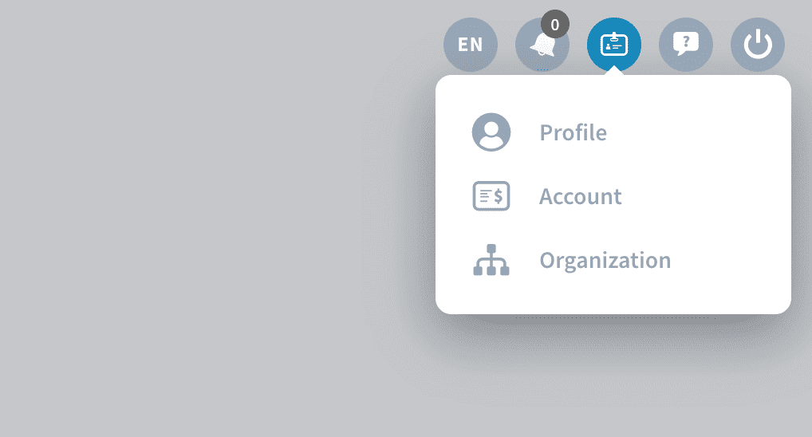

# 組織およびプロファイル

ForePaaSを使用するには、最初にユーザープロファイルを作成する必要があります。この作業は5分程度で完了し、**費用は一切かかりません**。

その後、**組織**を作成するか、組織に参加することができます。これはプロジェクトに取り組むチームメイトで共有するワークスペースです。組織に参加したら、[データプラント](/jp/product/dataplant/index)を作成できます。データプラントは個別のデータプロジェクトを実施するための専用の環境です。通常、データプラントはそれぞれ1つのプロジェクトに対応しています。

> 💡 ForePaaSはサブスクリプションプランの購入を通じて組織レベルで請求が行われます。 

---
## ForePaaSアカウントの作成
プラットフォーム上にアカウントを作成してForePaaS上のチームに参加します。これには費用は一切かかりません。

{ForePaaSプロファイルを作成する}(#/jp/product/account-setup/create-account.md)

---
## 組織の作成または組織への参加

組織は、特定の企業またはビジネスユニットを表します。組織には、複数のデータプロジェクトに取り組むすべてのチームメイトを追加できます。

{組織の詳細を確認する}(#/jp/product/account-setup/organization-create.md)

---
## 組織に対するサブスクリプションの有効化

**ForePaaSでは、ユーザー単位やデータプラント単位ではなく、組織のサブスクリプションプランと利用状況に応じて料金が発生します**。[課金アカウント](jp/product/billing/account/index)を通じて各自の組織用のサブスクリプションを購入できます。

{サブスクリプションを開始する}(#/jp/product/billing/index.md)

---
## 最初のデータプラントの作成

データプラントは、AIプロジェクトやAIアプリケーションを作成するための小さな工場のようなものです。ここには、生データの抽出から復元まで、必要なすべてのコンポーネントが含まれています。データプラントにはそれぞれに専用のリソースセットが存在し、プロジェクトのニーズに応じてこれらのリソースを自由に割り当てることができます。

{最初のデータプラントを作成する}(#/jp/product/dataplant/create-dataplant.md)

---
## ご意見をお寄せください🗣️

製品をより良いものにしていくには、皆さまからのご意見が不可欠です。弊社のサポートチームと製品チームは、皆さまにサービスを円滑にご利用いただけるよう全力で取り組んでいます。このためには、**皆さまに気兼ねなくご連絡いただき**、**皆さまの正直な声を聞かせていただく**ことが重要です。うまく機能している部分とそうでない部分を把握することで、サービスの改善に役立てていくことができます。

以下の2つのチャネルからご意見をお寄せください。
* **アイデアをお持ちの場合** 💡 [製品ポータル](https://hq.forepaas.io/#/features)で機能に関する要望やアイデアを送信するか、ナビゲーションバーの右上にある「*Roadmap（ロードマップ）*」をクリックしてプラットフォームから直接アクセスします。
* **サポートが必要な場合** 🆘 [サポートポータル](https://support.forepaas.com/hc/en-us/requests)で支援を依頼するか、ナビゲーションバーの右上にある「*Support（サポート）*」をクリックしてプラットフォームから直接アクセスすることができます。また、*support@forepaas.com*宛にメールを送付することもできます。