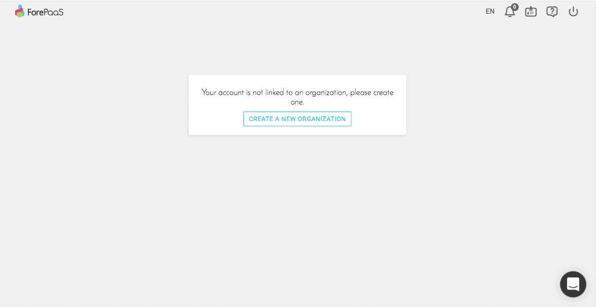
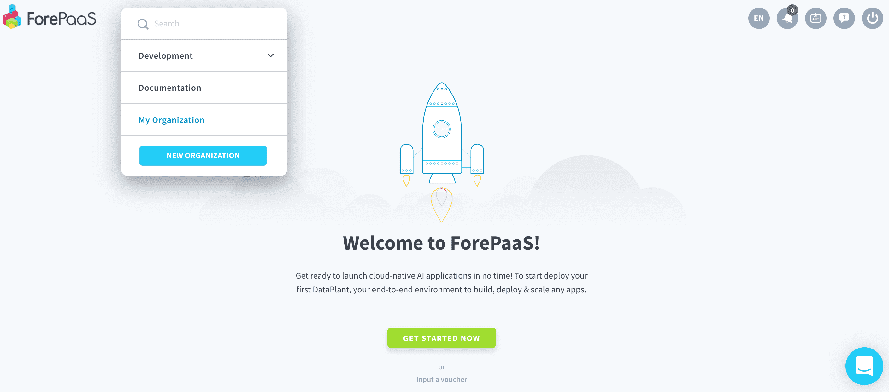
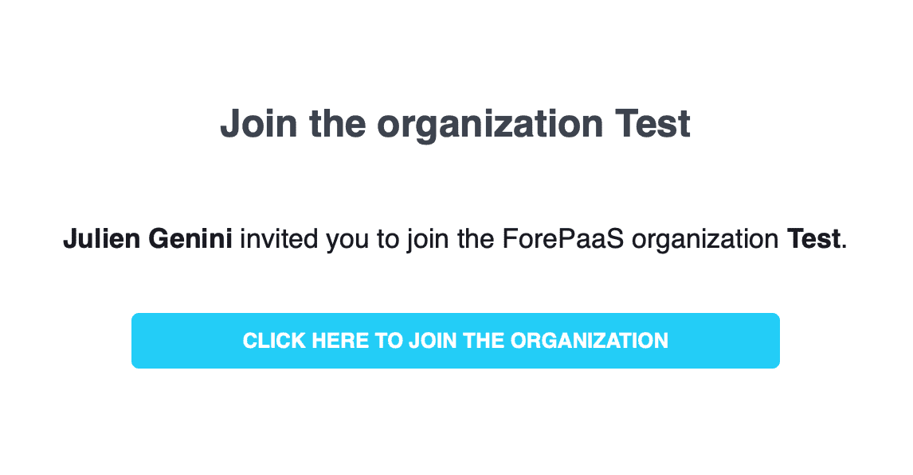
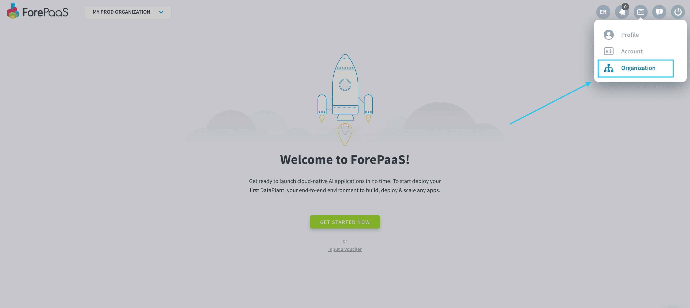

# 組織の作成または組織への参加
組織は、個別のユーザー、データプラント、プランをつなぎ合わせたコンパートメント化されたチームです。組織内にはチームメイトを必要な数だけ含めることができます。 

組織は同時に複数のデータプロジェクトで作業を行うことができます。各プロジェクトは[データプラント](/jp/product/dataplant/index.md)内で実行され、必要な数だけデータプラントを作成できます。

> 組織を作成または組織に参加するには、[ForePaaSのユーザーアカウント](/jp/product/account-setup/index.md)を保有している必要があります。

---
## 組織の作成
[プラットフォームのWebサイト](https://hq.forepaas.io)に移動します。

### いずれの組織にも参加していない場合
いずれの組織にも参加していない場合、次のようなページが表示されます。

「**Create a new organization（新しい組織を作成）**」をクリックします。

### すでにいずれかの組織に参加している場合
すでにいずれかの組織に参加している場合は、左上のドロップダウンメニューをクリックしてから、「**Create a new organization（新しい組織を作成）**」をクリックします。

名前を入力し、「**Done（完了）**」をクリックします。

---
## 既存の組織への参加
既存の組織に参加するには（チームがすでに組織を保有している場合など）、その組織にすでに参加している人に招待してもらう必要があります。

{ユーザーを招待する方法を確認する}(#/jp/product/account-setup/organization-invite-user.md)

組織への参加を招待する、クリック可能なリンクが記載されたメールが受信されます。

---
## 組織の設定の管理

それぞれの組織を管理するには、右上のドロップダウンメニューを開き、「**Organization（組織）**」をクリックします。

ここでは、以下の設定を行うことができます。
- ユーザー
- データプラント
- ストレージエンジン
- クオータ
- 課金設定
- その他のパラメータ：名前、説明、SSL証明書、ドメイン名など

{組織を設定する方法を確認する}(#/jp/product/account-setup/organization-settings.md)