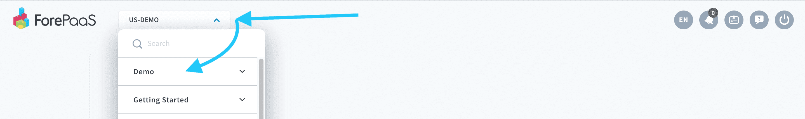
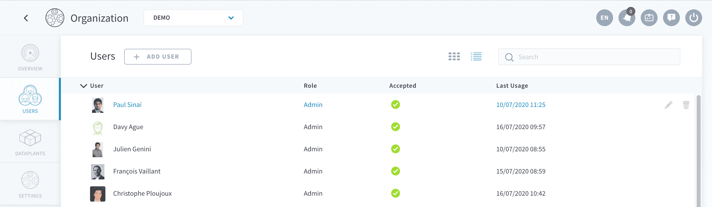
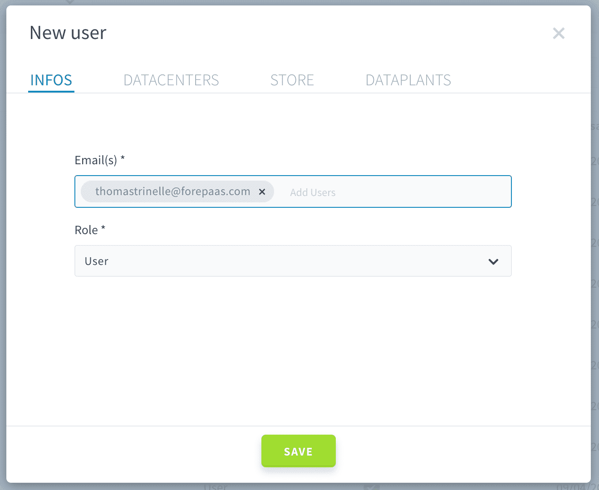
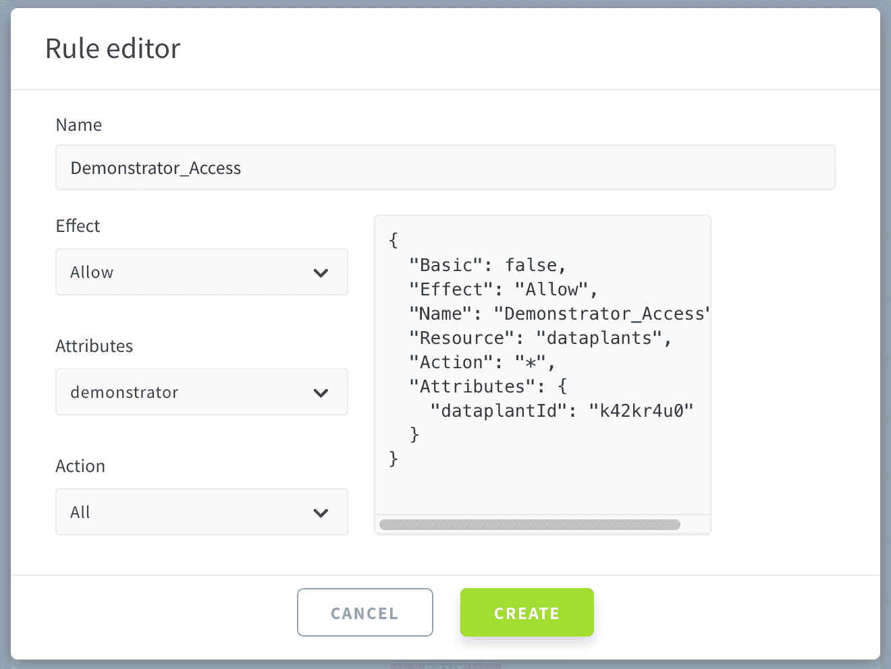
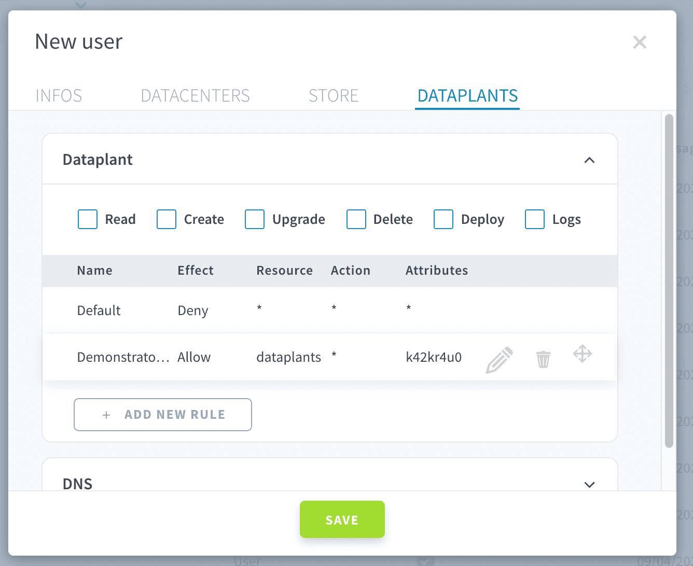
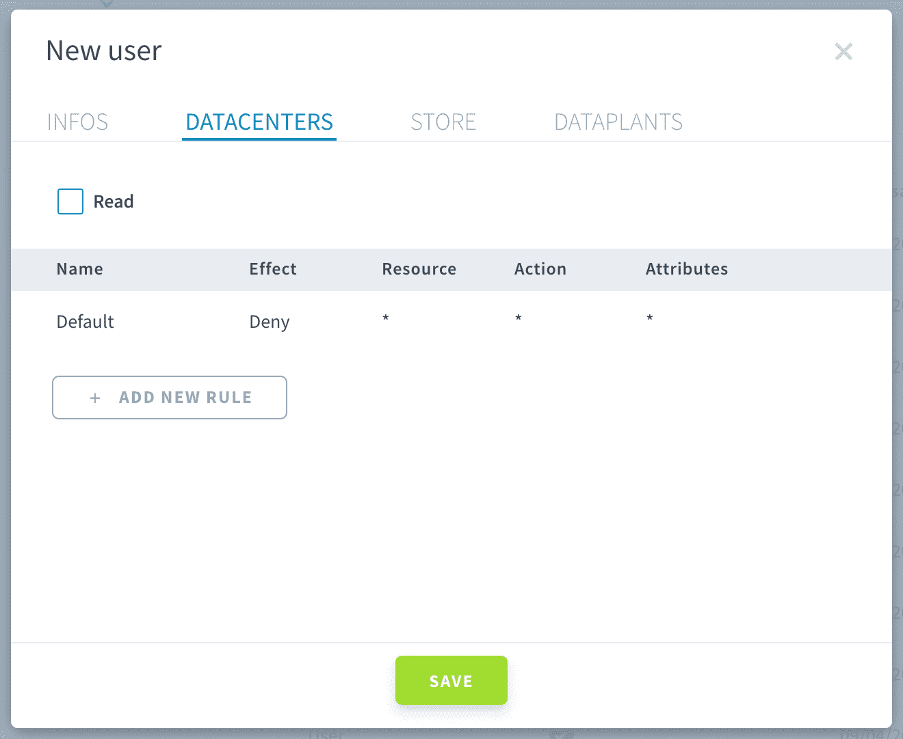
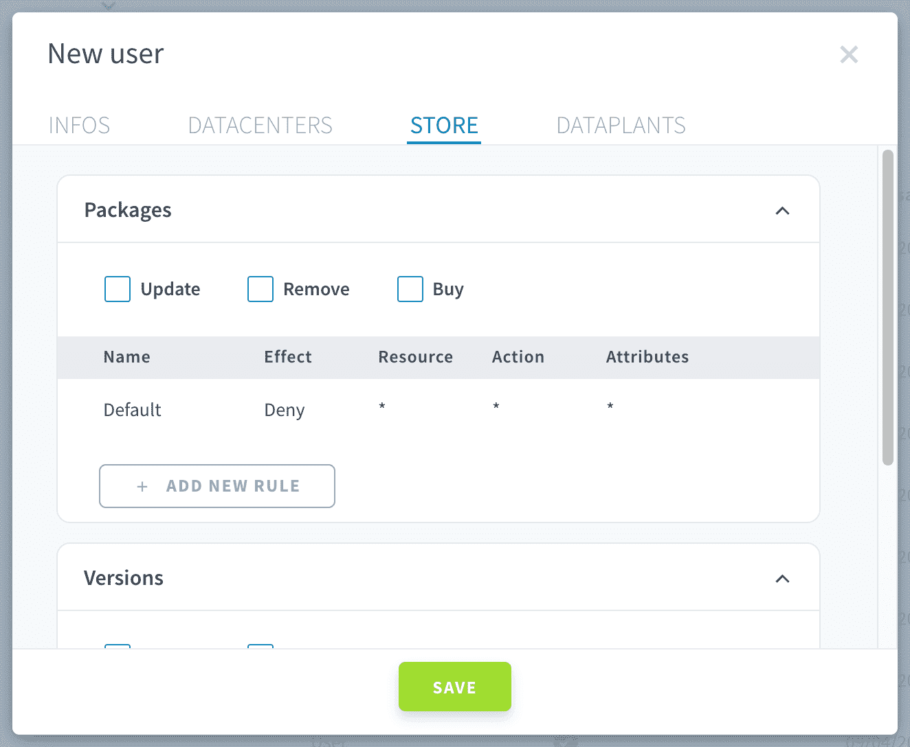
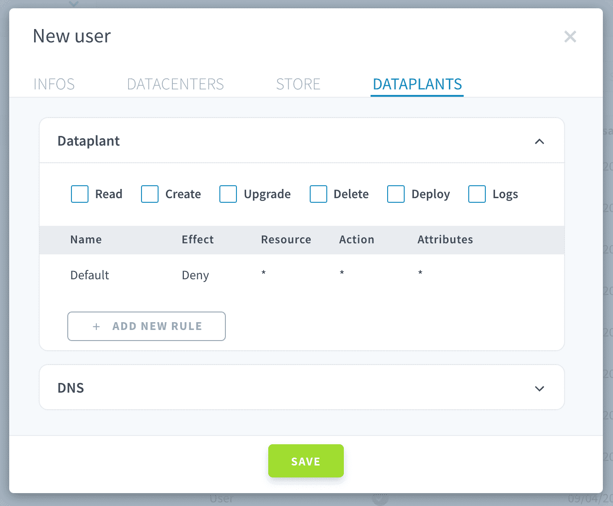
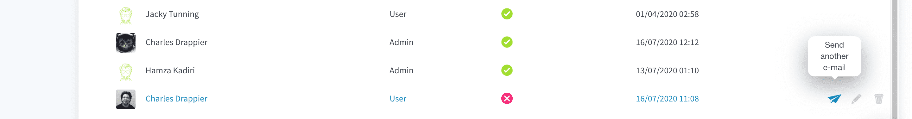

# 組織へのユーザーの追加

ForePaaSでは、コラボレーターを組織に簡単に招待できます。このページでは、次の内容について説明します。
- [ユーザーを招待する方法](/jp/product/account-setup/organization-invite-user?id=adding-users) 
- [アクセス制御ルールを管理する方法](/jp/product/account-setup/organization-invite-user?id=Access-Control-ACL-Rules)

---

## ユーザーの追加

### 組織のユーザーリスト

[ForePaaS](https://hq.forepaas.io)に直接アクセスし、左上のドロップダウンメニューをクリックして、ユーザーを追加する組織にアクセスします。

続いて、右上の「**Organization（組織）**」をクリックして組織を開きます。 

「*Users（ユーザー）*」タブをクリックします。自分自身を含む**組織内のユーザーのリスト**が表示されます。

「*+ Add User（ユーザーを追加）*」ボタンをクリックしてコラボレーターを招待します。

### ユーザー情報の入力

新しいユーザーがForePaaSアカウントを所有しているかどうかに関係なく、新しいユーザーの**メールアドレス**を入力します。
* このユーザーが*ForePaaSアカウントを所有していない*場合、ForePaaSプラットフォームにサインアップしてログインするための招待が送付されます。ここからサインアップしてメールを承認すると、自動的に組織に追加されます。
* このユーザーが*ForePaaSアカウントを所有している*場合は、組織への参加を促されます。

ユーザーの**ロール**を選択する必要があります。組織には次の2つのロールがあります。
* **Admin**：Adminには、組織のすべてのエレメントに対する**すべてのアクセス権限とコントロール権限**があります。Adminは、データプラントやユーザーの編集、管理、削除を行うことができ、組織のサブスクリプションプランの変更も可能です。また、組織内で展開されたデータプラントのすべてのサービス（DPE、Data Managerなど）にも事実上アクセスできます。

* **User**：Userには、デフォルトで**アクセス権限やコントロール権限は一切付与されていません**。デフォルトでは、Userは組織内に存在するデータプラントを参照することもできません。Userにできるのは、組織と組織の詳細（ユーザー、プラン、クオータなど）にアクセスすることだけです。ただし、**アクセス制御ルール**を使用すると、ユーザーに特定の権限を割り当てることができます（以下を参照）。

次の3つのタブ（データセンター、ストア、データプラント）に移動して、新しいユーザーのアクセス制御ルールを指定します。

---

## アクセス制御（ACL）ルール

組織レベルで管理できるルールには、次の3つの主要なカテゴリーが存在します。
* [データセンターアクセス権限](jp/product/account-setup/organization-invite-user?id=datacenters) - ユーザーは組織に関連付けられた特定のクラスターや場所にデプロイできます。これは*Premiumプラン*のみに適用されます。
* [ストアアクセス権限](jp/product/account-setup/organization-invite-user?id=store) - ユーザーはForePaaSストアや内部マーケットプレイスにデプロイされた拡張を公開して活用できます。プラットフォームの[内部マーケットプレイス](#/jp/product/dataplant/marketplace)に関する詳細記事を参照してください。
* [データプラントアクセス権限](jp/product/account-setup/organization-invite-user?id=dataplants) - ユーザーに特定のデータプラントや特定のデータプラント内のサービスに対するコントロール権限を付与できます。

### ルールの作成

ルールを作成するには、必要なルールのカテゴリーに移動して、「*+ Add a rule（ルールを追加）*」をクリックします。ルールエディター画面内で、以下の手順に従います。  

例えば、以下の例のルールでは、データプラント*demonstrator*（属性を*demonstrator*に設定）に対するすべてのアクセスとコントロール（アクションを*All*に設定）がユーザーに対して許可されます。

作成されたルールは特定のカテゴリー内に表示され、*ドラッグアンドドロップ操作で順序を変更*したり、*編集*や*削除*を行ったりすることができます。
  

!> ルールは追加式です。つまり、複数のルールを「積み重ねて」使用します。 

*例：*2つのデータプラントへのアクセスを許可するには、2つの異なるルールを作成し、それぞれのルールで個別にこれらのデータプラントへのアクセスを許可します。

!> ルールの順序は重要です。重複する2つのルールがある場合（両方のルールの影響を受けるサービスが少なくとも1つ存在する場合）、最後に処理されるルールが優先されます。    

*例：*すべてのデータプラントへのアクセス権限を付与するルール（ルール1）と、これらのデータプラントのうちの1つへのアクセスをブロックするルール（ルール2）がある場合：
* ルール1がルール2の後にある場合、ルール1が最後に処理されるため、ユーザーはすべてのデータプラントにアクセスできます。
* ルール1がルール2の前にある場合、ルール2が最後に処理されるため、ユーザーはルール2で制限されるデータプラントを除くすべてのデータプラントにアクセスできます。

以下のルールの各カテゴリー（データセンター、ストア、データプラント）を確認してください。

### **データセンター**

これらはデータプラントを作成する際のデータセンターの可視化権限です。データセンターごとに権限を1つずつ追加するか、「Read（読み取り）」ショートカットにチェックを入れてすべての権限を付与することができます。

### **ストア**

組織ではForePaaSストアに「パッケージ」を保有しているか、今後使用することになるはずです（これらを利用することで、テンプレートからデータプラントやアプリケーションなどを素早く作成できます）。
このタブでは、これらの「パッケージ」や「バージョン」に権限を割り当てることができます。
パッケージ：
  - Update (update)：名前の変更、説明、画像など...
  - Remove：パッケージの削除
  - Purchase (Buy)：ForePaaSプラットフォームの他のユーザーが作成したパッケージを購入する権限を付与

バージョン：
  - Update (update)：パッケージのバージョンの変更
  - Remove：バージョンの削除

### **データプラント**

この部分は最も重要で、データプラントやさまざまなカスタムドメイン（存在する場合）にアクセスするユーザーの権限を定義することができます。これらの権限はデータプラントごとに変更することができます。

データプラント：
  - Read：組織のデータプラントの参照を許可
  - Create：データプラントを作成する権限を付与
  - Upgrade：データプラントに割り当てられたFPUの数を変更
  - Delete：データプラントを削除
  - Deploy：データプラントでアプリケーションやワーカーをデプロイする権限を付与
  - Logs：データプラント内に存在する各種サービス（DPE、DM、QBなど）のモニタリングやログへのアクセスを許可

DNS：
  - Update：DNSの変更
  - Create：カスタムドメインの作成
  - Delete：カスタムドメインの削除

### 確認

設定が完了して、**選択内容を確認すると、組織への参加を招待するメールがユーザー宛に送付**されます。ユーザーにメールが届かない場合やユーザーが組織へ参加するのを忘れている場合は、いつもで紙飛行機のアイコンをクリックして招待を送付し直すことができます。

> 組織への参加の招待を承認していないユーザーは、「**status（ステータス）**」が❌で示されます。招待を承認して組織に参加したユーザーは✅で示されています。

ユーザーがメールに記載されている招待のリンクをクリックすると、ユーザーは（そのユーザーに割り当てられた権限に応じて）組織とその組織のデータにアクセスできるようになります。

---

以下の記事では、組織のその他の設定（サブスクリプションプラン、課金情報、クオータなど）の管理方法について説明します。

{組織のセットアップと管理💼}(#/jp/product/account-setup/organization-settings)