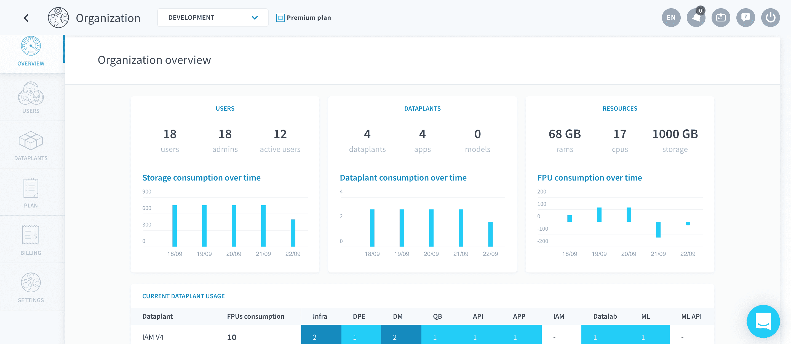
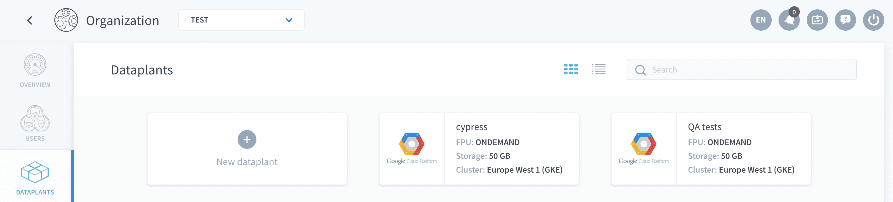
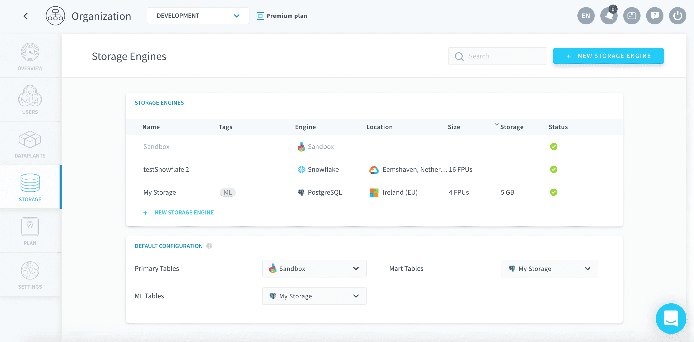

# 組織の設定の編集

組織の設定を開くには、画面の右上に移動し、**バッジ💳アイコン**の上にマウスカーソルを合わせます。「**Organization（組織）**」をクリックします。 

---
## 概要

組織のダッシュボードには、次のように、ForePaaS上での組織の主要情報の概要が表示されます。 
- ユーザーおよび管理者の数
- データプラントの使用状況
- リソース使用量

また、データプラントの主要な使用状況メトリックを確認することもできます。

---
## ユーザー

組織のメンバーの管理、新規メンバーの追加、アクセス権限の編集を行います。 

!> これらは組織のメンバーであり、Identity Access Manager（IAM）にあるデータプラントのユーザーとは異なります。 

{組織のメンバーを管理する}(#/jp/product/account-setup/organization-invite-user.md)

{IAMでデータプラントのユーザーを管理する}(#/jp/product/iam/users/index.md)

---
## データプラント
「Dataplants（データプラント）」タブでは、現在参加している組織内で作成されたすべての[データプラント](jp/product/dataplant/index)の概要を確認し、これらに直接アクセスできます。 

また、次の操作を行うこともできます。
* **Switch（切り替え）**：必要に応じて、別の組織にデータプラントを切り替え
* **Delete（削除）**：データプラントを削除

---
## ストレージ
「Storage（ストレージ）」タブでは、組織に追加したすべての**ストレージエンジン**の概要を確認し、これらに直接アクセスできます。

{ストレージエンジンの詳細を確認する}(/#/jp/product/dataplant/storage-engine/index)

---
## クオータ

?> この機能は準備中です。

クオータは、すべての組織に対して自動的に設定される制限です。クオータは誤って過度な利用が生じるのを防ぐための機能で、すべてのクラウドプロバイダーが設定しています。  
銀行が1週間あたりの引き出し限度額や支払い金額の上限を設定しているのと同じだと考えてください。  

> クオータを自分で変更することはできません。クオータを変更する場合は、クオータページで依頼を送信します。ForePaaSの専門スタッフがすぐに折り返しご連絡します。

---
## プラン
「Plan（プラン）」タブでは、**サブスクリプションプランの管理**を行うことができます。現在のプランに含まれているすべての機能と、アップグレードオプションが表示されます。  

- 「*Billing（請求）*」では、コストカテゴリーごとの過去1か月の内訳を含む次の請求書の詳細を確認できます。
- 「*Receipts（領収書）*」では、過去の請求書をPDFとしてダウンロードできます。

{請求と価格の詳細を確認する}(#/jp/product/billing/index.md)

---
## 設定

「Settings（設定）」タブでは、以下の管理を行います。
- 組織の**基本的なセットアップ**（名前、説明、色、2FA、プランのキャンセル）
- **連絡先**の詳細
- **インフラストラクチャ**オプション：ドメイン名と証明書。ForePaaSにデプロイしたアプリケーション用にドメイン名をカスタマイズし、セキュアドメイン名にアクセスするためのSSH証明書を作成することができます。
証明書を追加する際には、サーバーの証明書（.crtファイル）またはキー（.key）が必要です。

