# 最初のAPIのデプロイ

このチュートリアルでは、ForePaaSストアからAPIをデプロイする方法について学習します。
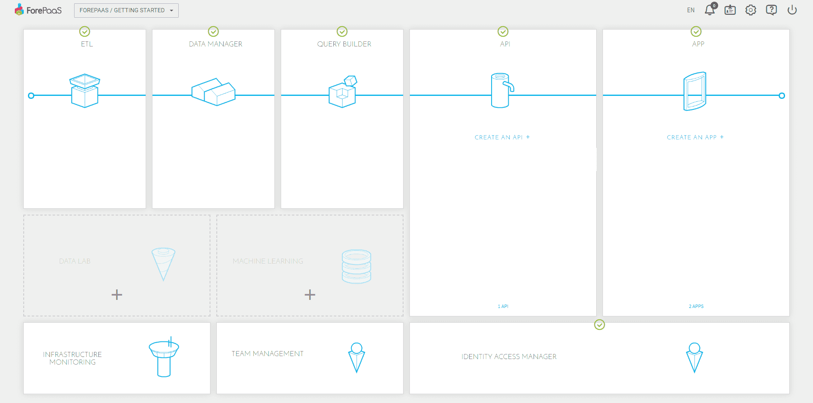
データプラントのメインページで、「APIの作成」を選択します。

次の2つの選択肢があります。
* __ストアから作成__：ストアから新規プロジェクトを作成
* __インポート__：既存のプロジェクトをインポート

{マーケットプレイスの詳細を確認する}(#/jp/product/dataplant/marketplace)

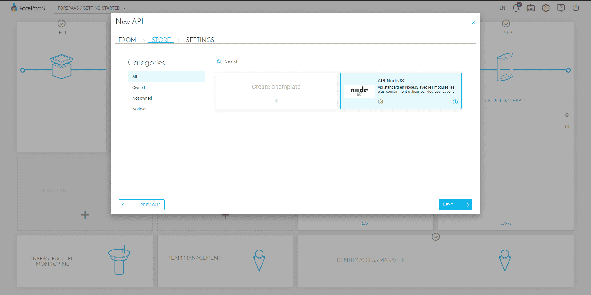
さまざまなテーマのAPIが利用できます。このデモでは、「API NodeJS」を選択します。

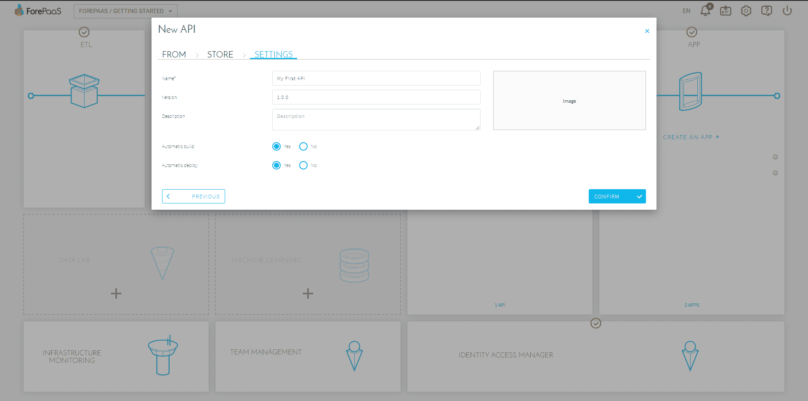
APIの名前を指定し、自動ビルドを有効にします。 

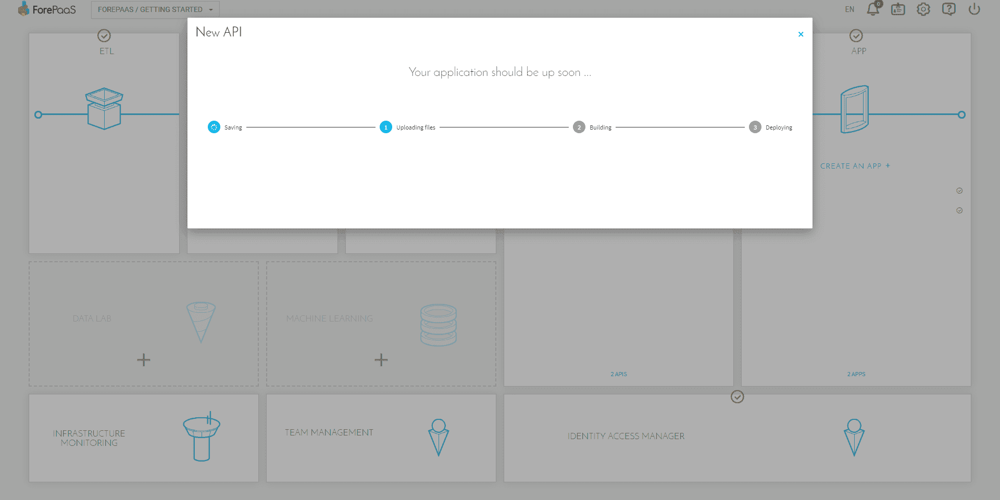
APIの作成には少し時間がかかります。

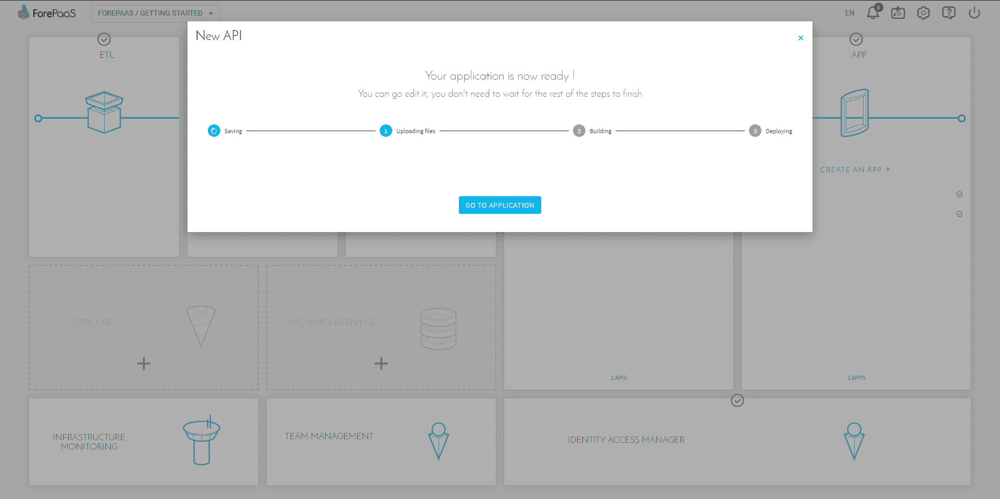
バックアップとAPIのアップロードが完了したら、この場所で待機するか、「Go to application（アプリケーションに移動）」をクリックしてデプロイをモニタリングできます。

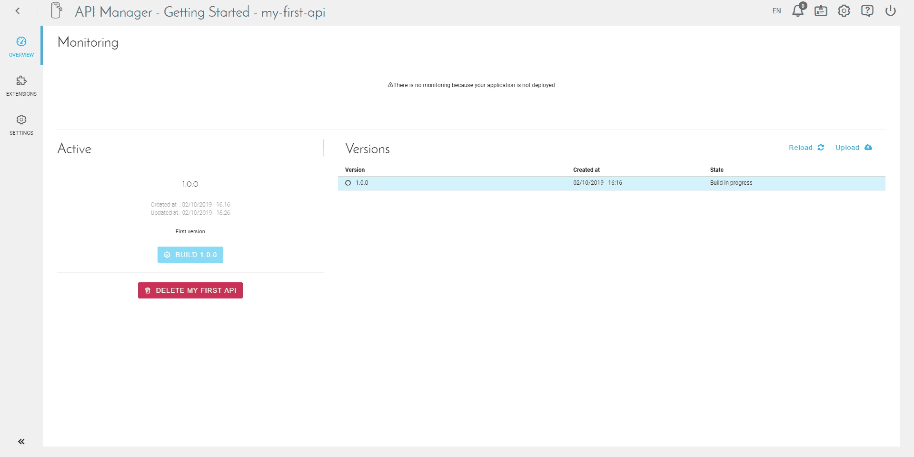
APIコンポーネントのホームページに移動します。
APIコンポーネントのホームページは、次の3つの部分に分かれています。
* __Monitoring（モニタリング）__：デプロイ後のAPIのステータス
* __Active（アクティブ）__：「アクティブ」バージョン（現在作業中のバージョン）のステータス
* __Versions（バージョン）__：APIで利用可能なすべてのバージョン（タグともいう）のリスト

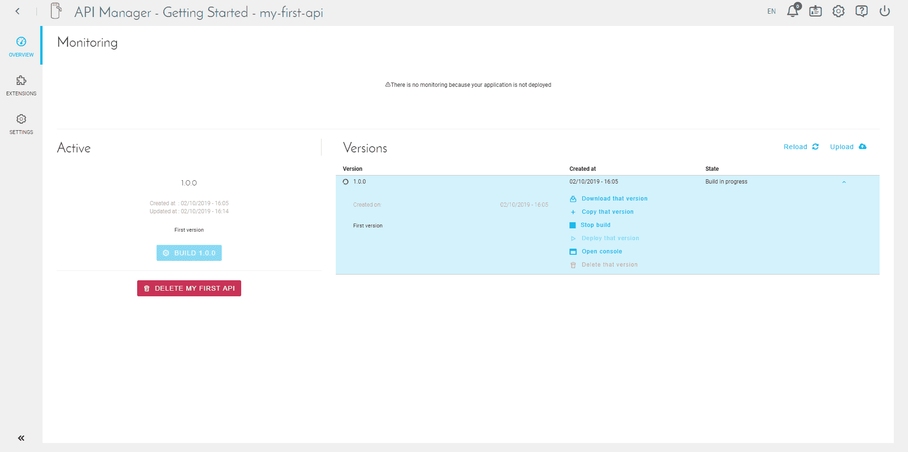
右側にある矢印を使用して、作成したバージョンの詳細を確認できます。

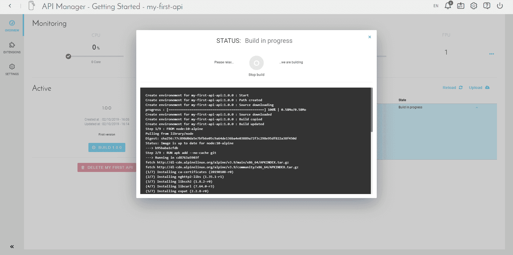
「Open Console（コンソールを開く）」をクリックして、アクティビティログを確認します。APIの作成時に自動ビルドを有効にしているため、すでにビルドが開始されています。 

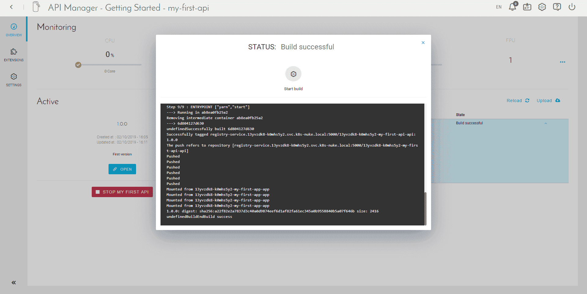
完了すると、ログの最後に「EndBuild success」と表示されます。

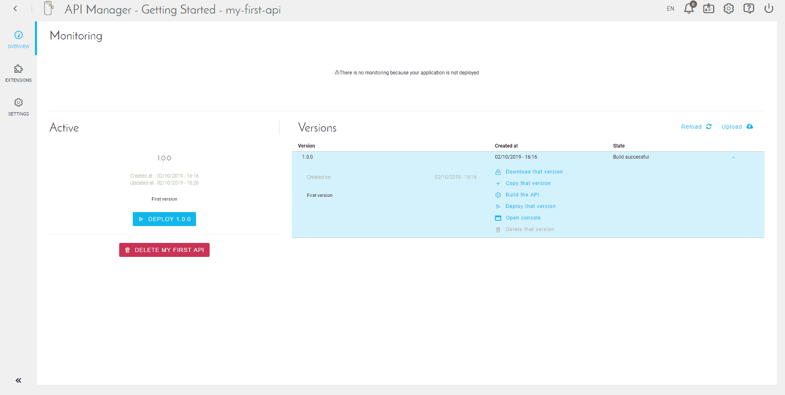
デプロイを開始するには、「Deploy（デプロイ）」をクリックしてださい。

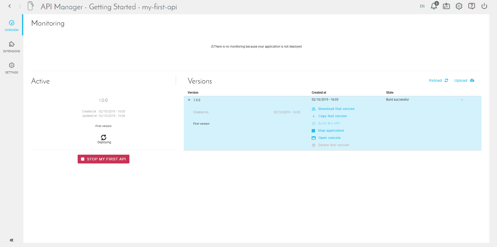
デプロイが開始されます。これには数分かかります。

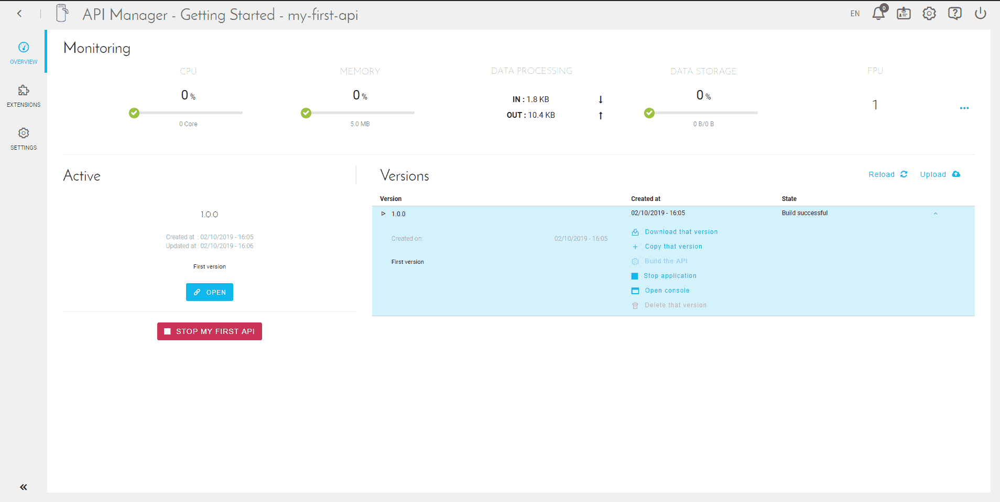
デプロイが完了すると、「Open（開く）」ボタンが表示されます。

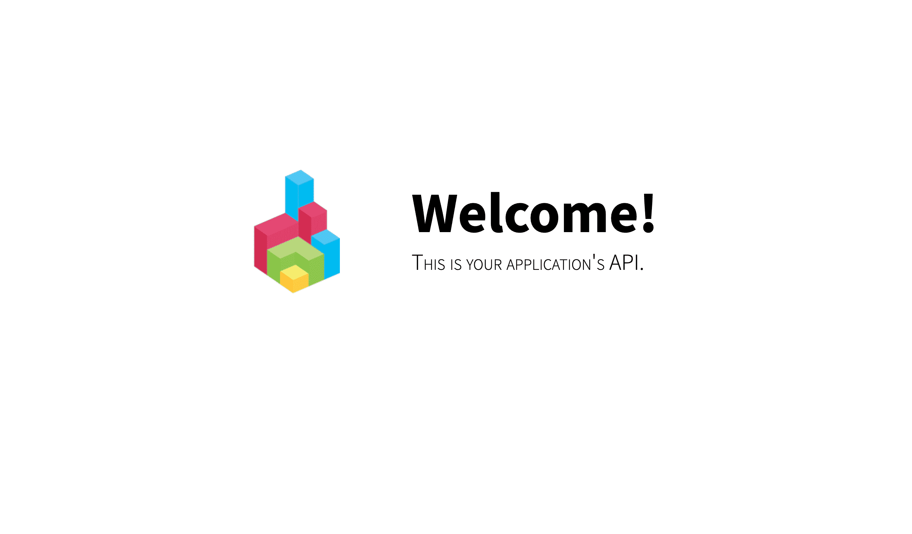
APIを開くと、この画面が表示されます。

APIにアクセスするには、アプリケーションをインストールしてAPIに接続します。APIのエンドポイントをそのまま使用することもできます。