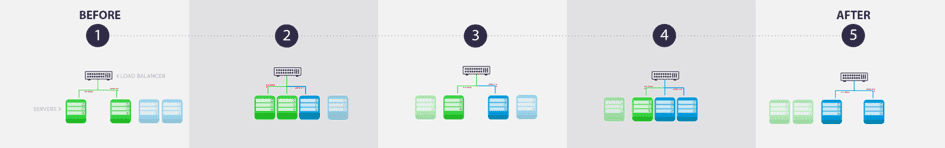

# API Manager

## API Managerとは

収集、保管されたデータおよびForePaaSプラットフォーム上に保管されたデータに、APIを介してアクセスします。

API（*Application Programming Interface*）は、各種コンポーネント、マシン、アプリケーション間で情報をやり取りするための明示的に定義された一連のメソッドです。

ForePaaSでは、APIコンポーネントを使用して**セキュアゲートウェイ**を作成できます。APIにより、データベースの種類を気にすることなく、同じクエリ構文（Query Builder）を使用することが可能になります。また、データベースが直接関与しないため、データベースのセキュリティが確保されます。

APIは次の方法で作成できます。
* ForePaaSに用意されているローコード環境を使用
* NodeJSのSDK（*Software Development Kit*）を使用

## 作成とデプロイ

ForePaaSプラットフォームは、分析アプリケーションを完全に実装することができるようになっており、APIおよびアプリケーションの作成では、アーティファクトを作成してデプロイを行う必要があります。実際、運用環境で変更を行うには、作成とデプロイを行う必要があります。

コンポーネント（API、アプリケーション、機械学習APIなど）をホストする専用のコンテナイメージが自動的に準備されることで、アーティファクトの作成が行われます。デプロイを行うと、このイメージからコンテナが作成され、分析アプリケーションに対する変更にアクセスできるようになります。

 
*図1：ForePaaSでのアーティファクトの作成*

ForePaaSプラットフォームでは、ブルーグリーン・デプロイ・モードを使用します（図2を参照）。これは、ブルーとグリーンの2つの同一の運用環境を実行することで、ダウンタイムとリスクを抑える手法です。常にいずれか一方の環境のみがライブ環境となり、ライブ環境ですべての運用トラフィックが処理されます。 

*図2：ブルーグリーンデプロイの概略図*

APIのデプロイが完了すると、ノードの追加や削除を行うことができます。それぞれのノードは作成されたアーティファクトのインスタンスを実行するコンテナです。これらのノードは、図2のグリーンおよびブルーのサーバーで表されます。このノード管理によって、APIのパフォーマンスを向上させることができます。これは水平スケーラビリティと呼ばれます。

{API Managerの詳細を確認する}(#/jp/product/api-manager/interface)

---

##  サポートが必要な場合🆘

> サポートの依頼が必要な場合は、いつでもプラットフォームの「*Support（サポート）*」タブから直接依頼を送信することができます。また、support@forepaas.com宛にメールを送付することもできます。

{サポートに質問を送付する🤔}(https://support.forepaas.com/hc/en-us/requests)