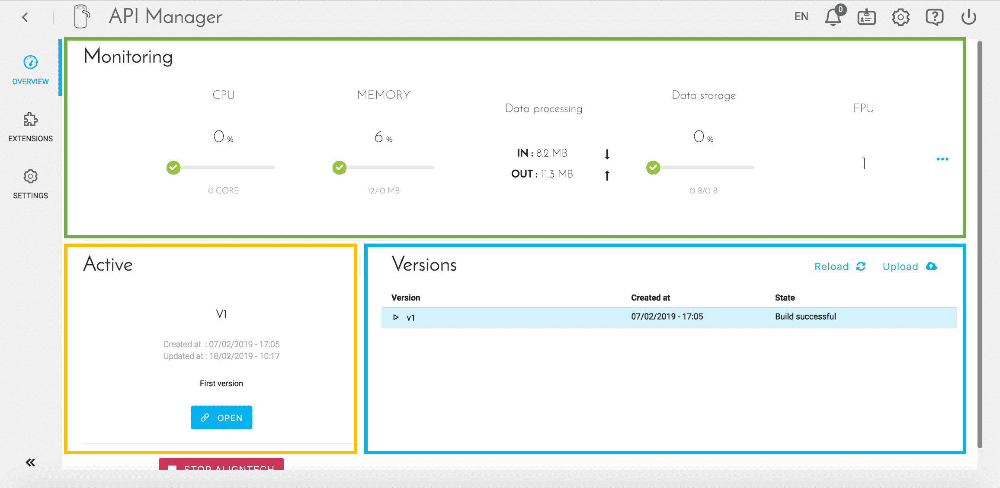
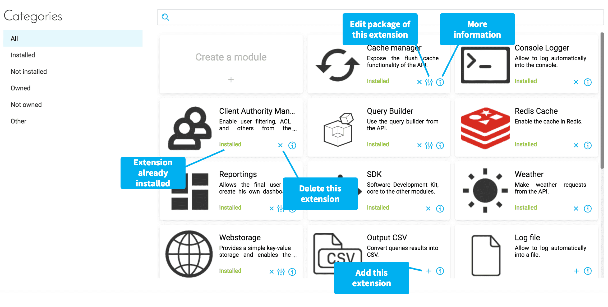
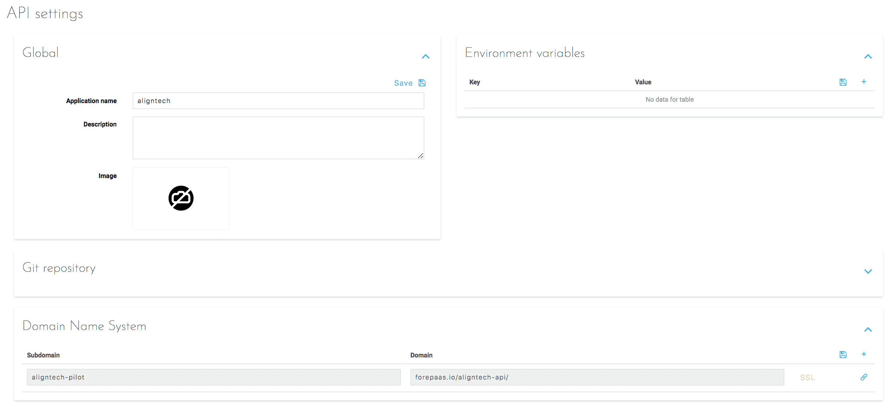

# API Managerのインターフェース

## 概要

最初のAPIが作成されると、APIの管理インターフェースにアクセスできるようになります。「*Overview（概要）*」タブでは、APIのライフサイクル全体を容易に管理できます。

この画面は、次の3つの部分に分かれています。
* 上部のブロック（緑）には、**APIで使用されるリソースに関する指標**が表示されます。これらの指標を用いて、インスタンス数を増やす必要があるかどうかなどを把握できます。

* 左側のブロック（黄）には、（運用中の）**アクティブバージョンのステータス**が表示されます。バージョンの状態（新規／作成済み／デプロイ済み）に応じてショートカットがボタンで提示されます。

* 右側のブロック（青）には、**APIの各種バージョン**が表示されます。アクティブバージョンは青で表示されます。各バージョンごとに、次のようなさまざまなアクションを実行できます。
    * 同期／ダウンロード - コードソース（ZipファイルまたはGitリポジトリ）の種類に応じたアクション
    * バージョンの複製
    * このバージョンのアーティファクトの作成
    * バージョンのデプロイ／停止
    * 作成コンソールを開く
    * バージョンの削除 - バージョンがデプロイされていない場合のみ

## 拡張の設定

マーケットプレイスを介してAPIを作成する場合、後者は「*Extensions（拡張）*」タブで参照できるデフォルトの拡張を使用して作成されます。

{拡張リストを参照する}(#/jp/product/api-manager/extensions-list.md)
 
この画面では、カテゴリ別に整理されたライブラリを表示し、次のことを行うことができます。
* すでにインストールされている場合や新しいバージョンのライブラリを取得する必要がある場合に拡張を削除
 
* 必要な場合やインストールされていない場合に拡張を追加

* 可能な場合にコンポーネントを設定

* ライブラリに関する関連情報にアクセス

* プロジェクトや組織に固有のオープンソースや独自の拡張をインポート

## 設定

「*Settings（設定）*」タブでは、3つのタイプのAPI設定を設定できます。

 
* **Global（グローバル）**：名前、説明、メインイメージなどのグローバルAPI情報が記載されます。

* **Environment Variables（環境変数）**：APIが動作するのに必要な変数を定義します。APIおよび各種拡張の円滑な動作に必要な変数が自動的に入力されます。ここにはビジネスニーズに固有の変数のみを記載します。

* **Domain Name System（ドメイン・ネーム・システム）**：デフォルトで生成されるURLの他に、APIにアクセスできるようにするため、1つ以上のURLを追加できます。組織レベルの別のドメインを追加している場合を除き、これらのURLのドメインは「forepaas.io」になります。