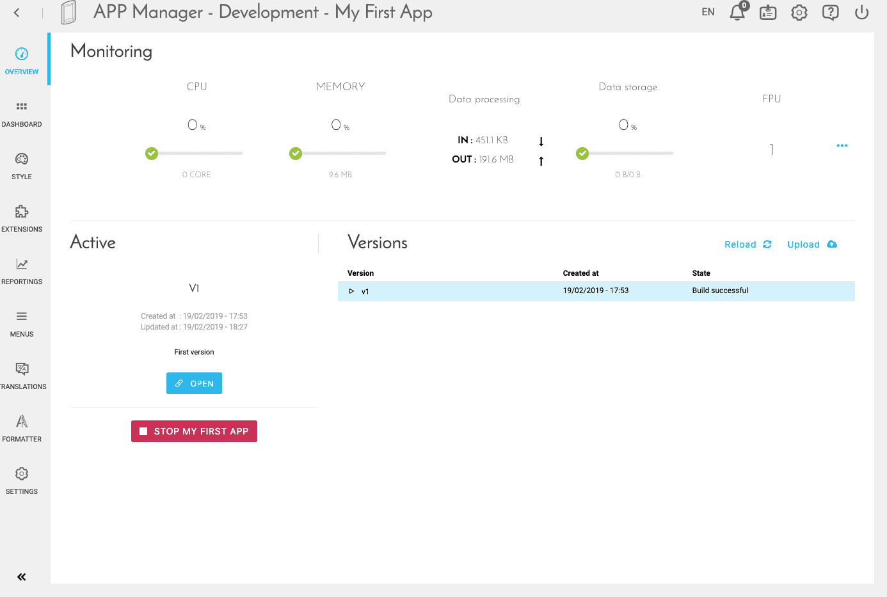
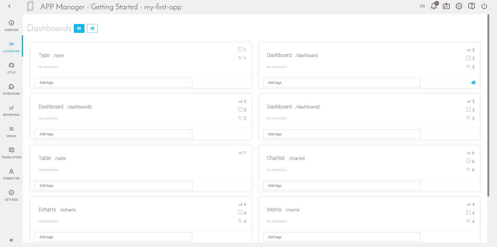
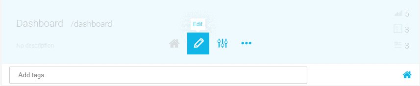
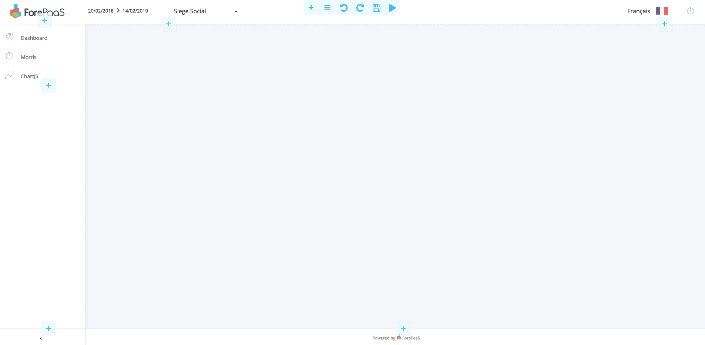
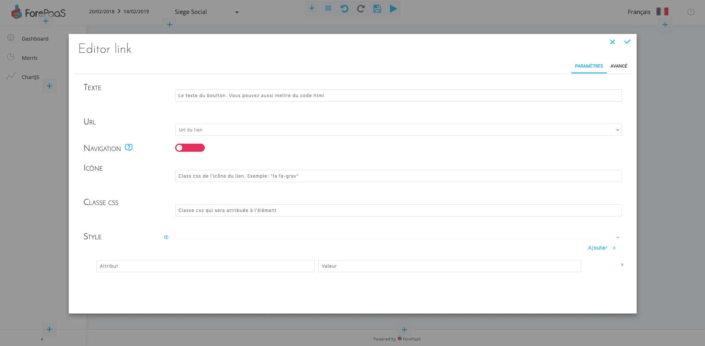
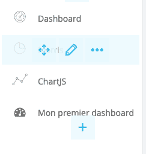
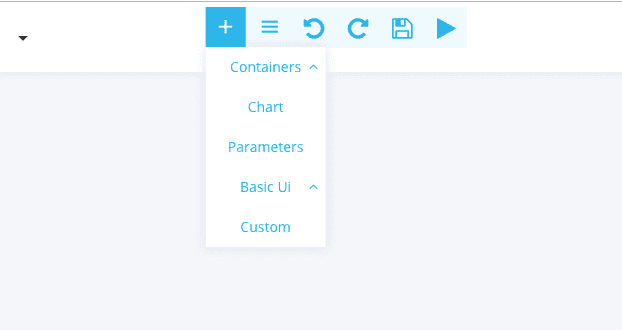
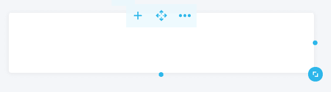
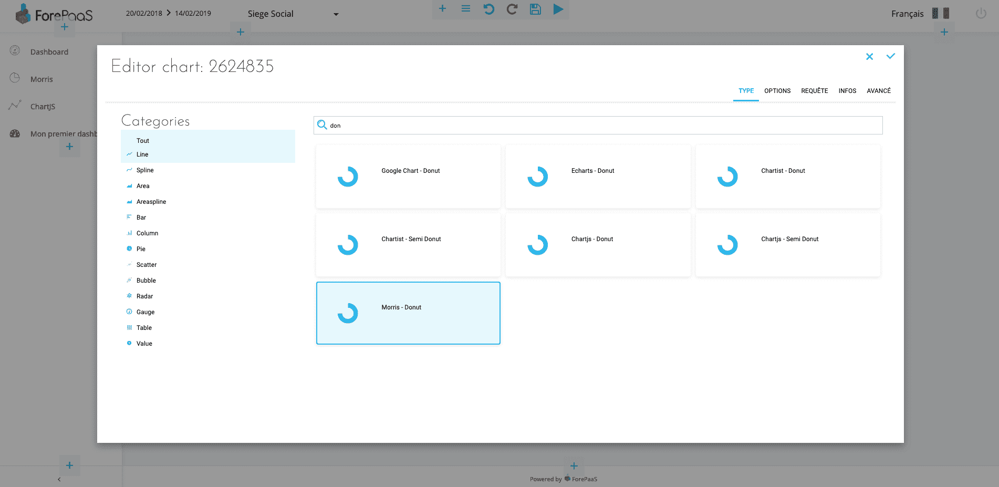

# 最初のダッシュボードの作成（ポイント・アンド・クリック）

始める前に、アプリケーションをデプロイしておく必要があります。  
このためには、「ReactJS - Dashlab」アプリケーションなどを使用し、自動ビルドとデプロイを行います。  
この例のスクリーンショットは、同じアプリケーションテーマを元に作成されています。

## メイン画面とダッシュボードの作成

はじめに、アプリケーションの「Overview（概要）」画面に移動します。  

この画面で、「Dashboard（ダッシュボード）」を選択します。

この画面では、新しいダッシュボードの作成、削除、編集などを行うことができます。
ここでは、新しいダッシュボードの作成を行います。

1. 画面の「New Dashboard（新規ダッシュボード）」を選択します。
2. ダッシュボードの名前を指定します（例：「My first dashboard」）。

このダッシュボードのURL（アプリケーションの稼働後にURLに表示される）は自動的に入力されます。
このURLは編集できます。このURLは一意でなければならず、複数のダッシュボードで同じURLを使用することはできません。
説明フィールドは任意で、アプリケーションの内容を分かりやすく記述することができます。

ここでは、「Advanced（詳細）」モードについては触れませんが、ダッシュボードのデフォルト動作を変更することもできます。最初はこのデフォルトモードで十分で、変更の必要はありません。

## 新しいダッシュボードの編集

### ダッシュボードへのリンクの追加

ダッシュボードが作成されたら、新しいブロックの上にマウスカーソルを合わせ、「Edit（編集）」をクリックしてエディターモードを開始します。

このページの右上で「フルスクリーン」モードが選択できます。このチュートリアルの次のステップでは、すべてのスクリーンショットをフルスクリーンモードで示します。

このダッシュボードは空白です。さらに、このページを初めて開く場合は、このダッシュボードに移動するためのリンクもありません。

このため、最初にダッシュボードに移動するためのリンクをメニュー内に作成する必要があります。

このためには、左側の列にある「+」ボタンを使用します。「Basic UI（基本UI）」を選択し、続いて「Link（リンク）」を選択します。
リンクエディターが表示されます。

テキストを入力できます（このテキストが画面に表示されます）。この例では、「My first dashboard」と入力します。  
URLフィールドで、前のステップでURLを変更していない場合は、「my-first-dashboard」を選択します。  
また、「Navigation（ナビゲーション）」を選択してアクティブに切り替えます。こうすることで、リンクがアクティブページの場合に、リンクの色を変更することができます。  
それ以外のフィールドはオプションで、リンクをさらにカスタマイズするのに使用できます。この例では、「Icon（アイコン）」に「fa fa-dashboard」を追加します。これはライブラリFont Awesome 4のアイコンに対応しています（https://fontawesome.com/v4.7.0/icons/）。

確認が済むと、リンクが左側のメニューに表示されます。

### ダッシュボードへのグラフの追加

ページにはまだ何も表示されていません。いきなりグラフィックを追加するのも間違いではありませんが、全体を見映えの良いものにするには、最初に「パネル」を追加します。
こうすることで、アプリケーションの「グレー」の背景ではなく、白の背景の上にグラフを表示することができます。
これを行うには、画面の上部にある「+」をクリックします。

「Containers（コンテナ）」を選択し、続いて「Panel（パネル）」を選択します。
次に、パネルの上にマウスカーソルを合わせると表示される矢印を使用して、「パネル」を拡張します。

このパネルの「+」を選択し、「Chart（グラフ）」を選択してこのパネル内に最初のグラフを追加します。

### グラフの設定

#### Type（タイプ）
グラフエディターが表示されます。
最初にグラフのタイプを選択する必要があります。
> 注：チュートリアル「[最初のカスタムグラフの作成](/jp/tutorials/app-manager/chart-spec)」を使用すると、独自のグラフをJavaScriptで直接作成することができます。

この例では、「Morris - Donut」を選択します。
> Morrisはオープンソースのライブラリで、見映えの良いドーナツグラフが利用できますが、詳細なカスタマイズはできません。

#### Options（オプション）
「Options（オプション）」タブという新しいタブが表示されます。このタブは常に表示される訳ではありません。ライブラリによってはクリックによるカスタマイズが利用できない場合があります。

このタブでは、ドーナツグラフの色をカスタマイズできます。デフォルトのテンプレートでも十分にカラフルですので、必要に応じて色を変更できますが、変更しなくても構いません。 

#### クエリ

このタブでは、グラフをQuery Builderで作成したクエリにリンクできます。
クエリを作成したことがある場合は、「Select a Query」をクリックします。

作成したことがない場合は、「Custom Query（カスタムクエリ）」を選択し、インターフェースを介してクエリを直接作成します。

見映えの良いドーナツグラフにするには、1つの「データ」と1つの「スケール」を使用するのが理想的です。
この例では、売上を小さくする必要があります。

#### Infos（情報）

このセクションでは、グラフの名前と説明を入力することができます（任意）。
例えば、フィールド名に「My first chart」と入力します。

また、「リンクされた動的パラメータ」も利用できます。
この設定を利用すると、グラフで表示されるデータが動的にフィルタリングされるように、日付の選択や選択ボックスにグラフを簡単に接続できます。

#### 詳細モード

詳細モードでは、JSON形式のグラフの設定ファイルを直接変更できます。
これまでに示した画面は、すべてこのJSONに関連付けられます。このJSONを使って指定可能なすべての設定を行うためのインターフェースはまだ存在しません。
このJSONの詳細については、グラフに関する技術ドキュメント（JSON形式のグラフ設定）を参照してください。

確認を行うとグラフが表示されます。