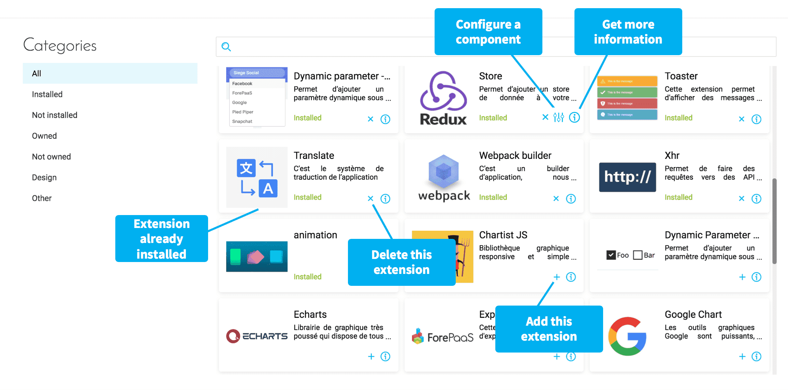

# 拡張

拡張は「Extensions（拡張）」タブからアクセスできる一連のパッケージで、アプリケーションにサードパーティのグラフソフトウェア、翻訳サービス、または動的パラメータなどの追加機能を提供できます。 
 
{利用可能な拡張のリストを確認する}(#/jp/product/app-manager/extensions/list)

---
## 拡張の管理

App Managerの「*Extensions（拡張）*」タブでは、次のように、サポートされている各種ライブラリの表示と管理を行うことができます。 

* **追加**：プロジェクトに必要な拡張の追加
* **設定**：拡張のグローバル設定（該当する場合）
* **削除**：すでにインストールされている拡張の削除（必要ない場合、または新しいバージョンのライブラリを使用する場合）
* **詳細の確認**：外部ライブラリにリンクされた拡張に関する詳細の確認
* **インポート**：プロジェクトや組織に固有のオープンソースや独自の拡張のインポート

---
## 拡張のカスタマイズ

ForePaaSのマーケットプレイス内の拡張には、それぞれ固有の設定ファイルがJSON形式で存在し、編集やカスタマイズを行うことができます。

{拡張の設定に関する実践的なチュートリアル}(#/jp/getting-further/app-dev/extension.md)

---
次のステップでは、APP Managerコンポーネントの次のタブについて説明します。

{次の記事：メニュー}(#/jp/product/app-manager/menu)

