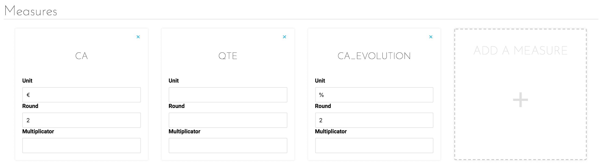
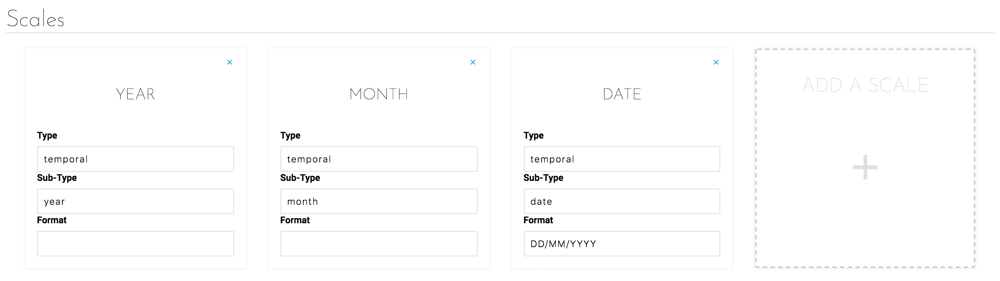
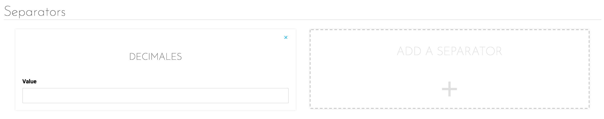

# フォーマッタ

## はじめに

アプリケーションの各種ダッシュボードに表示されるデータは、多種多用なソースから取得されており、多くの場合、統一されたものではありません。
そのため、並べて表示するデータの桁数や単位に違いが生じる場合があります。こうした問題に対処するため、フィールドごとに以下の管理を行うことができます。
* 単位
* 倍率
* 小数点または3桁ごとの区切りの記号
* 値を表示する小数点以下の桁数

さらに、スケールについては、データの経時性を示すこともできます。これらはすべて、アプリケーションの「*Formatter（フォーマッタ）*」タブで設定できます。

## インターフェース

「Formatter（フォーマッタ）」タブは、3つの部分に分かれており、それぞれ、使用される2タイプのデータ（*メジャーとスケール*）および暗号化データの視覚化に不可欠な要素（*セパレーター*）に対応します。

  
*図1：メジャーの編集*

このタブで、メジャーはData Managerで利用可能ないずれかのフィールドの名前です。これらのフィールドはそれぞれ1つの値を表します。図1に示す編集パネルでは、以下の変更を行うことができます。

* **Unit（単位）**：このデータのメジャーの単位（ユーロ、時間、キロメートルなど）
* **Round（概数）**：小数点以下の必要な桁数
* **Multiplier（乗数）**：乗数ではデータを動的に変更。データが0と1の間の値で表された比率の場合、100を乗じる必要があるため、この乗数が特に重要

  
*図2：スケールの編集*

値を表すメジャーと異なり、スケールはデータのグループ化やセグメント化を行うことができるフィールドです。最も一般的なスケールは、日、月、年などの時間の大きさです。図2に示す編集パネルでは、以下の編集を行うことができます。

* スケールのタイプ（例：temporal）
* サブタイプ（タイプのやや詳細な内容を指定）。時間データは特定の日、月、年などになります。 
* 表示形式

  
*図3：セパレーターの編集*

最後に、次の2種類のセパレーター（区切り記号）が存在します。
* 小数点
* 3桁ごとの区切り

これらの区切り記号はどのような文字でもよく、値の可読性を高めるために挿入されます。
{フォーマッタの詳細を確認する}(#/jp/technical/sdk/app/formatter)

{次の記事：設定}(#/jp/product/app-manager/settings/index)
