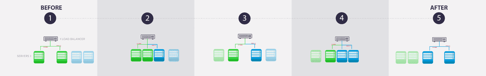
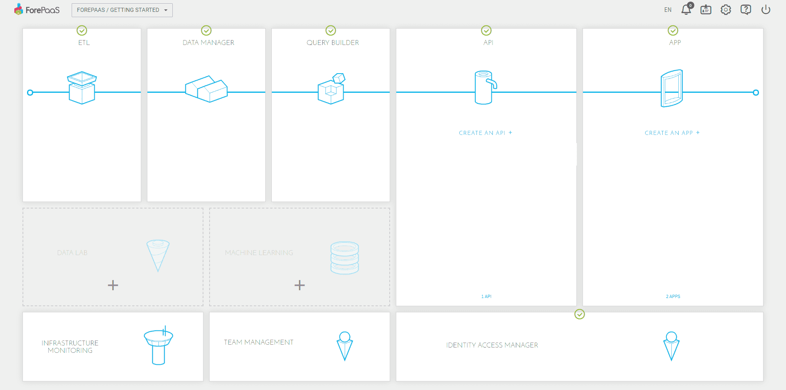
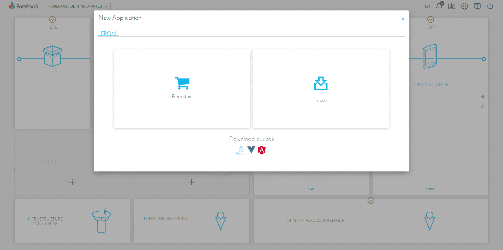
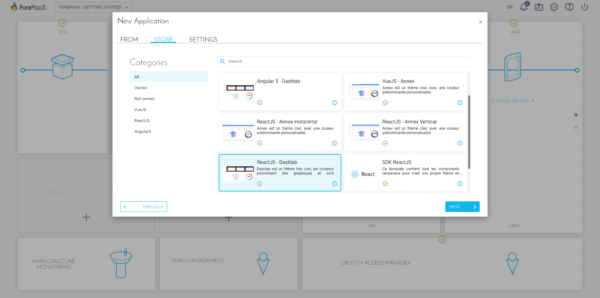
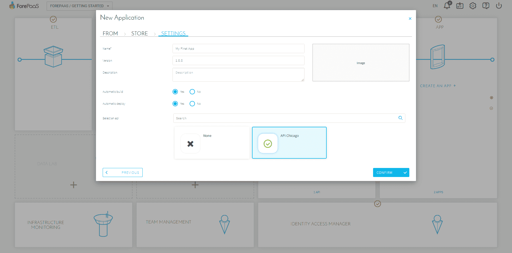
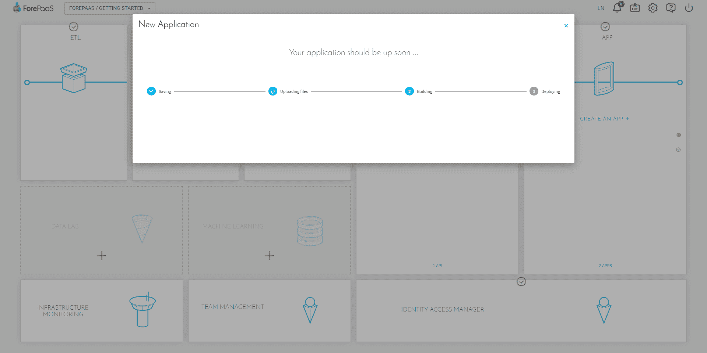
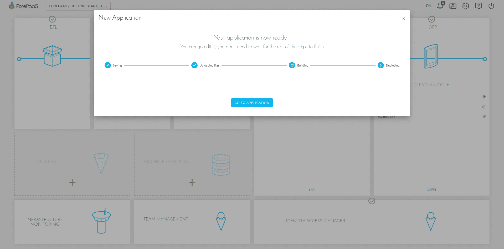

# APP Manager

---

## APP Managerとは

APP Managerコンポーネントの機能を利用すると、**アプリケーションの作成とデプロイを素早く円滑に行うことができます**。
APP Managerでは、アプリケーションのデプロイ、設定、基本機能の管理を行うことなく、テンプレートやSDKからダッシュボードやその他のアプリケーションを作成できます。このため、技術的な制約にわずらわされることなく、個別のニーズや最終的なビジネス価値に専念することができます。

アプリケーションは次の方法で作成できます。
- ForePaaSに用意されているローコード環境を使用
- SDK（*Software Development Kit*）を使用

ローコード環境では、ユーザーインターフェースから直接次のことを行うことができます。
- ダッシュボードを使用した復元の定義と構成
- アプリケーションでのナビゲーションを管理
- アプリケーションの設計を選択
- ユーザーにアプリケーションへのアクセスを付与

アプリケーションを作成するステップは、次の通りです。
1. マーケットプレイスでテンプレートを選択するか、既存のコードをインポート
2. 拡張を選択（データ視覚化ライブラリを含む）
3. ダッシュボードを作成
4. 構成／ナビゲーション
5. デザイン／スタイルを調整（任意）
6. データの書式設定とラベルの翻訳（任意）
7. API、APPビルド、デプロイを選択

---

## 作成とデプロイ

このプラットフォームは分析アプリケーションの実装をエンドツーエンドで管理できるようになっており、アプリケーションの作成では、アーティファクトを作成してデプロイを行う必要があります。実際、運用環境で変更を行うには、作成とデプロイを行う必要があります。

コンポーネント（API、アプリケーション、機械学習APIなど）をホストする専用のコンテナイメージが自動的に準備されることで、アーティファクトの作成が行われます。 デプロイを行うことで、このイメージからコンテナが作成され、アプリケーションに適用された変更が利用できるようになります。

 
*図1：ForePaaSでのアーティファクトの作成*

ForePaaSプラットフォームでは、ブルーグリーン・デプロイ・モードを使用します（図2を参照）。これは、ブルーとグリーンの2つの同一の運用環境を実行することで、ダウンタイムとリスクを抑える手法です。常にいずれか一方の環境のみがライブ環境となり、ライブ環境ですべての運用トラフィックが処理されます。 

 
*図2：ブルーグリーンデプロイ*

アプリケーションのデプロイが完了すると、ノードの追加や削除を行うことができます。それぞれのノードは作成されたアーティファクトのインスタンスを実行するコンテナです。これらのノードは、図2のグリーンおよびブルーのサーバーで表されます。このノード管理によって、アプリケーションのパフォーマンスを向上させることができます。これは水平スケーラビリティと呼ばれます。

---

## アプリケーションの作成

この記事を読み進める前に、[APIの作成チュートリアル](jp/tutorials/api-manager/my-first-api)を終了しておくことをお勧めします。実際、アプリケーションでデータをレンダリングするのにはAPIが必要です。このチュートリアルでは、ForePaaSストアからアプリケーションを作成します。

データプラントのメインページで、「Create APP（アプリケーションを作成）」を選択します。

次の2つの選択肢があります。
* __ストアから作成__：ストアから新規プロジェクトを作成
* __インポート__：既存のプロジェクトをインポート

最初のアプリケーションの場合は、マーケットプレイスを選択します。

{マーケットプレイスの詳細を確認する}(#/jp/product/dataplant/marketplace)

さまざまなテーマのアプリケーションが利用できます。このデモでは、「ReactJS - Dashlab」を選択します。

次に、アプリケーションの名前を指定し、自動ビルドを有効にします。

アプリケーションの作成には少し時間がかかります。

アプリケーションのバックアップとアップロードが完了したら、「Edit the application（アプリケーションの編集）」をクリックしてApp Managerコンポーネントに移動します。このコンポーネントでは、ForePaaS上にホストされている個別のアプリケーションのデプロイの管理と編集を行うことができます。

{APP Managerコンポーネントの詳細を確認する}(#/jp/product/app-manager/overview.md)

---

##  サポートが必要な場合🆘

> サポートの依頼が必要な場合は、いつでもプラットフォームの「*Support（サポート）*」タブから直接依頼を送信することができます。また、support@forepaas.com宛にメールを送付することもできます。

{サポートに質問を送付する🤔}(https://support.forepaas.com/hc/en-us/requests)