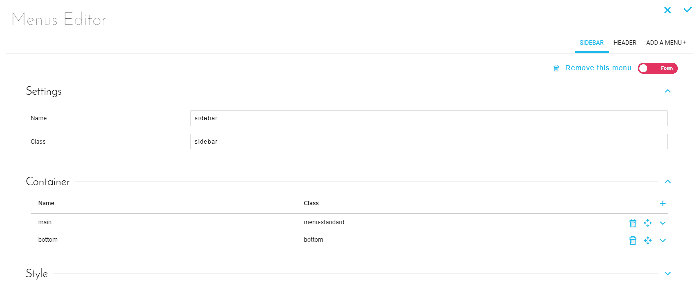
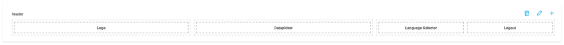
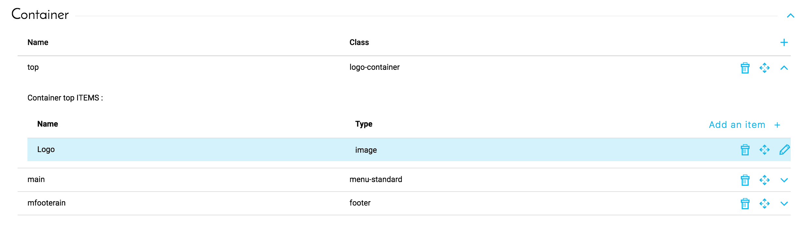

# メニュー

## はじめに

ForePaaSプラットフォームでは、ドラッグアンドドロップ・オプションを使用して、複数のページ、リダイレクト、複数のダッシュボード、パフォーマンス指標を含む複雑な分析アプリケーションの作成を容易に行うことができます。

メニューを使用すると、アプリケーションやアプリケーションの基本的なチャプターを構成できます。このナビゲーションの管理は、アプリケーションの「Menus（メニュー）」タブで一元的に行われます。このタブは、1つ以上のナビゲーションメニューと、メニューを構成するコンテナやブロックを定義するのに使用します。

コンテナはメニューのサブセクションに対応しています。コンテナは、ロゴ、一連のタブ、接続解除ボタンなどを表示するのに使用できます。

ブロックは、次のようなコンテナの要素です。
* アプリケーションのダッシュボードや外部URLへのリダイレクトリンク
* 静的テキスト
* ロゴなどを表示するための画像
* アクティブユーザーの名前を表示するブロック
* ダッシュボードのグラフにリンクしてデータを対話形式で表示するための動的パラメータ
* マーケットプレイスで入手可能なカスタムブロックまたはアプリケーション用に開発されたカスタムブロック

## インターフェース

メニューインターフェースにアクセスするには、*アプリケーションエディターのサイドバー*のメニュータブを選択するか、アプリケーションを編集中の場合は、メインのツールバー（上部中央）のメニューアイコンを使ってインターフェースを開くことができます。

*図1：メニューエディターのインターフェース*  

このインターフェースでは、新しいメニューおよびメニュー要素の追加、既存のメニューおよびメニュー要素の編集、および余分なコンポーネントの削除を行うことができます。 

アプリケーションの各種メニューは、互いに次のように表示されます。

  
*図2：メニューの例*

個々のメニューは薄い灰色の点線で囲まれたコンテナに分割され、コンテナ内には濃い灰色の点線で囲まれた各種要素が表示されます。コンテナを構成する要素と同じように、これらのコンテナは編集、移動、削除できます。

  
*図3：コンテナの編集*

!> **警告**：追加したメニューはアプリケーションインターフェースに自動的に追加される訳ではありません。アプリケーションのテーマに、個々のメニューの受け入れに使用できるスペースが必要になります。テーマによっては、メニューの名前がメニューの表示に大きく影響します。

{次の記事：翻訳}(#/jp/product/app-manager/translation)