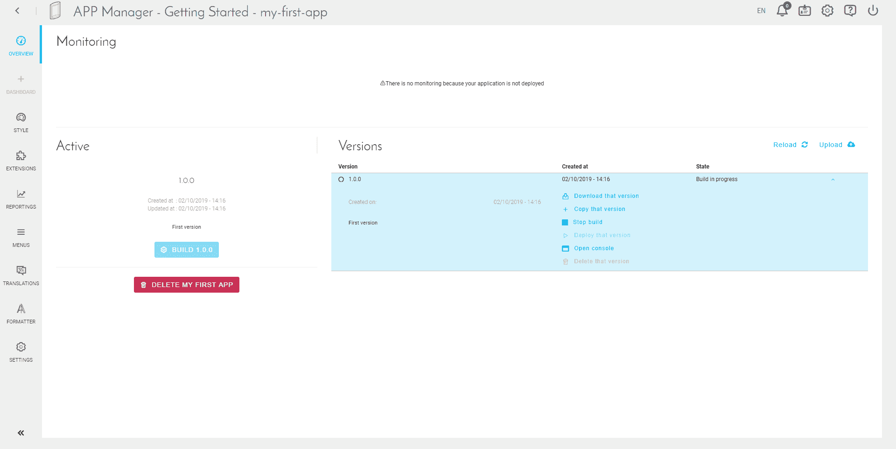

# App Managerのインターフェース

---

## ダッシュボード

アプリケーションの管理インターフェースで、「*Preview（プレビュー）*」タブを使用してアプリケーションのライフサイクルを容易にモニタリングすることができます。

この画面は、次の3つの部分に分かれています。
* 上部のブロック（緑）には、**アプリケーションで使用されるリソースに関する指標**が表示されます。これらの指標を用いて、インスタンス数を増やす必要があるかどうかなどを確認できます。

!> 指標や使用状況を可視化するには、最初にアプリケーションをデプロイする必要があります。

* 左側のブロック（黄）には、（運用中の）**アクティブバージョンのステータス**が表示されます。バージョンの状態（新規／作成済み／デプロイ済み）に応じてショートカットが利用できます。

* 右側のブロック（青）には、**アプリケーションの各種バージョン**が表示されます。アクティブバージョンは青で表示されます。各バージョンごとに、次のようなさまざまなアクションを実行できます。
    * 同期／ダウンロード - コードソース（ZipファイルまたはGitリポジトリ）の種類に応じたアクション
    * バージョンの複製
    * このバージョンの作成
    * バージョンのデプロイ／停止
    * 作成コンソールを開く
    * バージョンの削除 - バージョンがデプロイされない場合のみ

---

## バージョンおよびデプロイの管理

アプリケーションの「Dashboard（ダッシュボード）」が表示されます。
ダッシュボードは、次の3つの要素で構成されます。
* __Summary（サマリー）__：デプロイ後のアプリケーションのステータス
* __Active（アクティブ）__：「アクティブ」バージョン（現在作業中のバージョン）のステータス
* __Tags（タグ）__：アプリケーションで利用可能なすべてのバージョンのリスト

右側にある矢印を使用して、作成したバージョンの詳細を確認できます。

自動ビルドを有効にしているため、すでにビルドが開始されています。「Open Console（コンソールを開く）」をクリックして、アクティビティログを確認します。

完了すると、ログの最後に「EndBuild success」と表示されます。

デプロイを開始するには、「Deploy 1.0.0（デプロイ1.0.0）」をクリックしてださい。

デプロイが開始されます。これには少し時間がかかります。

デプロイが完了すると、「Open（開く）」ボタンが表示されます。アプリケーションを開くと、次の画面が表示されます。

「King」アカウントまたはIAM内で直接作成した「ForePaaS ID」アカウントを使用してログインできます。

---

アプリケーションのデプロイは済みましたか。デプロイが済んだら、稼働しながらアプリケーションの作成や変更を行うことができます。「*dashboard builder（ダッシュボードビルダー）*」タブを使って見映えの良いアプリケーションを作成する方法をご確認ください。

{次の記事：ダッシュボード}(#/jp/product/app-manager/dashboard/index)