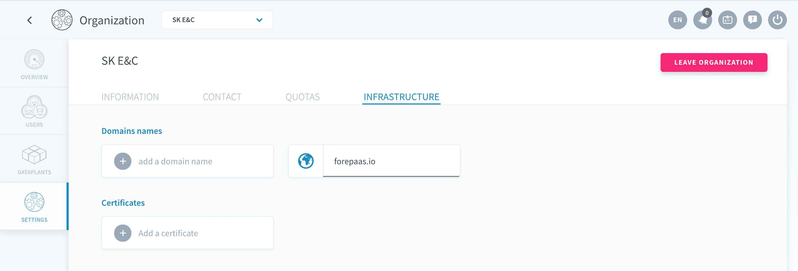
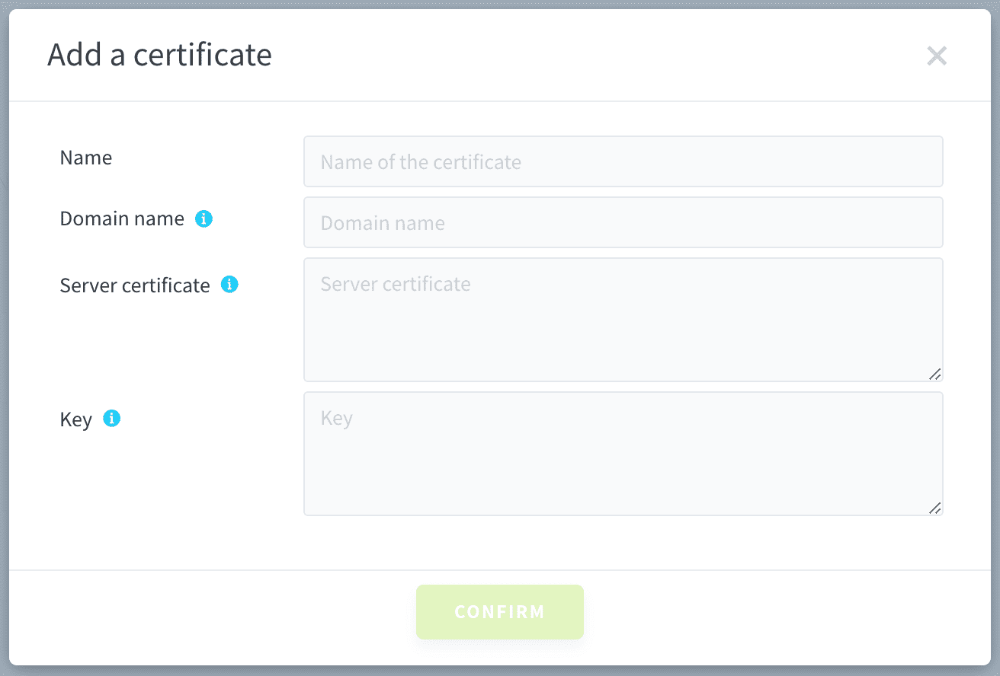
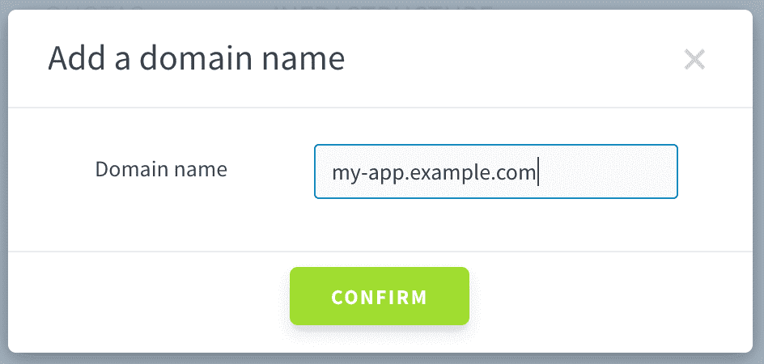
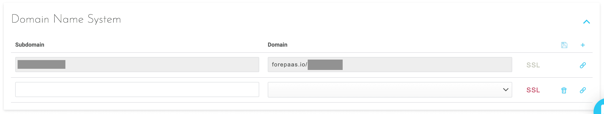

# アプリケーションのカスタムドメインの設定

**専用のドメインを作成するのはなぜでしょうか**。データプラントに、次のURLでアクセスできる新しいアプリケーションがあるとします。
```
https://my-dataplant.forepaas.io/my-app/
```

このアプリケーションのサブドメインはグローバル設定を変更することで容易に変更できますが、次のように、必ずドメイン末尾は`forepaas.io`になります。
```
https://my-app-on-my-dataplant.forepaas.io/
```

**この`forepaas.io`というドメインを完全に取り除きたいとしたら、どうでしょうか**。作成中の最終的な成果物にまったく新しいURLを付与したい場合は、このアプリケーションのURLを、可能な範囲で次のようにお好きな形にすることができます。
```
https://my-app.example.com/
```

これを行うには、次のステップを実行します。
1. [秘密キーおよび.csrファイルを生成](jp/product/app-manager/settings/custom-domain?id=generate-a-private-key-and-a-csr-file)
2. [秘密キーを使用して.pemファイルを取得](jp/product/app-manager/settings/custom-domain?id=obtaining-a-crt-amp-pem-file)
3. [組織レベルでドメイン名を登録](jp/product/app-manager/settings/custom-domain?id=register-domain-for-your-organization)
4. [新しいアプリケーションのドメイン名を登録](jp/product/app-manager/settings/custom-domain?id=register-domain-for-your-application)

---

## 要件

このページのステップを実行する場合は、次の内容について理解しておくことを強くお勧めします。
* [OpenSSL](https://www.openssl.org/)ツールのインストールおよび使用方法
* 有効な[SSL証明書](https://en.wikipedia.org/wiki/Transport_Layer_Security)の生成方法
* ドメインへの[ホスト名](https://en.wikipedia.org/wiki/Hostname)の追加方法

!> 以下のステップでは、**既存のドメインを持っている**ことが前提になっています。既存のドメインをお持ちでない場合は、最初に専用のドメインを作成し、アプリケーションでそのドメインを使用できるようにする必要があります。

既存のドメインをお持ちでない場合は、ドメインを取得する方法をオンラインで確認してください。[Google Domains](https://domains.google/)ツールなどのさまざまな選択肢が利用できます。

上記の条件がすべて満たされたら、アプリケーションのカスタムドメインのセットアップに進む前に、*秘密キーおよびCSRファイルの生成*を行う必要があります。次のセクションを参照してください。

---

## 秘密キーおよびCSRファイルの生成

### 必要な情報

CSR（証明書署名要求）を生成するには、以下の情報が必要です。

| パラメータ | 説明 |
|:----------|:------------|
| **C**（国コード） | 国を表す2文字のコード（句読点なし）を使用します。*例：USまたはCA* |
| **ST**（州または都道府県名） | 州または都道府県名は省略形を使用せずに記述します。*例：California* |
| **L**（市区町村名） | 市区町村フィールドは市や町の名前です。例：Berkeley。省略形は使用しません。*例：St. LouisではなくSaint Louis* |
| **O**（組織名） | 会社名や部門名に、&、@、またはShiftキーを使用するその他の記号が含まれる場合、登録するには記号をアルファベットで綴るか、記号を省略する必要があります。*例：XY & Z Corporationの場合は、XYZ CorporationまたはXY and Z Corporationとする* |
| **OU**（部門名） | 部門名（OU）フィールドは、この依頼を行う部門または組織の名前です。OUフィールドを省略するには、キーボードのEnterキーを押します。 |
| **CN**（コモンネーム） | コモンネームは、ホスト名を含むドメイン名です。コモンネームは、「www.company.com」や「company.com」のようになります。 |
| **emailAddress** | ドメイン名の実際の連絡先のメールアドレス |

テキストエディターを開き、次の構造を用いて**my-app.txt**ファイルを作成します。

```txt
[req]
default_bits = 2048
prompt = no
default_md = sha256
req_extensions = req_ext
distinguished_name = dn

[ dn ]
C=FR
ST=Hauts-de-Seine
L=Neuilly-sur-Seine
O=MyCompany
OU=MyCompany
emailAddress=contact@example.com
CN=my-app.example.com
```
!> 上記の表に示したパラメータは、個別の情報に置き換えてください。

### OpenSSLを使用したファイルの作成

各自のコマンドライン環境で、次のbashコマンドを実行します。
```bash
openssl req -new -sha256 -nodes -out my-app.csr -newkey rsa:2048 -keyout my-app.key -config my-app.txt
```

これにより、次の2つのファイルが作成されます。
* **my-app.csr**：これはSSL認証局へ提供する必要があります。
* **my-app.key**：個人用の秘密キーです。やり取りは行わず、安全に保管する必要があります。

!> カスタムドメインを初めて作成する場合は、アプリケーションキーを安全に保管するようにしてください。[OpenSSLの要点に関するDigital Oceanの記事](https://www.digitalocean.com/community/tutorials/openssl-essentials-working-with-ssl-certificates-private-keys-and-csrs#private-keys)を参照してください。

---

## CRTおよびPEMファイルの取得

`.csr`ファイルが準備できたら、このファイルを使用して証明書（CRT）ファイルとPEM（Privacy Enhanced Mail）ファイルを取得できます。このためには、my-app.csrファイルをお好きなSSL認証局に提供します。SSL認証局からは、有効な`.crt`ファイルと`.pem`ファイルが提供されます。

`.pem`ファイルを使用する際には、あらかじめファイルが有効であることを確認します。このためには、以下のコマンドを実行します。すべてのコマンドで同じ出力が得られるはずです。

```bash
openssl rsa -noout -modulus -in my-app.key | openssl md5
openssl req -noout -modulus -in my-app.csr | openssl md5
openssl x509 -noout -modulus -in my-app.pem | openssl md5
```

---

## 組織およびアプリケーションに対する新規ドメインの登録

新しいドメインを使用するには、すべてのデータプラントまたはデータプラント内のアプリケーションで新しいドメインを利用できるように、最初に**組織**レベルで新規ドメインを登録する必要があります。その後、**アプリケーション**に移動して新しいドメインを個別にセットアップします。

### 組織のドメインの登録

「*Organization（組織）*」情報に移動し、「*Settings（設定）*」セクションを選択して、「*Infrastructure（インフラストラクチャ）*」タブに移動します。



「**Add a certificate（証明書を追加）**」をクリックします。証明書の追加の画面で、以下の内容を入力します。
* *Name（名前）*：個別に使用するための分かりやすい名前（この名前は実際の証明書名には影響しません）
* *Domain name（ドメイン名）*：このホスト名は生成したSSL証明書と関連
* *Server certificate（サーバー証明書）*：SSL認証局から提供された`.pem`ファイルの内容をコピー
* *Key（キー）*：OpenSSLを使用して作成した`.key`ファイルの内容をコピー



新しい証明書の作成を確認し、続いて、「**Add a Domain（ドメインを追加）**」をクリックします。ドメインの追加の画面で、証明書のドメインと同じドメインを入力します。



操作は以上です。これで、組織に対するSSL証明書のセットアップは完了です。**お使いのすべてのデータプラントとデプロイ済みのアプリケーションで、この新しいドメインを利用できます**。続いて、アプリケーションの設定に移動し、アプリケーションのカスタムDNSをセットアップします。

### アプリケーションのドメインの登録

データプラントに移動し、DNSの変更を行うアプリケーションを編集します。「*Settings（設定）*」タブに移動し、「*Domain Name System（ドメイン・ネーム・システム）*」セクションを選択します。

この例のように、`my-dataplant.forepaas.io`のCNAMEとして`my-app.example.com`に対するDNSエントリを作成します。
* `my-app.example.com`はSSL証明書を提供したホスト名
* `my-dataplant.forepaas.io`はデータプラントのメインのURL

**お疲れさまでした**。🏆https://my-app.example.com/のような新しいURLでアプリケーションが利用できるようになったはずです。



---

## セットアップがうまくいかない場合

疑問点が解消されない場合は、弊社のサポートポータルまたはsupport@forepaas.comまでお問い合わせください。

{サポートポータルに質問を送付する❓}(https://support.forepaas.com/hc/en-us/requests)
