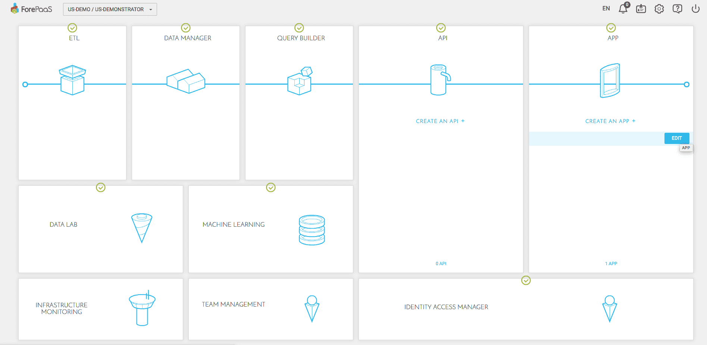
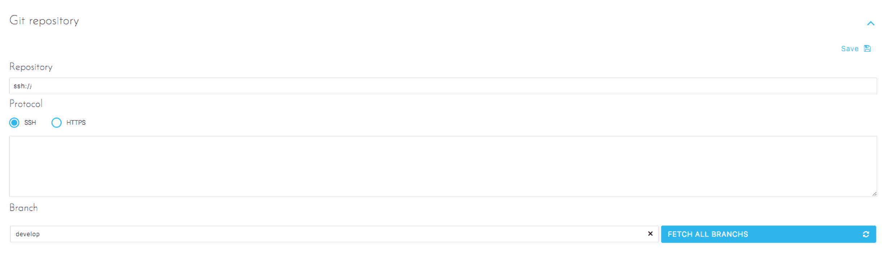
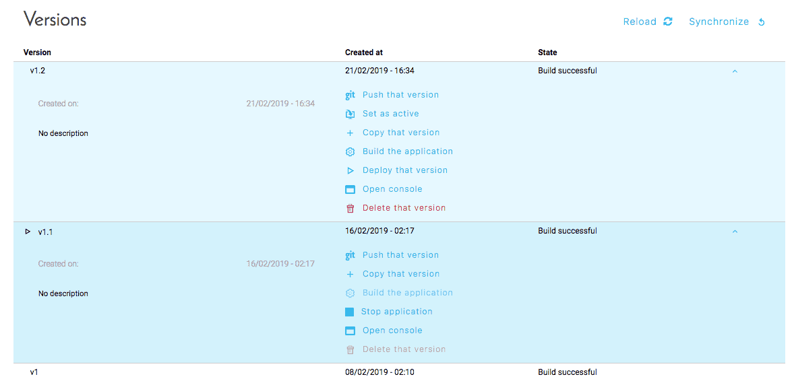
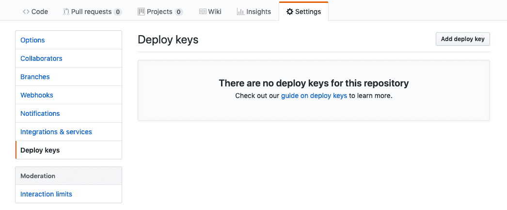

# アプリケーションとGitリポジトリとのリンク 

?> このチュートリアルの内容はAPIにも利用できます。 

## 前提条件

### アクセス権限の定義

このチュートリアルでは、Gitリポジトリでアプリケーションに読み取り／書き込み権限を付与する方法について説明します。

### リポジトリの設定

Gitについてすでにご存じの場合や、リポジトリを使用する準備ができている場合は、次のステップに進んでください。
そうでない場合は、以下のリポジトリプロバイダーが利用できます。
- [Github](https://github.com)
- [Gitlab](https://gitlab.com)
- [Bitbucket](https://bitbucket.org)

リポジトリの作成は簡単です。ただし、社外秘のアプリケーションの保存を行う場合は、パブリックリポジトリを作成しないように注意してください。 

## 手順

リポジトリのセットアップが済んだら、アプリケーションインターフェースに移動してリポジトリをリンクします。 

App Managerに移動し、リンクするアプリケーションで「Edit（編集）」をクリックします。  

左側のメニューで、「Settings（設定）」に移動します。次に、以下のフィールドに入力します。

__Repository（リポジトリ）__：これはリポジトリのアドレスで、リポジトリプロバイダーによって提供されます。通常、これはリポジトリプロバイダーのホームページに記載されています。このアドレスは、HTTP URLまたはSSHアドレスです（選択した接続モードによって異なります）。

__SSH__：SSHアドレスを使用する場合は、上記で入力したアドレスに加えて、リモートのリポジトリとアカウントに、画面上に表示される「公開キー」をコピーする必要があります。SSHキーはApp Managerによって自動的に生成されるため、各自で生成する必要はありません。 

__HTTPS__：これはリポジトリのHTTPSアドレスです。クローンのURL https://は、パブリックまたはプライベートのすべてのリポジトリで利用できます。プライベートリポジトリの場合は、リポジトリを操作するたびにユーザー名とパスワードを入力する必要があります。 

__Branch（ブランチ）__：ここまでの設定がすべて完了したら、このボタンを使用してリモートのブランチを同期し、保存を行う前にブランチを選択できます。

設定が済んだら、「Overview（概要）」画面で次の2つの新しいアクションを実行することができます。

__Push that version（このバージョンをプッシュ）__：このバージョンを元にGitリポジトリに新しいブランチを作成できます。これはリポジトリを初期設定する最初のステップです。

__Synchronize（同期）__：前に選択したブランチの内容をダウンロードし、ForePaaS環境内に新しいバージョンを自動的に作成できます。

### SSH認証を使用したリポジトリのセットアップ

アプリケーションの設定時に接続モードとしてSSHを選択すると、必要なSSHキーがApplication Managerによって自動的に提供されます。
このSSHキーをGitリポジトリにコピーして貼り付ける必要があります。この操作を行う画面は、リポジトリプロバイダーによって異なります。

最もよく利用されるプロバイダーの1つであるGithubの場合、
リポジトリへのSSHキーを追加するには、「Settings（設定）」に移動する必要があります。  
  

「Deploy Keys（デプロイキー）」を選択し、「Add deploy key（デプロイキーの追加）」をクリックします。  
ここで、（App Managerによって提供された）SSHキーを貼り付け、名前を付けます（例：ForePaaS - MyFirstDataplant）。  
双方向で同期を行えるようにするため、「Allow write Access（書き込みアクセスを許可する）」にチェックを入れるのを忘れないでください。先ほど説明した「このバージョンをプッシュ」機能には、このオプションが不可欠です。

### HTTPS認証を使用したリポジトリのセットアップ

#### プライベート認証
HTTPS認証の作成では、（リポジトリにアクセスできる）アカウントのユーザー名とパスワードを入力する必要があります。同期を行うたびに、パスワードの入力が要求されます。これはデータプラント内には保存されません。

#### パブリック認証
パブリック認証では、情報を入力する必要はありません。 

これで、アプリケーションの同期は完了です。

