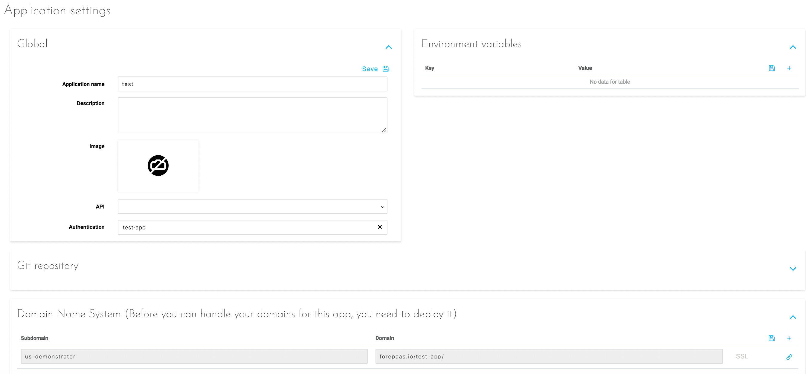

# 設定

デプロイ済みのアプリケーションの設定では、以下のオプションを設定できます。
* [グローバル設定](jp/product/app-manager/settings/index?id=global)
* [環境変数](jp/product/app-manager/settings/index?id=environment-variables)
* [Gitリポジトリ連携](jp/product/app-manager/settings/index?id=git-repository)
* [ドメイン・ネーム・システム](jp/product/app-manager/settings/index?id=domain-name-system)

---

## グローバル

名前、説明、メインイメージなどのアプリケーションのグローバル情報です。

---

## 環境変数

アプリケーションが動作するのに必要な変数です。アプリケーションおよび各種拡張が適切に動作するのに必要な変数が自動的に入力されます。ここにはビジネスニーズに固有の変数のみを記載します。

---

## Gitリポジトリ

{外部のGitリポジトリをアプリケーションにリンクする}(#/jp/product/app-manager/settings/git-integration.md)

---

## ドメイン・ネーム・システム

デフォルトで生成されるURLの他に、アプリケーションにアクセスできるようにするため、1つ以上のURLを追加できます。組織レベルの別のドメインを設定している場合を除き、これらのURLのドメインは「forepaas.io」になります。

{アプリケーションのカスタムドメインを設定する}(#/jp/product/app-manager/settings/custom-domain.md)

---

## 疑問点は解消されましたか。😒

疑問点が解消されない場合は、弊社のサポートポータルまたはsupport@forepaas.comまでお問い合わせください。ご連絡をお待ちしています。

{サポートポータルに質問を送付する❓}(https://support.forepaas.com/hc/en-us/requests)