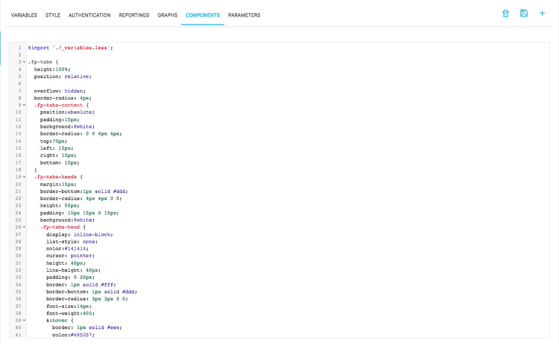

## スタイル

ForePaaSプラットフォームでは、アプリケーション内でスタイルとデザインを変更できます。アプリケーションに適用するグラフや図表の定義は、「*Style（スタイル）*」タブで一元的に行われます。CSS/LESSでのこれらの変更は、以下の図のように、異なる複数のファイルで適用できます。

アプリケーションのスタイルを変更する場合は、アーティファクトを作成し直して再度デプロイする必要があります。

{次の記事：拡張}(#/jp/product/app-manager/extensions/index)