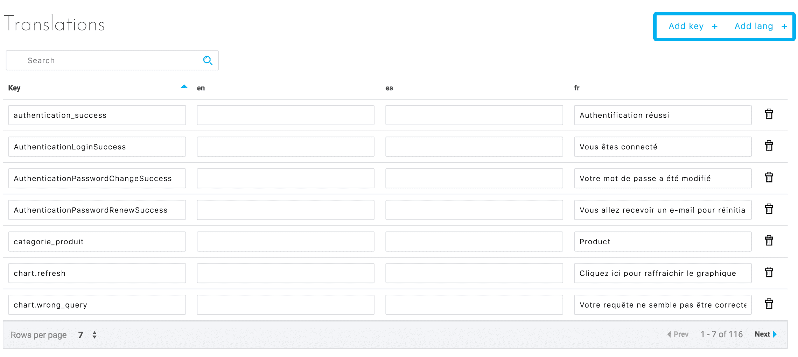

# 翻訳

## はじめに

ForePaaSプラットフォームで作成するアプリケーションはネイティブで多言語に対応しています。翻訳対象のフィールドとアプリケーションで利用可能な言語は、「Translations（翻訳）」タブで確認できます。

このタブでは、次のことを行うことができます。
* 言語の追加
* 翻訳が必要なすべての表現の一覧
* 追加されたすべての言語でのこれらの表現の翻訳の追加または編集

マーケットプレイスで提供されているテーマには、アプリケーションを適切に動かすことができるようにあらかじめ翻訳が含まれています。このため、データフィールドの名前など、使用している表現がテーマに含まれていない場合にのみ翻訳を追加する必要があります。同様に、SDKを使用してアプリケーションを作成する場合も、大半の翻訳を追加する必要があります。

## インターフェース
図1は翻訳エディターのインターフェースを示しています。このインターフェースでは、次のことを行うことができます。
* 言語の追加
* 翻訳キーの追加
* 翻訳の保存

  
*図1：主なアクション*

翻訳キーを新規に追加すると、新しい行が作成され、これらの翻訳キーの各言語の翻訳を入力できます（図2を参照）。

言語コード（fr、en、esなど）があれば、言語を追加できます。言語を追加すると、翻訳を入力するための新しい列が作成されます（図2を参照）。各翻訳キーは直接変更または削除することができます。

  
*図2：アプリケーション用の翻訳のリスト*


## アプリケーション連携

### グラフ
事前定義された多くのグラフでは、シンプルな翻訳（変換）システムが利用できます。
#### 軸の変換
```
"site" : "Site"  
```
すべてのグラフでsiteが「Site」に置き換えられます。

#### 値の変換
軸の値を変換するには、軸の名前と値の組み合わせを使用する必要があります。
```
"site-2" : "New York" 
```
すべてのグラフの軸「site」に、「2」ではなく、「New York」と表示されます。


{次の記事：フォーマッタ}(#/jp/product/app-manager/formatter)