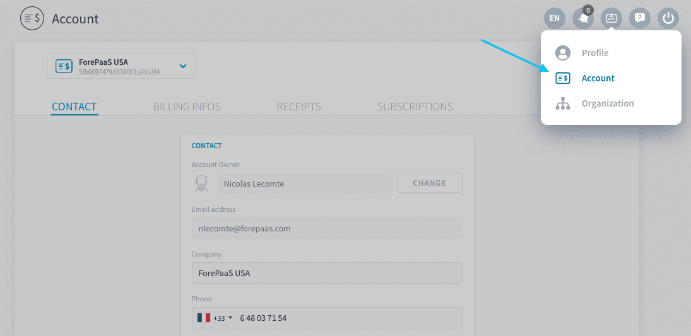
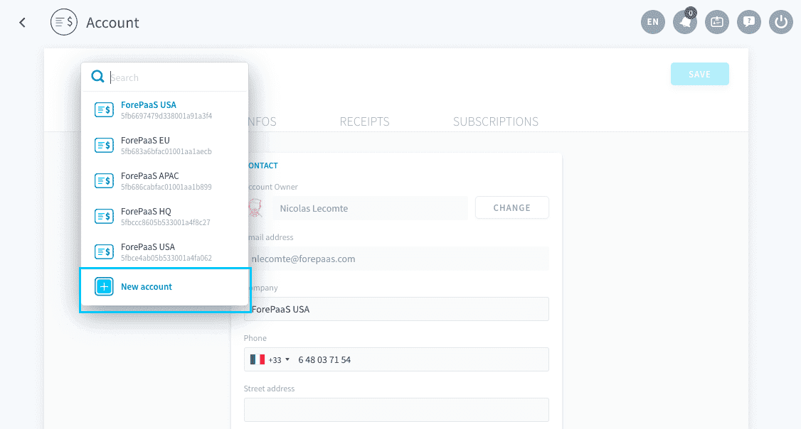
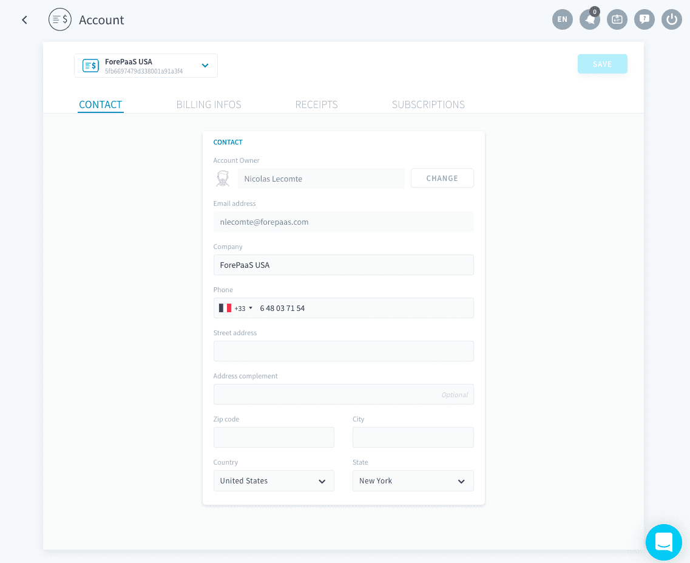
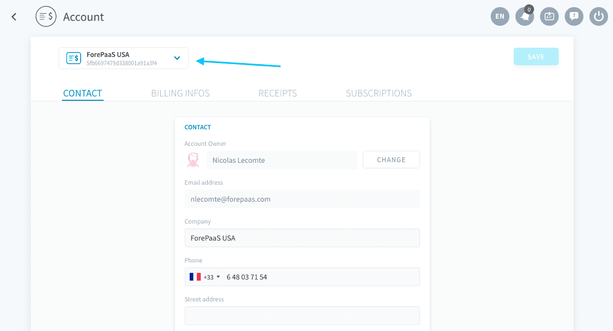
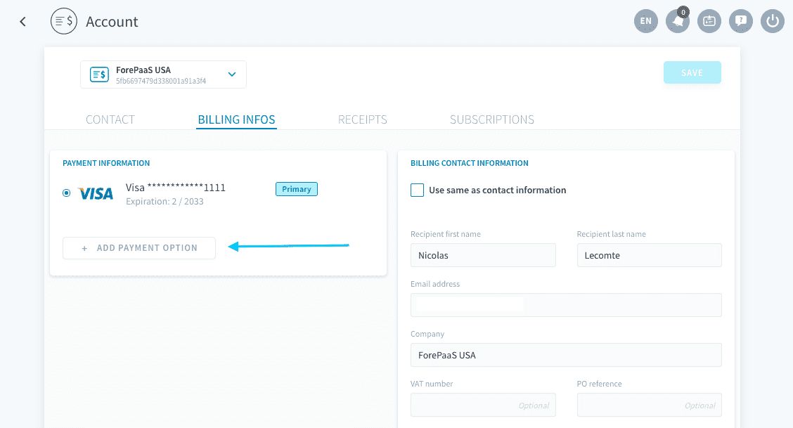
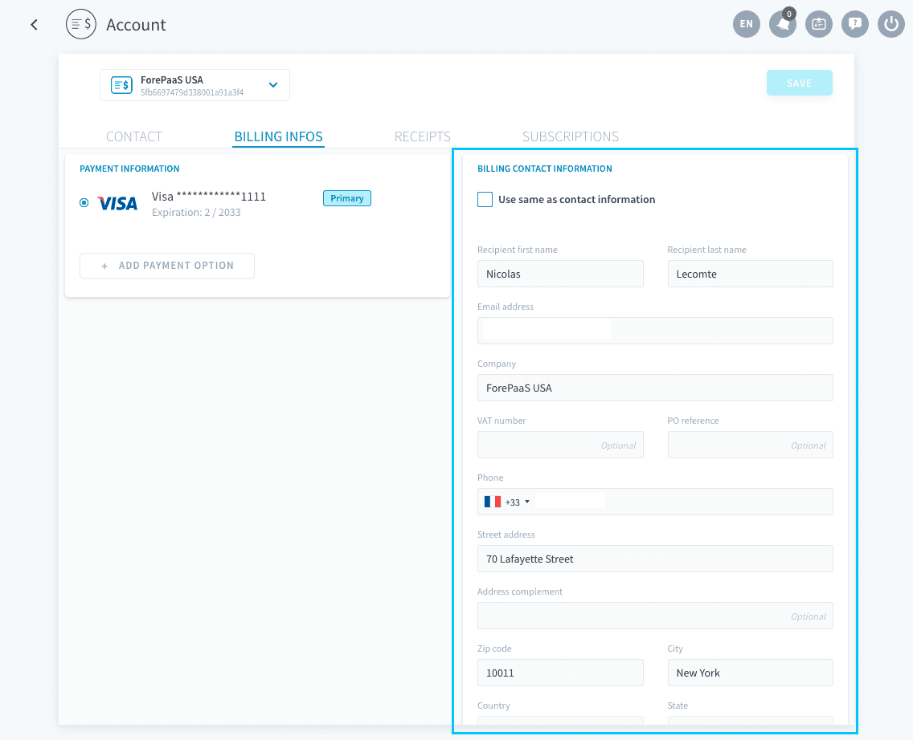
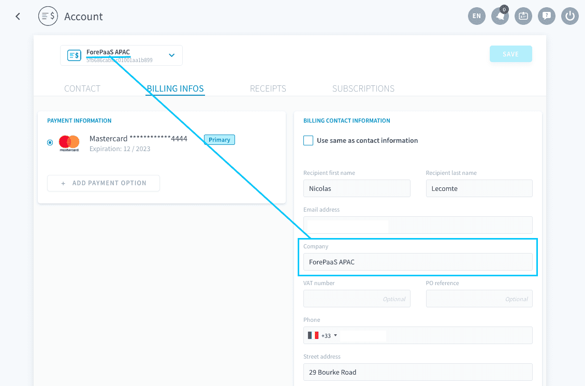
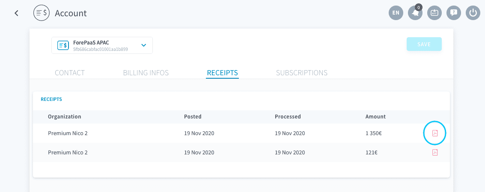
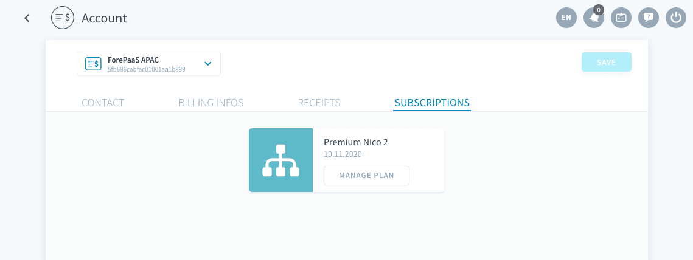
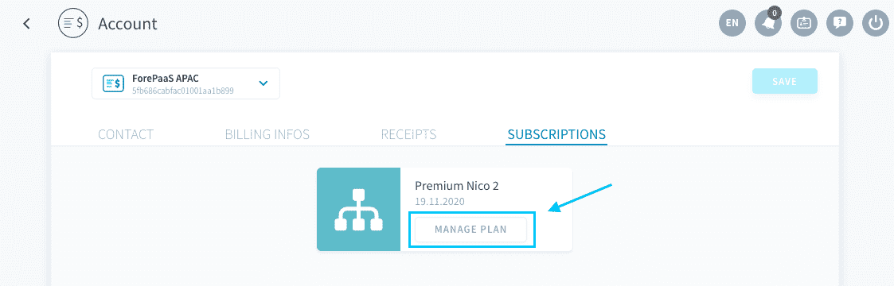

# Billing Account

A billing account is linked to a ForePaaS user and enables invoicing of the different services of the platform. 

Users can own several billing accounts at the same time. You can create a new billing account either when [getting a new subscription for your organization](jp/product/billing/plans/add-subscription) or by clicking **New account** in the dropdown menu at the top of the Account page.

Your billing account is constitued of the following:

* [An owner](/jp/product/billing/account/index.md?id=account-owner)
* [A payment method](/jp/product/billing/account/index.md?id=payment-method)
* [A billing address](/jp/product/billing/account/index.md?id=billing-information)
* [Records and current subscriptions](/jp/product/billing/account/index.md?id=past-and-current-bills)

---
## Account owner

The *account owner* page of your account lists all your contact information. Some fields (first and last name, email address, phone number and company) are mirrored to your [user profile](/jp/product/account-setup/edit-account): editing them here will edit them in your ForePaaS profile too, and reciprocally.

A user can own multiple billing accounts, for example if they need to be invoiced differently depending on the region of operations. The display name of a billing account is the name entered for the field *Company* in the [Billing Infos](/jp/product/billing/account/index.md?id=billing-information) tab.

You can switch between all the billing accounts that you own by clicking on the dropdown menu in the header.

You have the possibility to transfer the ownership of a billing account to a fellow ForePaaS user, for instance if you are undergoing a career change. Click on the link below to learn more.

{Transfer the ownership of a billing account}(#/jp/product/billing/account/transfer.md)

---
## Payment method

You can either use a debit or credit card, or a SEPA transfer provided you live in the European Union. Click on **Add payment option** in the Billing Infos tab.

If you change the payment method of a billing account, the new method will be used **for all subscriptions associated with the account**.

### Debit or credit card
ForePaaS supports the following card providers:
* Visa
* MasterCard
* American Express

We do not support prepaid cards at the moment.

### Bank account
If you are a European Union resident and wish to use automatic SEPA transfers as your payment method, please reach out to our support team.

---
## Billing information

The Billing Infos tab also lists the invoicing address for your account. 

The name entered in the field *Company* is also the display name of your billing account.

> For your convenience, you can enter a different *company* name in the Billing information than in your profile/account owner contact information.

---
## Past and current bills

The *Receipts* tab lists all **past** bills of your account. You can download each issued invoice as a PDF.

The *Active Subscriptions* tab lists all **current** subscriptions on your account.

You can manage each individual subscription of your billing account by clicking on **Manage plan**.

This redirects you to the [Plan page of your organization](/jp/product/account-setup/organization-settings?id=plan), from where you can manage each specific subscription (plan, committed resources, etc.).

---
##  Need help? 🆘

At any step, you can ask for support by sending us a request directly from the platform, going to the *Support* tab. You can also send us an email on support@forepaas.com.