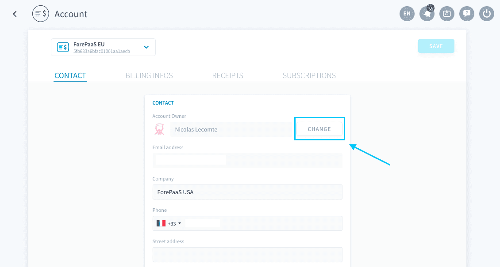
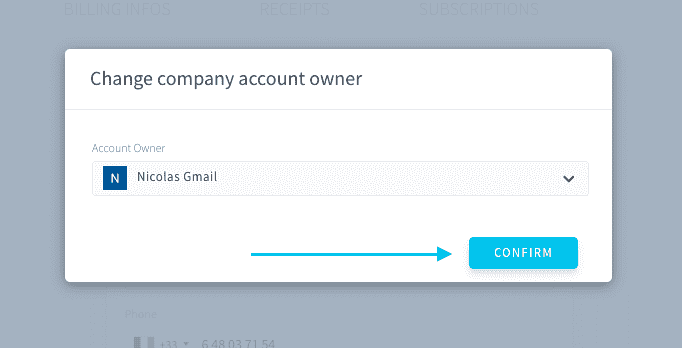

# Transfer ownership of a billing account

You have the possibility to transfer the ownership of a billing account to a fellow ForePaaS user, for instance if you are undergoing a career change. Click on **Change** next to your name.

Choose the user which you want to transfer the ownership of the billing account to, and click on **Confirm**. 

You will then receive an email with a link to confirm the transfer of account. You have **24 hours** to confirm the transfer. 

Once you confirm, the new account holder will then receive an email to accept the ownership. They have **24 hours** to accept the transfer. 

!> If either you or them don't confirm, the ownership will not be transfered.

---
##  Need help? 🆘

At any step, you can ask for support by sending us a request directly from the platform, going to the *Support* tab. You can also send us an email on support@forepaas.com.