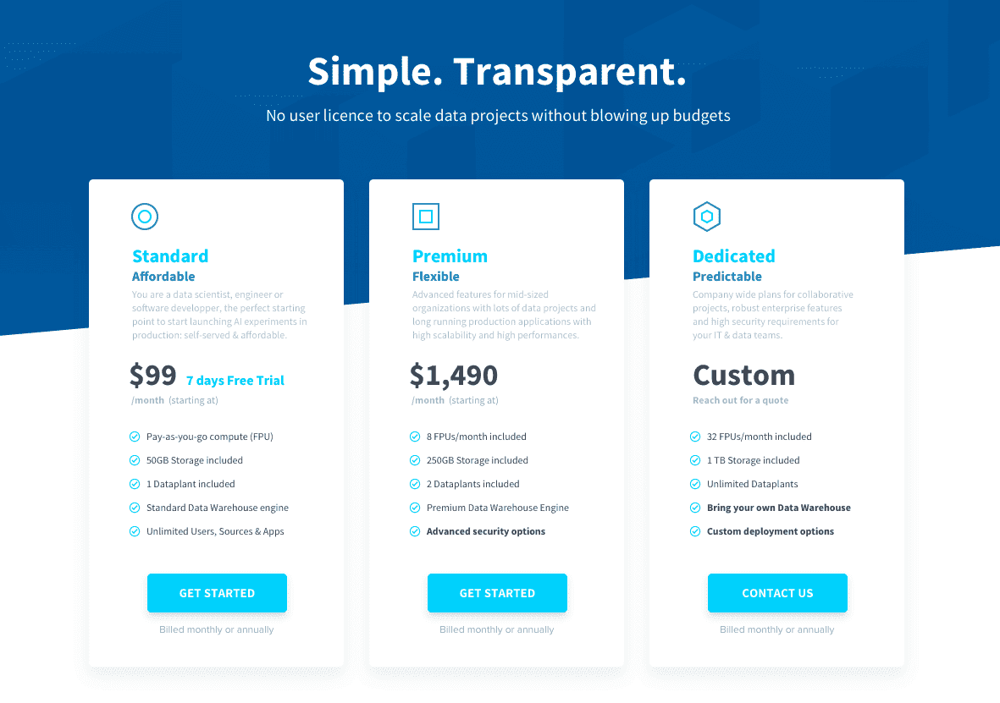

# Pricing and Billing

On ForePaaS, you are charged at the organization level for your [subscription plan](/jp/product/billing/plans/add-subscription) as well as your [additional resource consumption](/jp/product/billing/resources/index). 

{How much is ForePaaS?}(https://www.forepaas.com/jp/pricing/)

---
## Resource consumption

Whenever you are using ForePaaS for your projects, you are effectively consuming resources in physical data centers. A certain amount of resources is granted for each subscription plan and additional consumption is billed per usage. 

{Resource consumption on ForePaaS}(#/jp/product/billing/resources/index.md)

---
## Subscriptions

In order to create [Dataplants](/jp/product/dataplant/index), your organization must have an active subscription plan.

{Get a subscription plan}(#/jp/product/billing/plans/add-subscription.md)

---
## Manage your billing

An organization is invoiced through what is called a **billing account**. It is associated with a legal address and a method of payment, and is owned by one of the members of the organization.

{Manage billing}(#/jp/product/billing/account/index.md)

---
##  Need help? 🆘

At any step, you can ask for support by sending us a request directly from the platform, going to the *Support* tab. You can also send us an email on support@forepaas.com.