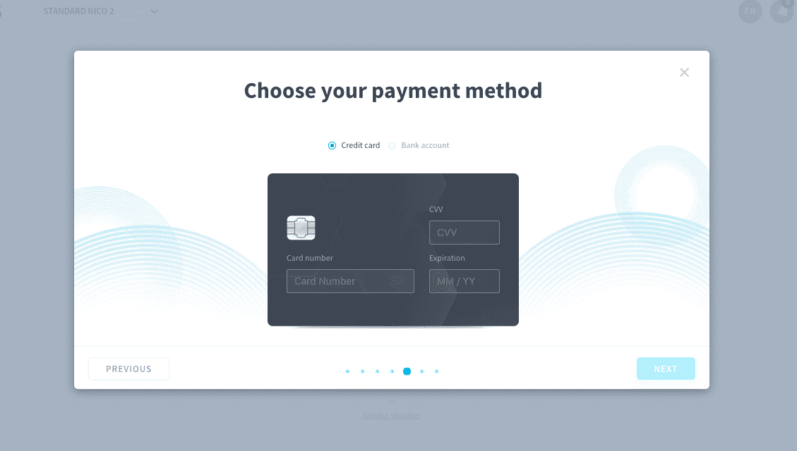

# Get a subscription plan

Each [organization](/jp/product/account-setup/index) must have an active subscription plan in order to be able to create new projects.

ForePaaS has 3 pricing plans: *Standard*, *Premium*, and *Dedicated*.

{💡 Get the details for each plan.}(https://www.forepaas.com/jp/pricing/)

You can be interested in doing either one of two things:
* [Get a subscription plan for a new organization](/jp/product/billing/plans/add-subscription.md?id=get-a-subscription-plan-for-a-new-organization)
* [Change the subscription plan for an existing organization](/jp/product/billing/plans/add-subscription.md?id=change-the-subscription-plan-for-an-existing-organization)

---
## Get a subscription plan for a new organization

Open your organization. On the landing page, click on **Get Started now**.

#### Choose a plan

You will be asked to choose one of the subscription plans. 

> You can choose to get billed annually in order to get a **10%** discount on your subscription. You will be able to review this choice when you confirm your order.

#### Choose a support level

Choose the [support level](https://www.forepaas.com/jp/pricing/) you want for your organization's projects.

|    Level     |  Included:   | 
| :---------------------: | ----------------| 
|  **Basic** (*$0/mo*) |   Email support, online chat support, documentation portal, public roadmap. | 
|  **Advanced** (*$990/mo*) |  **All of Basic**, phone support, Technical Account Manager, standard invoicing.    | 
|  **Business Critical** (*$14,900/mo*) |  **All of Advanced**, dedicated Project Engineer and expert assistance, project migration support, audit options, custom terms and agreements.  |

#### Optional: reserve resources

You then have the possibility to purchase [committed resources](jp/product/billing/resources/committed.md) for your organization. Committed resources enable you to reserve resources annually at a discounted rate.

This step is completely optional.

#### Choose a billing account

Subscriptions (as well as any subsequent additional resources consumption) are invoiced through a [billing account](/jp/product/billing/account/index.md). The initial linked billing account is the account of the person purchasing the subscription, though the ownership of a billing account can later be transferred to another user.

If you have never purchased anything on ForePaaS, a billing account will be created automatically as you click on **New account**. You will then be prompted to enter a payment method and a billing address.

If you already own one or more billing accounts on ForePaaS, you can use either one of them or create a new one.

Enter a payment method if you are creating a new account, or verify the payment method of your existing account. You have to enter a payment method even if you are activating the free-trial of a standard subscription: you will only be charged at the end of the free-trial period provided your subscription is still active then.

> If you are a European Union resident and wish to use automatic SEPA transfers as your payment method, please reach out to our support team.

Enter your billing address and information, or verify them if you are using an existing account.

!> Changing the billing information (or primary payment method) of an existing billing account will also change it for all the active subscriptions of this account.

#### Confirm your order

Finally, review your order and press **Confirm** to activate your subscription.

Congratulations! You are now able to [begin your first data project on ForePaaS](/jp/product/dataplant/create-dataplant).

At any moment, you can also manage your organization's subscriptions and invoicing by going to [the Organization menu](/jp/product/account-setup/organization-settings.md?id=plan).

---
## Change the subscription plan for an existing organization

If you want to change your subscription plan or support level, please reach out to our support team either directly from the platform, going to the **Support** tab, or by sending us an email at support@forepaas.com.

[Committed resources](/jp/product/billing/resources/committed) cannot be cancelled or refunded.

---
##  Need help? 🆘

At any step, you can ask for support by sending us a request directly from the platform, going to the *Support* tab. You can also send us an email at support@forepaas.com.