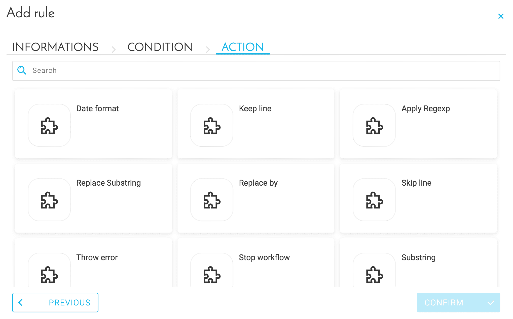

# 準備のルールのセットアップ

ForePaaSプラットフォームには、デフォルトの「ブループリントルール」が用意されています。このデフォルトのブループリントルールには、ユーザーが簡単なデータ準備を実行するのに役立つクリーニングロジック（日付や3桁ごとの区切りなど）が含まれています。 

ForePaaSプラットフォームを利用する際のブループリントルールの使用は必須ではありません。ブループリントルールを使用すると、ForePaaSのウェアハウス内にデータを取り込む際に定義するETLアクションにルールが自動的に追加されます。

---

## ブループリントルールの設定

ルールでは、次の3つのステップを設定する必要があります。
1. **Informations（情報）**：ルールの名前と説明
2. **Condition（条件）**：条件に対して適用するルール
3. **Action（アクション）**：条件が確認された場合に、データに対して適用するアクション

属性に対するルールを追加するには、該当するフィールドで、次のボタンをクリックします。

---

## 条件
 次のような、さまざまな**条件**が利用できます。

- *All（すべて）*：すべての値に適用されるルール

- *Type（タイプ）*：タイプに基づいて値に適用されるルール（数値である、数値日付ではない／日付ではない、など…）  

- *Regexp（正規表現）*：正規表現に基づいて適用されるルール

- *Condition（条件）*：算術式によってフィルタリングするルール（等しい、等しくない、より小さい、など）  

- *Set（セット）*：一連の値で属性をフィルタリングするルール、適用（等しい）または除外（等しくない）

---

## アクション

次のような、さまざまな**アクション**が利用できます。 

- *Replace by*:値を1つの値に置き換える

- *Substring（サブ文字列）*：値を切り詰める

- *Date format（日付の形式）*：日付の形式を置き換える  

- *Keep line（行を保持）*：一致する値を保持する

- *Skip line（行をスキップ）*：一致する値をスキップする 

- *Throw error（エラーをスロー）*：値が一致する場合にエラーをトリガーする

- *Replace substring（サブ文字列を置き換え）*：一致するサブ文字列を置き換える   

- *Apply regexp（正規表現を適用）*：一致する値に新しい正規表現を適用する

- *Stop workflow（ワークフローを停止）*：進行中のワークフローを停止する

アクションを設定すると、該当する属性に対してルールが適用されます。 

{ブループリントルールの詳細を確認する}(#/jp/product/etl/actions/settings/blueprint-rules.md)