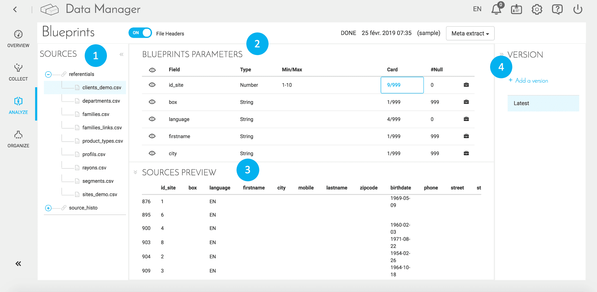
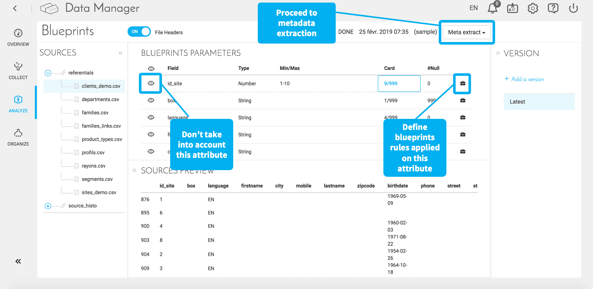

# 分析
分析はForePaaSで**データ品質**を確保する最初の段階です。

分析を定義すると、Data Managerの「*Analyze（分析）*」メニューでソースの検証と分析が行われます。分析には、次の情報が表示されます。

* **メタデータの抽出**：メタデータは、さまざまなソースのデータに関する情報を提供する構造化されたデータのセット
* **ブループリント**：ブループリントは、データソースに適用して適合性をチェックするための一連のルールに対応  

  

1. 左側には、「Collect（収集）」メニューに列挙されるソースが表示されます。
2. プラットフォームには、ファイルのメタデータ（カーディナリティ、最小値／最大値、フィールドのタイプなど...）に関する情報が表示されます。

|        |          |         |
| :------------ | :-------------: | -------------: |
|       |     フィールドの有効化／無効化     |
| Field       |     フィールド名     |
| Type     |   フィールドタイプ（str：文字列、Num：数値など）    |     
| Min/Max        |   NumやFloatなどのフィールドの最小値／最大値     |  
| Card        |     一意の値の数／合計数     | 
| #Null        |     Null値の数     |  
|        |     フィールドに対するルールの実装      |  

3. 結果のサンプルが表示されます。
4. データ品質および管理ルールを追加できます。

### 基本的な操作
  

メタデータの抽出は、次の2つの方法で行うことができます。
- Sample（サンプル） = 抽出されたソースのデータサンプル（こちらの方が高速）
- Exhaustive（完全） = ソースの完全な分析

ブループリントの属性ごとに、次の操作を行うことができます。
* データを体系化する際にある属性を無視
* データをロードして処理する際にある属性に適用できるブループリントのルールを設定

{次の記事：体系化}(#/jp/product/data-manager/organize)