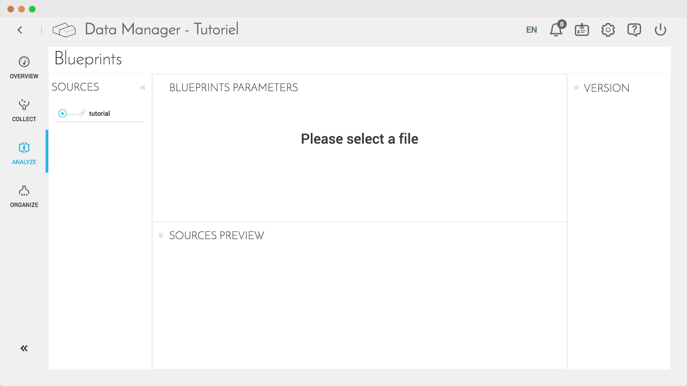
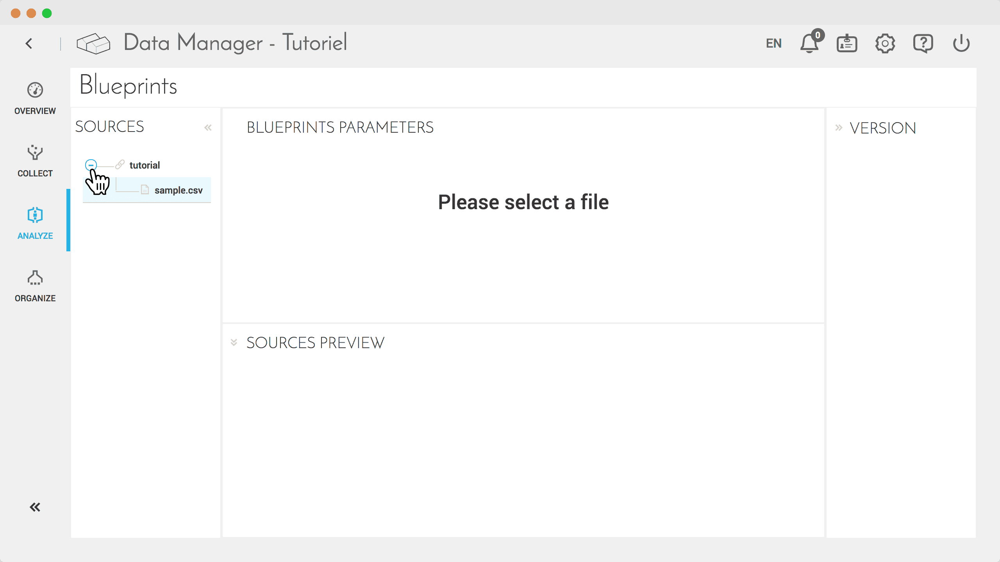
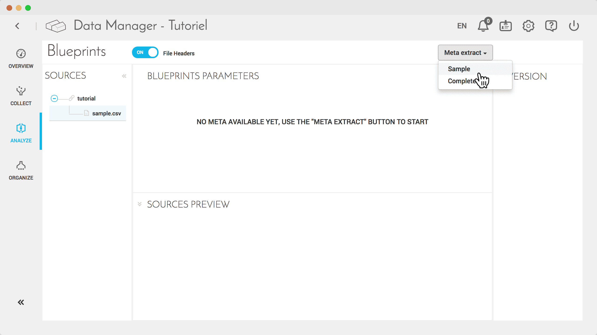
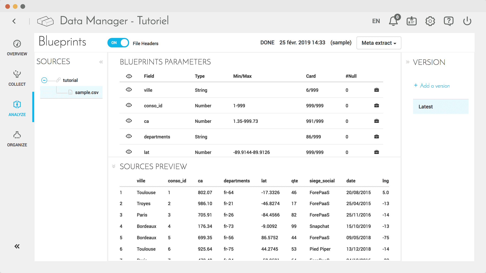
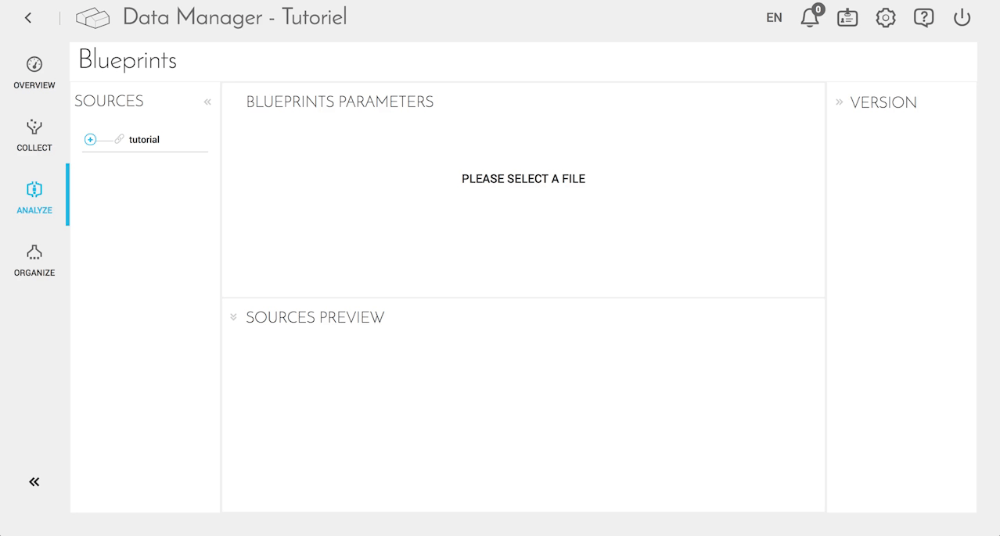

# ソースの事前分析の実行

## はじめに

データ分析はデータ処理の重要な役割を担っています。ここでは本番運用前に、分析、フィルター処理、ルールの追加、データのプレビューを行うことができます。

**Analyze（分析）**機能は**Data Manager**にあります。

## ソースの分析

*.csv*ファイルのアップロードなどにより**収集**ステップでテーブルの追加が完了したら、次のステップである**分析**に進むことができます。

1. 分析には、次の4つのパネルがあります。
  - **Sources（ソース）**：左側のパネルです。追加したすべてのソースが表示されます。ソースはツリー形式で表示され、指定したソースの名前を親、それぞれのテーブルを子として表示されます。
  - **Blueprints（ブループリント）**：上部のパネルです。ソースを選択すると、処理されたメタデータが表として表示されます。ルールやフィルターを追加することができます。
  - **Sources Preview（ソースプレビュー）**：下部のパネルです。「Blueprints（ブループリント）」パネルで設定したルールやフィルターを用いてデータをプレビューできます。
  - **Version（バージョン）**：右側のパネルです。目的のテストを行うために、データのバージョンを作成できます。

2. 最初に、「**Sources（ソース）**」パネルでテーブルを選択します。使用するテーブルの名前は、*tutorial*というソースの*sample.csv*です。

3. すべての新しいソースやテーブルでメタ抽出を行って、メタデータを使用できるようにする必要があります。これを行うには、「**Meta extract（メタ抽出）**」選択ボックスをクリックして「**Sample（サンプル）**」を選択し、テーブルのサンプルを生成します。選択したテーブルのサイズによっては、この処理に時間がかかることがあります。

4. 生成が済んだら、関連するルールなどを追加してデータでの作業を開始できます。

---

以下は、このガイドの内容をアニメーション画像にまとめたものです。

