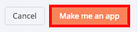
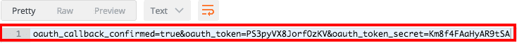

# Appfigures

## はじめに

Appfiguresは、モバイルアプリケーション用のインサイトおよび分析プラットフォームです。このコネクターでは、Appfiguresのデータの探索と分析を容易に行い、人々がアプリケーションをどのように利用しているかをモニタリングできます。 

## 概要

## ステップ1：クライアントキーとシークレットキーの取得
https://appfigures.com/developers/keysにアクセスします。

新しいクライアントを作成します。  
  
お好きな名前を付け、すべての権限に対して「read」を選択します。  
  
「Make me an app」をクリックします。  
  
「client key」と「secret key」を取得します。  

  

## ステップ2：OAuthリクエストトークンの生成

Postmanを使用してPOSTリクエストをhttps://api.appfigures.com/v2/oauth/request_tokenに送信します。

次のヘッダーを使用：  
Authorization: OAuth oauth_signature_method=PLAINTEXT, oauth_consumer_key=client_key, oauth_callback=oob, oauth_signature=secret_key&

レスポンスからoauth_tokenとoauth_token_secretを取得例：  
oauth_callback_confirmed=true&oauth_token=vifQIctgFPZkzjAn&oauth_token_secret=8kFCkkeHTMuKitXm)
  
  

## ステップ3：アプリケーションの許可

ブラウザでURL：https://api.appfigures.com/v2/oauth/authorize?oauth_token=oauth_tokenを開きます（oauth_tokenをステップ2で取得したトークンに置き換えます）。  
必要に応じて、Appfiguresアカウントにログインしてアプリケーションを許可します。  
  
承認されると、検証コードにアクセスできるようになります。  
  

## ステップ4：アクセストークンの取得

もう一度、Postmanを開いてGETリクエストをhttps://api.appfigures.com/v2/oauth/access_tokenに送信します。

次のヘッダーを使用：  
Authorization:  OAuth oauth_signature_method=PLAINTEXT,oauth_verifier=verifier_code,oauth_consumer_key=client_key,oauth_token=oauth_token,oauth_signature=secret_key&oauth_token_secret  
最後に、レスポンスから新しい（最終的な）oauth_tokenとoauth_token_secretを取得します。  
例：  
oauth_token=aleSBfJOFruuo66c&oauth_token_secret=EMt1klatKL8vAp3p
  
  

## ステップ5：必要な情報

Appfiguresアカウントに接続するためには、次の情報を用意する必要があります。  
* client_key（ステップ1）  
* secret_key（ステップ1）  
* oauth_secret（ステップ4）  
* oauth_secret_key（ステップ4）  
