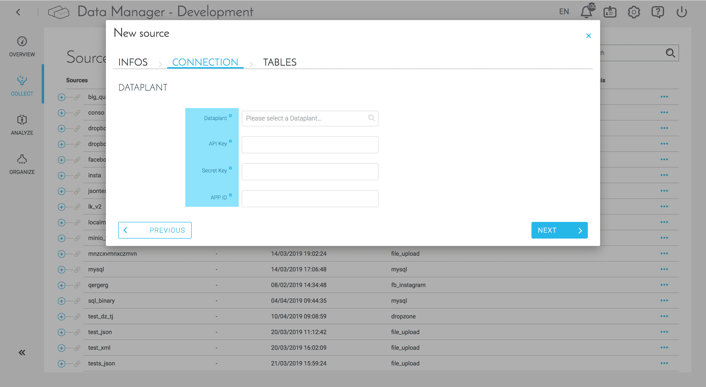
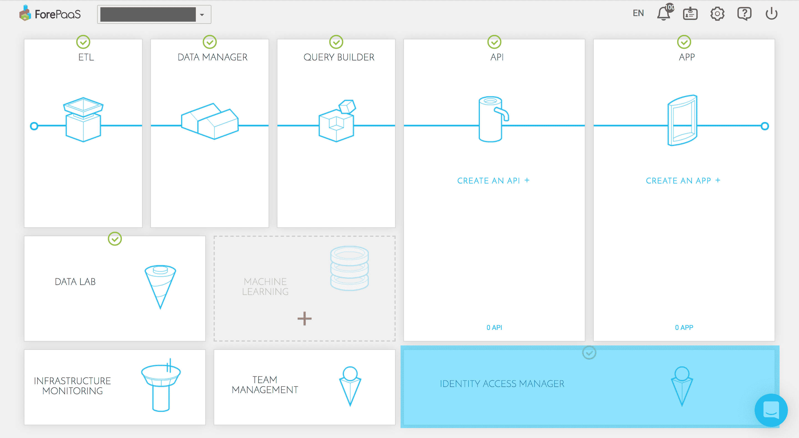
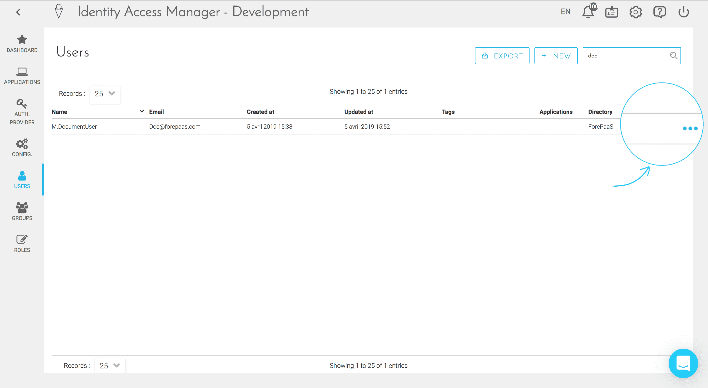
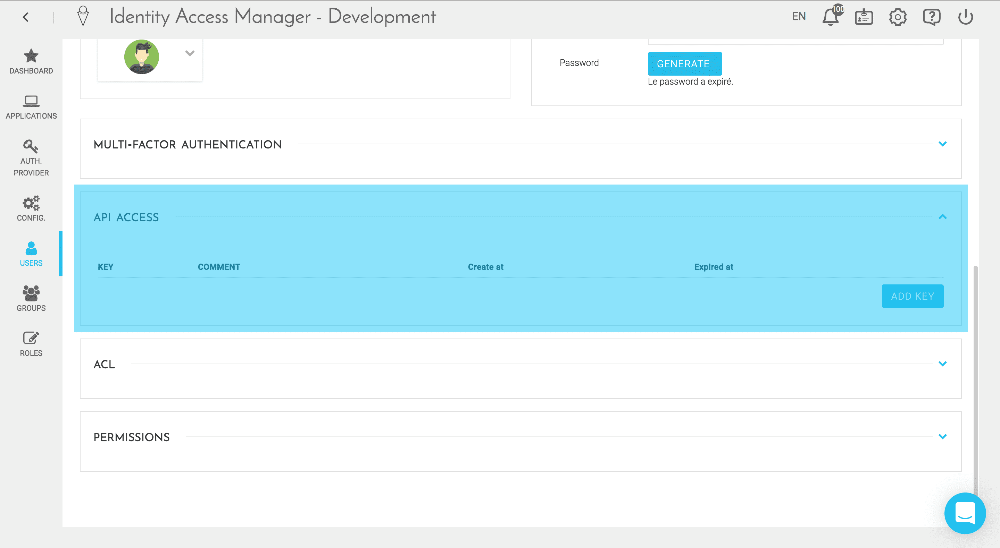
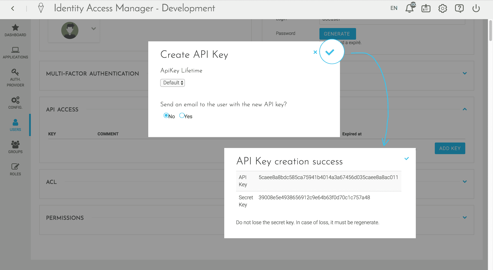
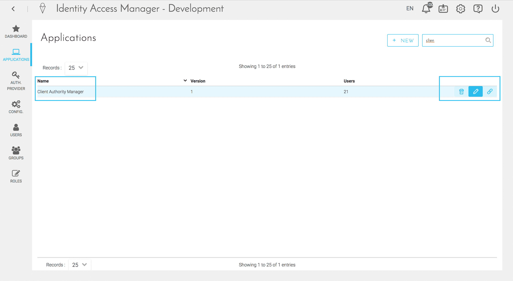
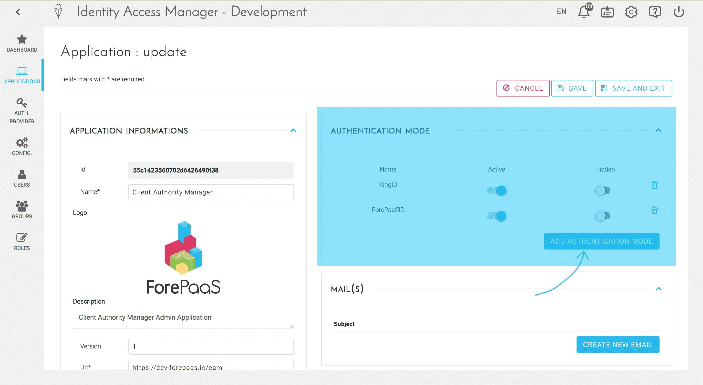
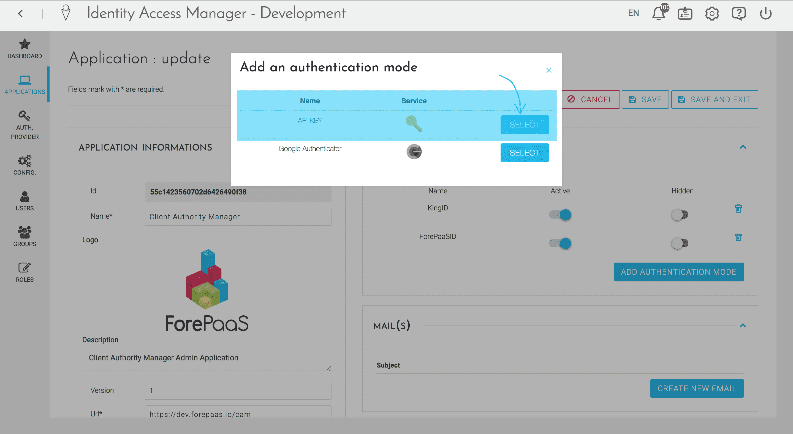

# データプラント

「データプラント」ソースは、別のデータプラント内のテーブルのデータを現在のデータプラントにインポートするためのコネクターです。

## ソースの構成

「データプラント」コネクターを使用するには、次の操作を行う必要があります。
* 元のデータプラント（エクスポートするデータプラント）のIdentity Accessコンポーネントで**APIキーとシークレットキー**のアクセスを取得
* CAM（Client Authority ManagerまたはAccess Manager）から**APP ID**を取得し、**KEY API**認証モードを有効化

これらの手順が済んだら、以下のフィールドに入力してソースを設定できます。
* **DataPlant**：データのエクスポート元のデータプラント名
* **API Key**：このデータプラントに関連付けられているAPIキーのID
* **Secret Key**：APIキーを作成する際にやり取りされるシークレットキー
* **APP ID**：Client Authority ManagerアプリケーションのID

## APIアクセスの取得

1. ForePaaSにログインし、データのエクスポート元のデータプラントに移動します。続いて、Identity Access Managerコンポーネントをクリックします。

2. Identity Access Managerコンポーネント内で、« Users（ユーザー） »タブに移動し、ユーザープロファイルを編集します。

3. ユーザープロファイルページを下にスクロールすると、ForePaaSへのAPIアクセスが存在します。このセクションの表示を展開し、まだキーが作成されていない場合は、「ADD KEY（キーを追加）」をクリックします。

4. 新しいAPIキーを作成する際には、APIキーの有効期間（すなわちAPIキーが無効になるタイミング）を選択できます。また、新しく作成したAPIキーとシークレットキーをメールで受け取ることもできます。 

## APP IDの取得とAPI認証モードのアクティブ化

1. IAMコンポーネントのメニューで、« Applications（アプリケーション） »タブを選択し、「編集」アイコンをクリックしてClient Authority Managerアプリケーションページに移動します。

2. このページには、アプリケーションのAPP IDの情報が表示されます。APIキーの認証モードが表示されていない場合は、「ADD AUTHENTICATION MODE（認証モードを追加）」をクリックします。表示されている場合は、「Active（アクティブ）」に設定されていることを確認します。

3. 新しく表示されたウィンドウでAPI認証モードを選択して確認を行います。 

