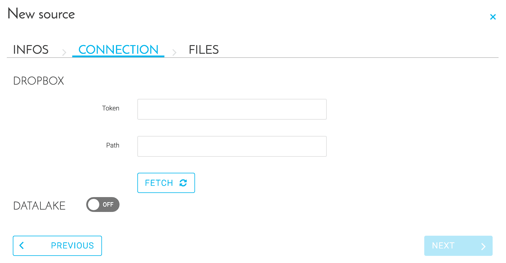

# Dropbox

## はじめに

Dropboxは、ファイル共有や共同作業に使用するクラウドストレージサービスです。ForePaaSでは、Dropboxに保存したデータを収集し、プラットフォームに直接インポートすることができます。  

## 構成画面の概要

 

## DropBoxのトークンの取得

* https://www.dropbox.com/developers/apps/createにアクセスします。

* 「`Dropbox API`」を選択します。

* 「`Full Dropbox`」または「`App Folder`」アクセスを選択します。

* アプリケーションの名前を指定します。

* アプリケーションが作成されたら、アプリケーションリストを選択します。

* 必要に応じて、「`App Key`」と「`App Secret`」をコピーします。

* 「`Generated access token`」の下の「`Generate`」をクリックします。

* このトークンをコピーします。

<!-- Resources definition -->

