# Facebook

## はじめに

このコネクターを使用すると、Facebookデータの統合を容易に行うことができます。以下のガイドに従い、ForePaaSでフォロワーのデータの利用を始めることができます。 

## 構成画面の概要
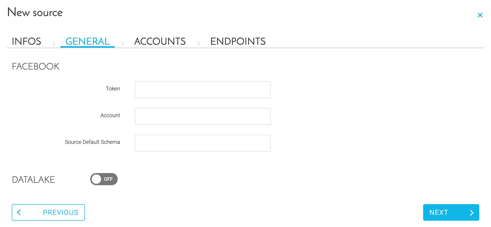

## フィールドの説明
- **Token（トークン）**：Facebook Developerアプリケーショントークン  
- **Account（アカウント）**：FacebookページのID
- **Source** Default Schema（ソースのデフォルトスキーマ）: todo

生データの保持を有効にするには、`DATALAKE`の前にある切り替えボタンをクリックします。

## Facebook Developerアプリケーショントークンの作成方法

以下のステップでは、Facebook Developerのユーザーインターフェースでアプリケーショントークンを作成する手順について説明します。

### 前提条件

- アクセストークンが必要なFacebookページに対するすべての**管理者**権限を持つFacebookアカウントに、ログインします。  
`自分がページの管理者でない場合は、管理者にページへのアナリストアクセスを付与するように依頼してください。`

- トークンへのアクセス権限を付与したアカウントに、ページに対する管理者またはアナリストの役割がなくなった場合、該当するアクセストークンは無効になることに注意してください。

### 手順

#### ステップ1：Facebook Developerアプリケーションの作成

- https://developers.facebook.com/に移動し、右上隅にある「`Get Started`」をクリックします。

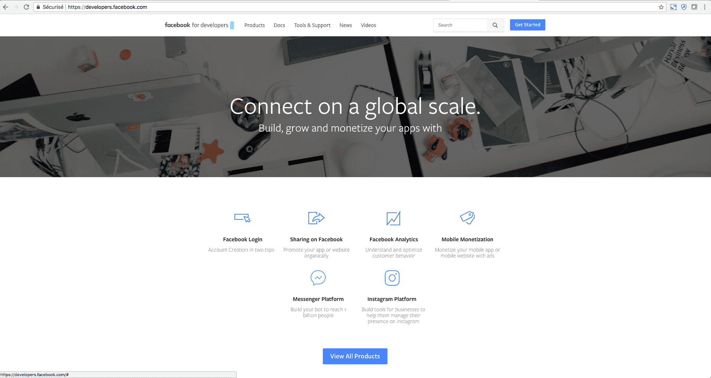

- 表示されたポップアップウィンドウの手順に従います。« First App »の作成は必須ではありません。この手順は省略できます。

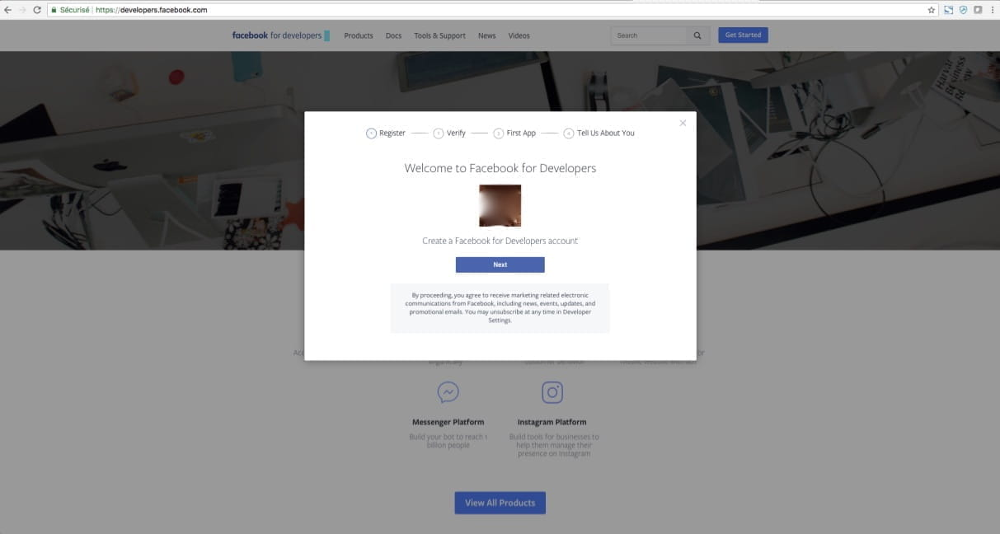

- https://developers.facebook.comに移動します。右上隅の検索バーの右横にある「`My Apps`」メニューを開きます。右上隅の「`Add a New App`」ボタンをクリックできるようになります。

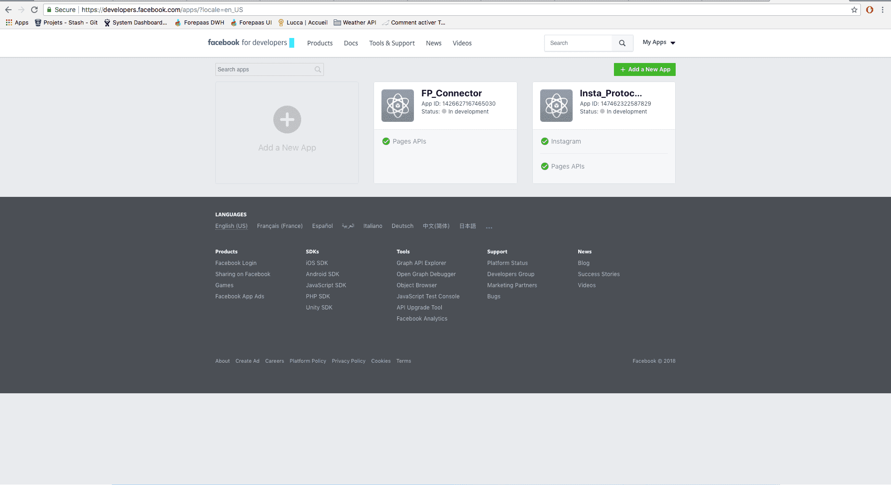

- ポップアップ表示されたフォームの空欄に入力し、「`Create App ID`」をクリックします。

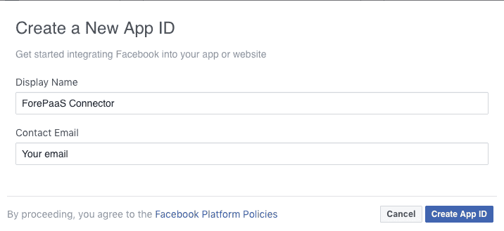

#### ステップ2：App IDとApp Secretの取得

- 新しいApp Dashboardが表示されます。左側にある「`Settings`」をクリックしてから、そのすぐ下の「`Basic`」をクリックします。

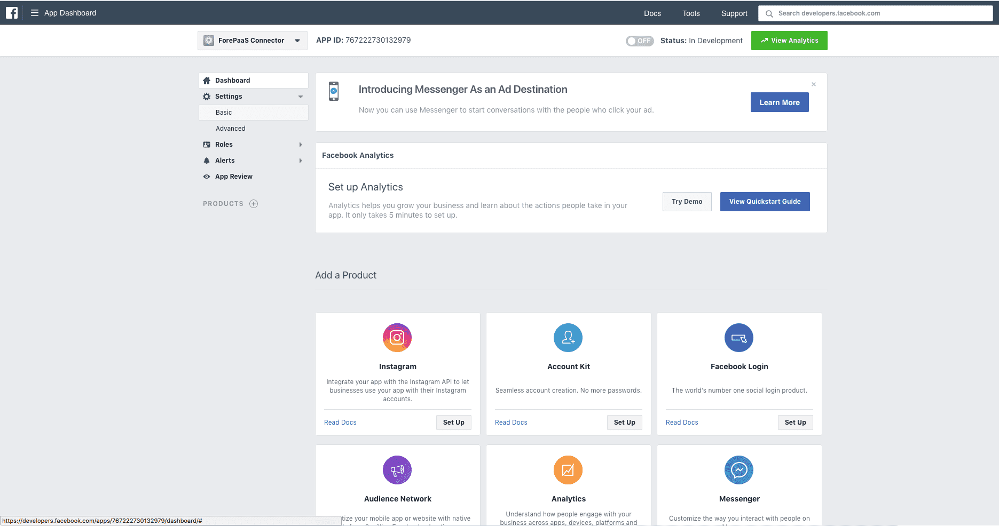

- 「`App Secret`」フィールドの右側にある「`Show`」をクリックします。

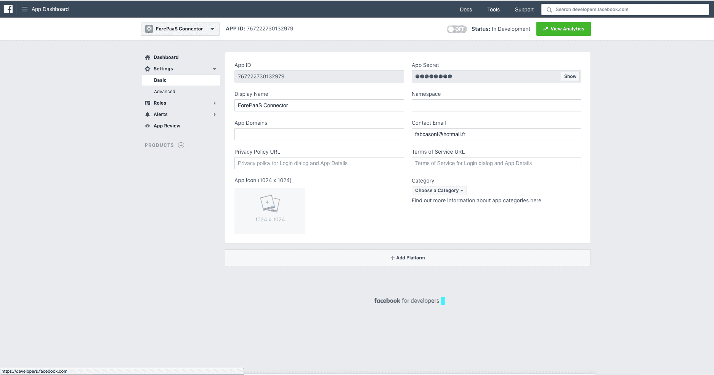

- App IDとApp Secretをコピーし、新しく開いたテキストエディターウィンドウに貼り付けます。

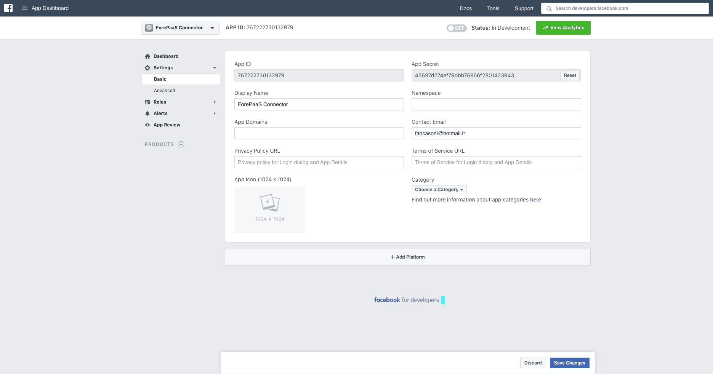

### Facebookアプリケーションを認可する方法

* https://developers.facebook.com/appsに移動します。レビューが必要なアプリケーションをクリックします。

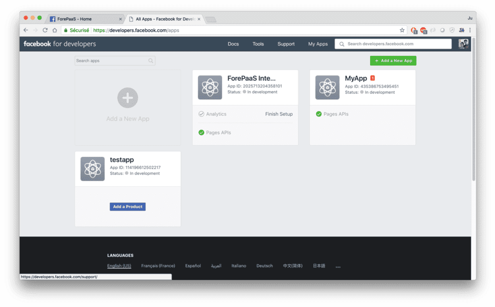

* 基本設定に移動します。「Settings」をクリックしてから「Basic」をクリックします。

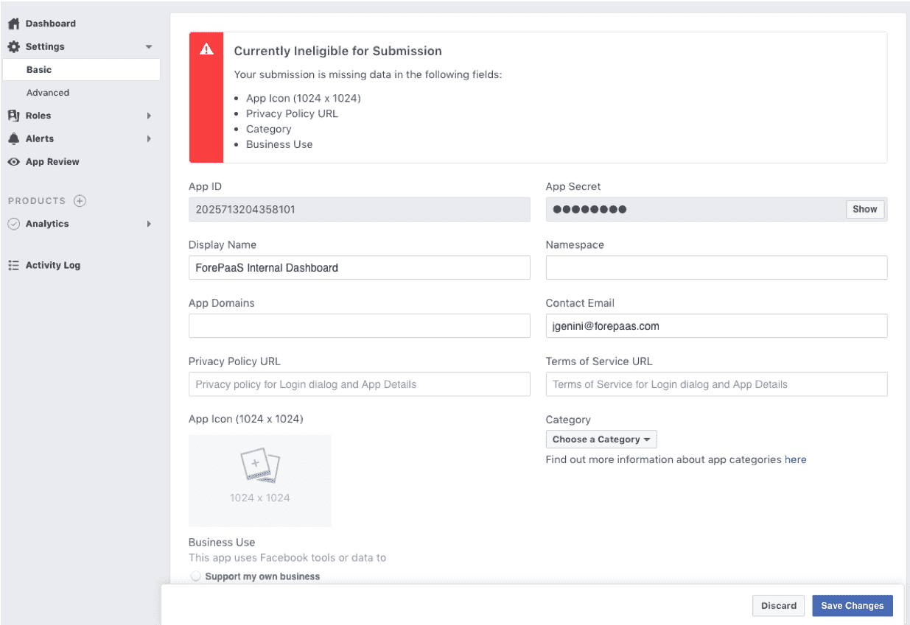

* 基本設定を入力します。アプリケーションを申請するには、以下の情報を入力します。

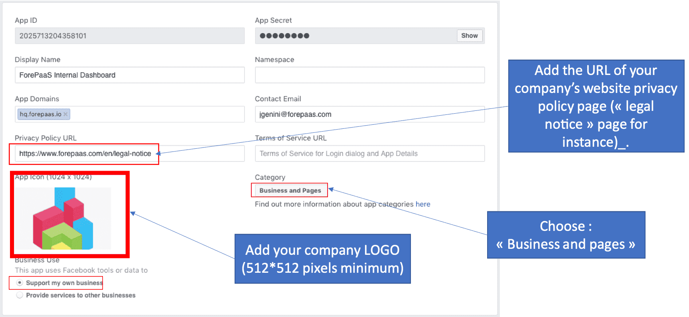

* プラットフォームを追加します。設定ページの下部にある「Add Platform」をクリックします。次に、Websiteをクリックし、会社のWebサイトのURLを入力して、右下にある「Save changes」をクリックします。 

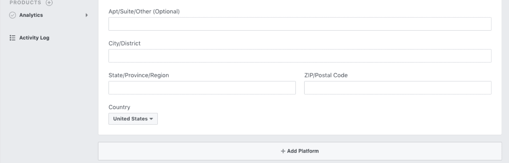

* 「App Review」をクリックして、アプリケーションのレビューを開始します。続いて、右隅の「Add items」をクリックします。 

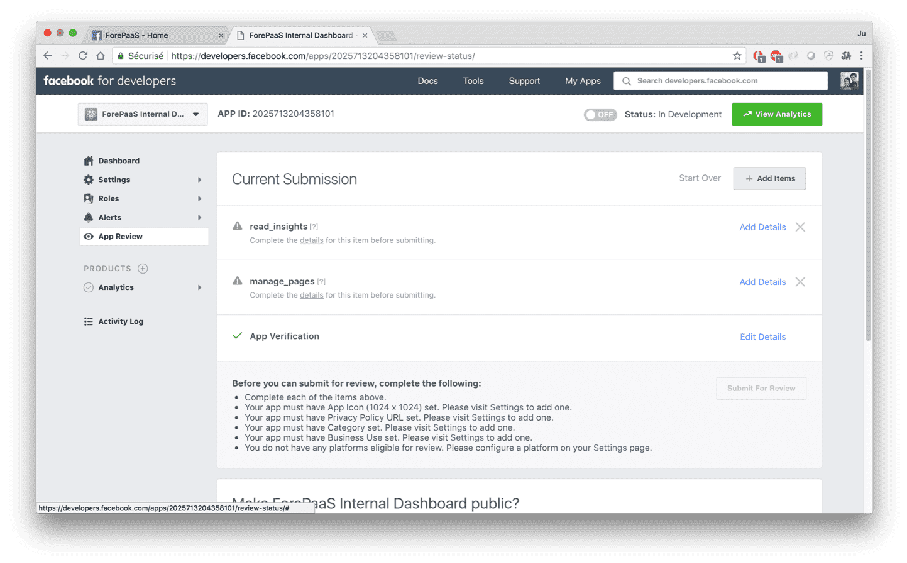

* 「Read_insights」をクリックし、Add 1 Itemをクリックします。 

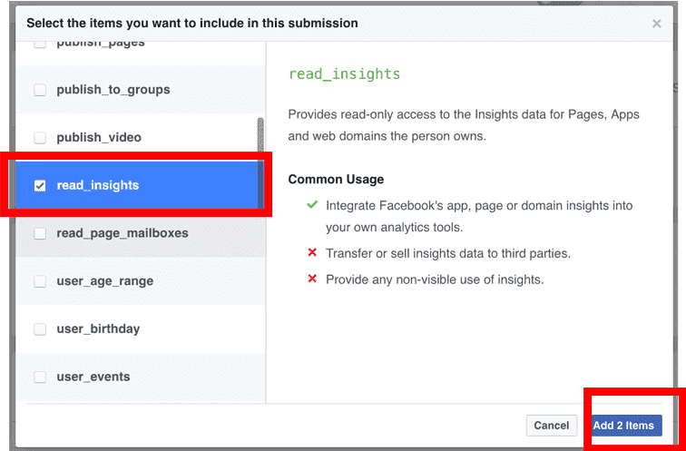

* 申請の詳細を追加します。「App review」タブに戻り、read_insightsの「Add Details」をクリックします。 

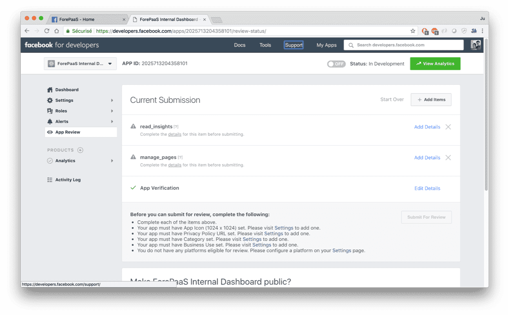

* read_insightsの申請の詳細を追加します。

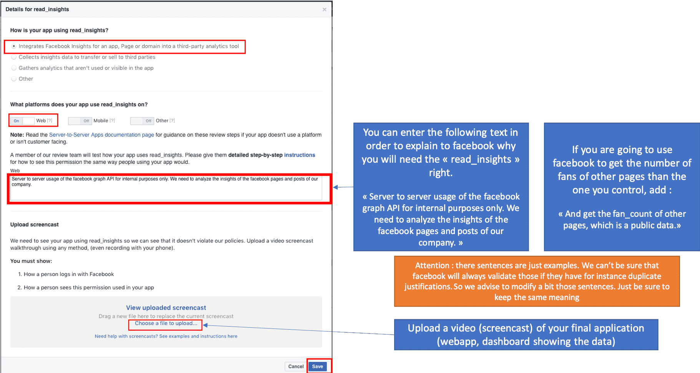

* レビューを申請します。条件をよく確認し、「I accept...」をクリックしてから、「Submit」をクリックします。 

* レビューの結果を確認します。
Facebookのレビューには2～3日かかります。繁忙期には数週間かかる場合もあります。
レビューが承認されない場合：
承認されない理由がスクリーンキャストにある場合は、Facebookの通告に基づいてスクリーンキャストを再調整します。
承認されない理由がレビューテキストにある場合は、テキストを再調整し、弊社までフィードバックをお送りください。
承認されない理由が過度に制限的と思われる場合や、現在のドキュメントと矛盾する場合は、ForePaaSチームまでお問い合わせください。
弊社でできる限りの支援を行います。

* ビジネスを作成します。左側のメニューで、「Settings」をクリックしてから「Advanced」をクリックします。「Business Manager」が表示されるまで下にスクロールして、「Get Started」をクリックします。 

* 以下のフォームに入力して検証を行います。 


* ビジネスを検証します。アプリケーションの検証が済んだら、ビジネスの検証を行うため、メッセージが送付されます。
App Reviewに移動し、« Provide business details »をクリックします。これらを入力し、「Next」ボタンをクリックします。  

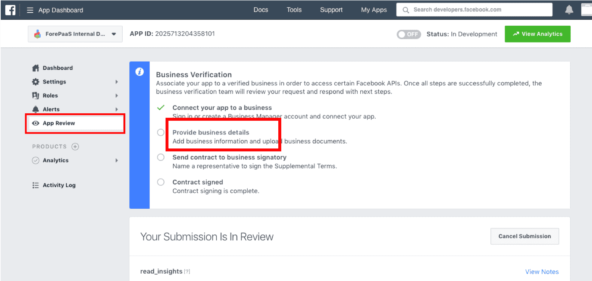

* ビジネスの正式名称と、先ほど入力した内容と一致する以下のうち少なくとも1つが記載されたビジネスドキュメントを提供する必要があります。
 * 会社の電話番号
 * 住所
 * Tax ID（納税者登録番号）

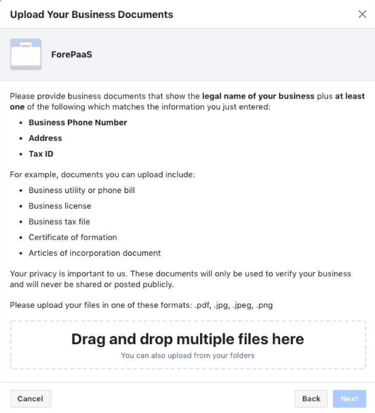

* 申請者に関する基本情報を入力し、「Submit」をクリックします。 

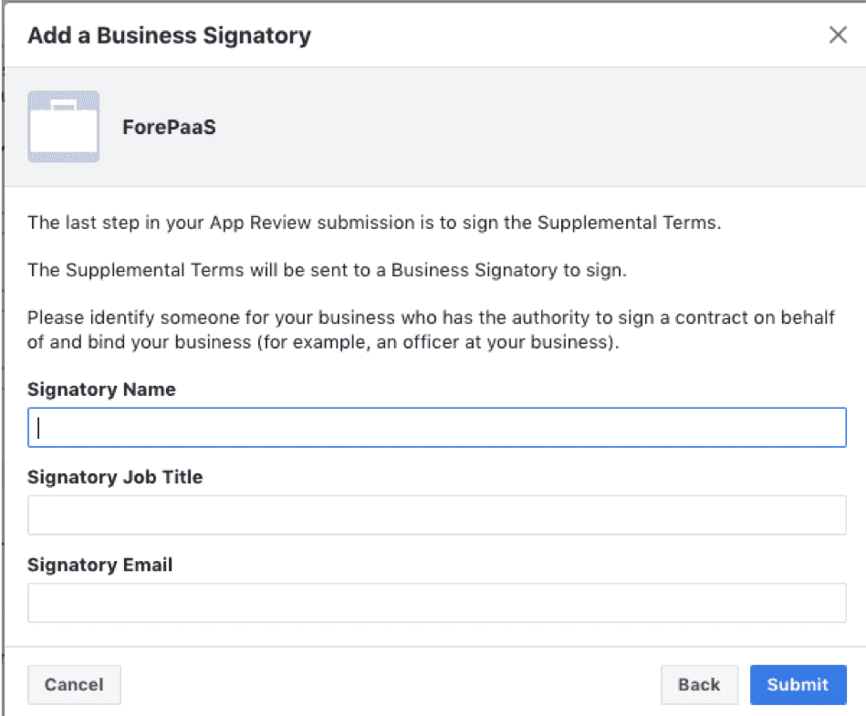

* 法的規約の承認を行うため、メールが送付されます。
メールが届かない場合は、迷惑メールボックスを確認してください。
または、直前のステップをやり直して、電子メールの情報を修正し、再度「Submit」するとメールが再度送信されます。
法的規約を承認するには、リンクをクリックします。

* 法的規約のページで、規約の内容をよく確認します。
すべての規約に同意する場合は、« I Agree »をクリックします。 

ステップ3に進みます。

#### ステップ3：アプリケーションのトークンの生成

- https://developers.facebook.com/tools/explorer/に移動します。  

- 右上にある「`Graph API Explorer`」ドロップダウンメニューをクリックし、新しく作成されたアプリケーション（以下のスクリーンショットの`ForePaaS Connector`）を選択します。

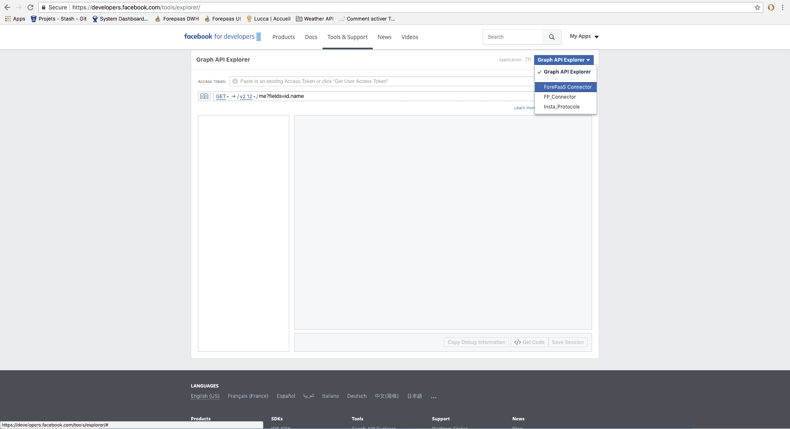

- 次に、「`Get token`」ボタンをクリックし、ドロップダウンメニューから「`Get User Access Token`」を選択します。

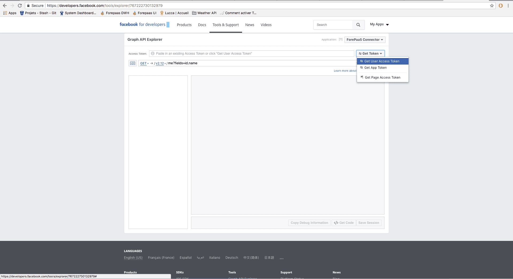

- ポップアップ表示されたウィンドウで、必要なその他の権限を選択し**（必ず「`read_insights`」オプションにチェックを入れてください）**、「`Get Access Token`」ボタンをクリックします。

> 注：前述のように、この作業を行うには、**管理者**または**アナリスト**のアクセス権を持つアカウントでFacebookにログインする必要があります。</pre>

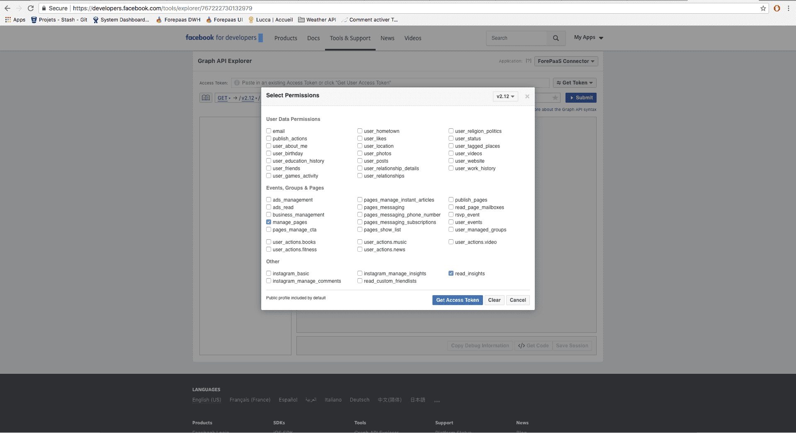

- 「`Continue as`」ボタンをクリックします。 

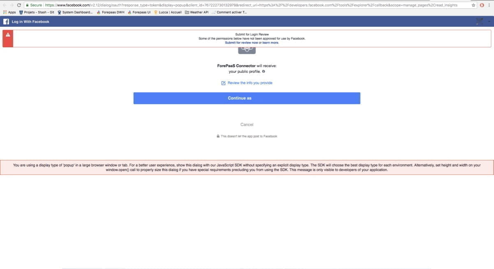

- 次に、右下にある「`OK`」をクリックします。

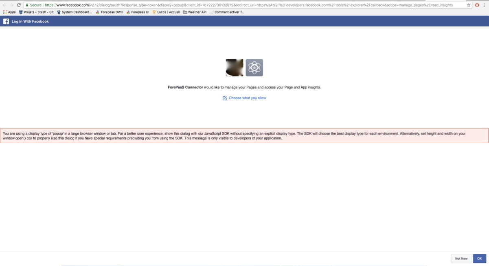

- 短期のアクセストークンが生成されました。アクセストークンをコピーして、App IDとApp Secretと一緒にテキストエディターに貼り付けます。

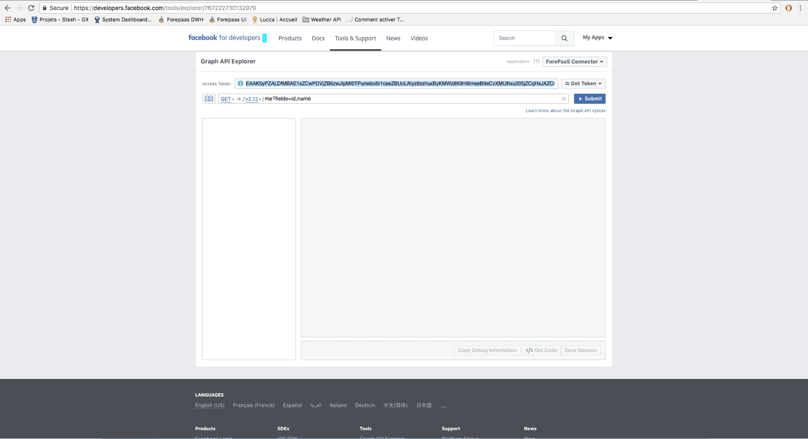

- 次に、**{app_id}**、**{app_secret}**、**{access_token}**の値を置き換えて、以下のURLテンプレートを編集します。 
> ``` https://graph.facebook.com/v2.12/oauth/access_token?grant_type=fb_exchange_token&client_id={app_id}&client_secret={app_secret}&fb_exchange_token={access_token} ```

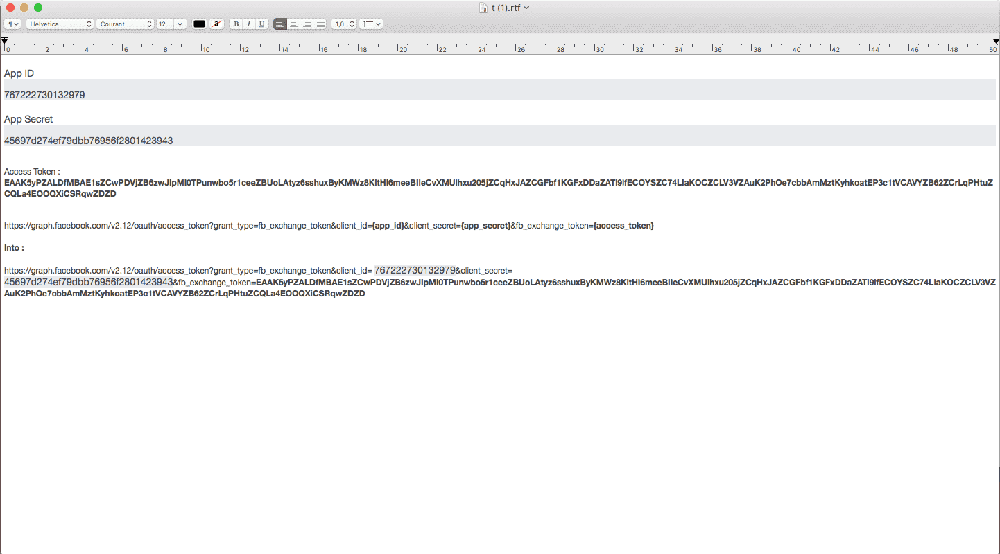

- 編集が済んだら、URLをWebブラウザに貼り付けます。結果をコピーし、テキストエディターに貼り付けます。

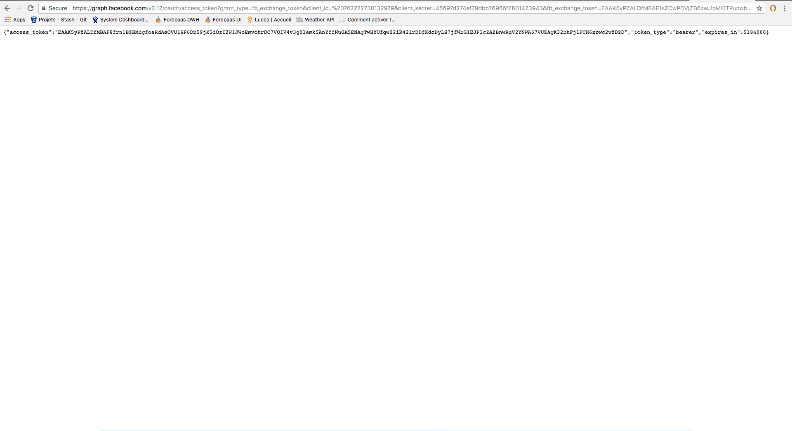

- 次の新しいURLをコピーし、**{access token}**を直前のステップの結果の`"access_token"`フィールドの内容に置き換えます。 
 > ```https://graph.facebook.com/v2.12/me?access_token={access_token}```

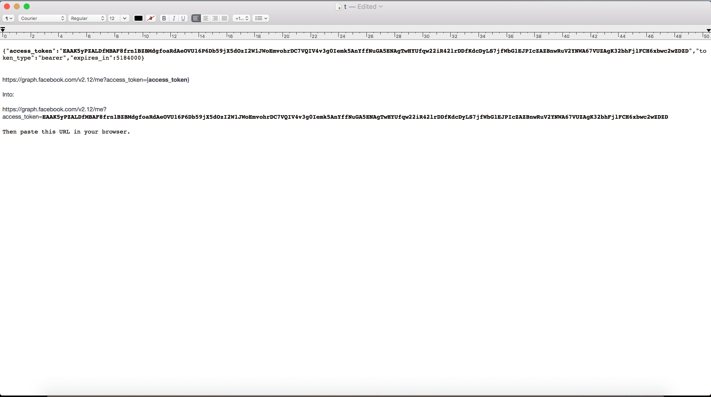

- もう一度、直前のステップの結果をテキストエディターにコピーし、次のURLテンプレートの**{account_id}**と**{access_token}**を前のステップの**id**フィールドと**access_token**フィールドに置き換えます。 
> ```https://graph.facebook.com/v2.12/{account_id}/accounts?access_token={access_token}```

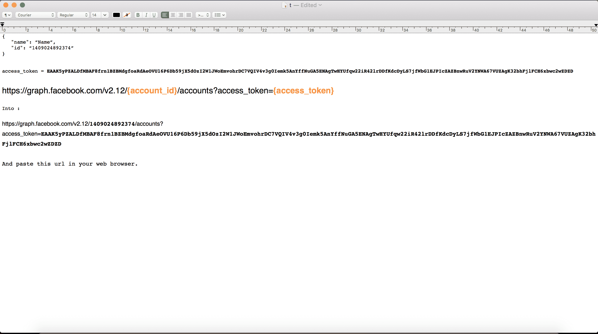

- 最後にもう一度、URLをWebブラウザに貼り付けます。画面に表示された情報を.jsonドキュメントに保存して、新しく取得したトークンを使用できるようになります。


## FacebookページのIDを確認する方法

### 前提条件

- この情報を取得するには、Facebookページの管理者である必要があります。

### 手順

#### ステップ1：Facebookページへの管理者アクセス権を持つFacebookアカウントにログインします。

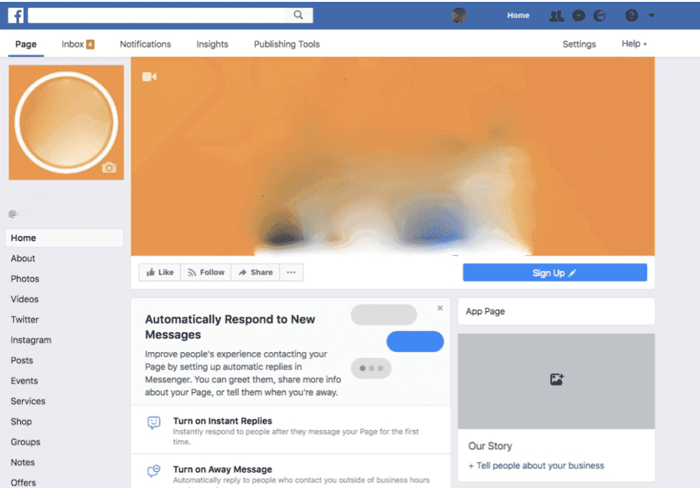

#### ステップ2：横に並んだ3つの点をクリックし、ドロップダウンメニューで「`Edit Page Info`」を選択します。

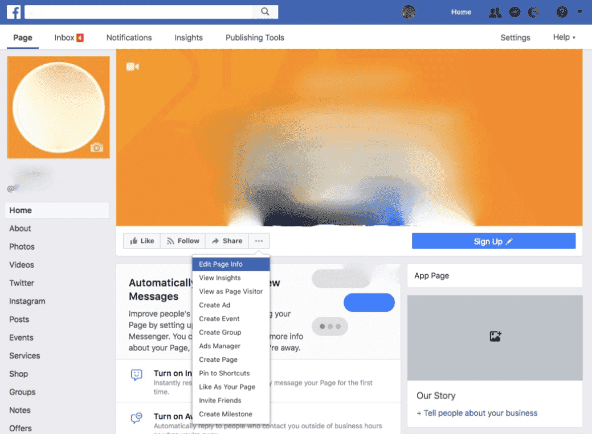

#### ステップ3：ポップアップ表示されたウィンドウの下部にある「`See All Information`」をクリックします。

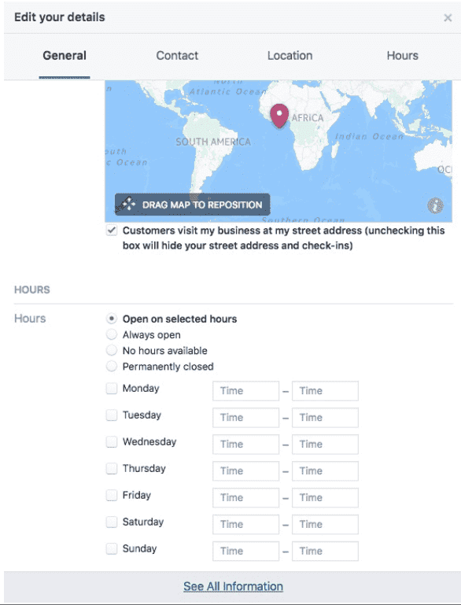

#### ステップ4：ページの一番下にあるPage IDをコピーします。

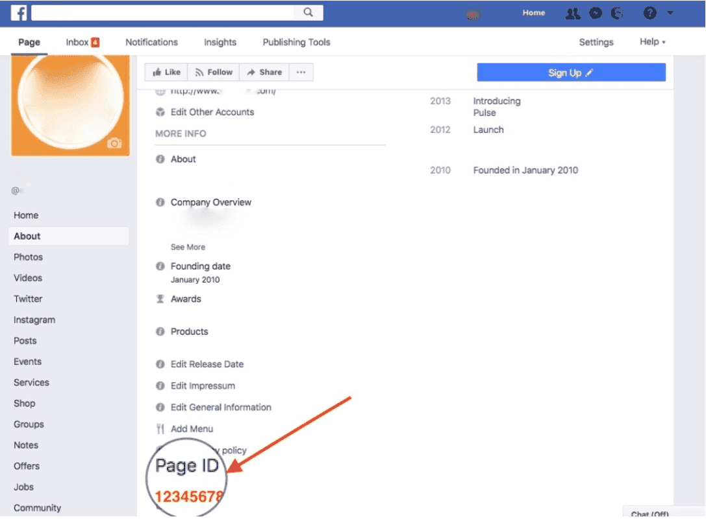

