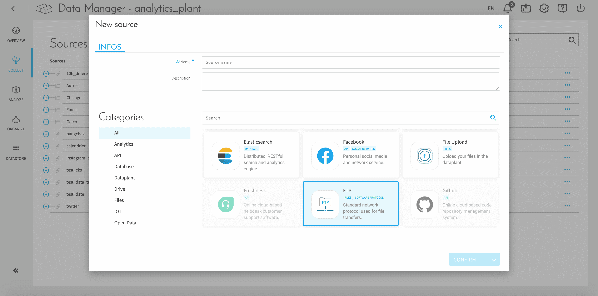
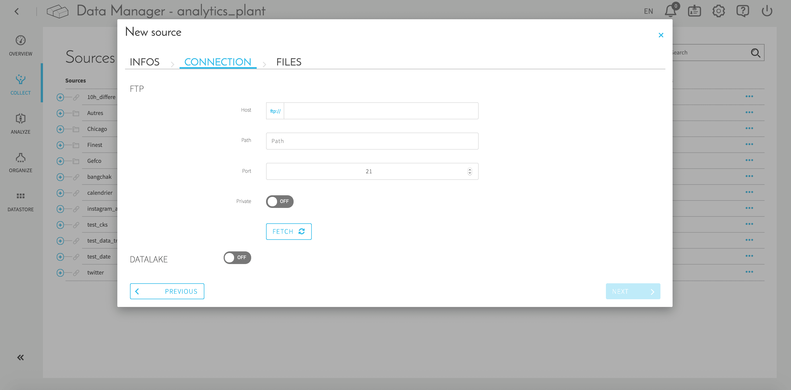
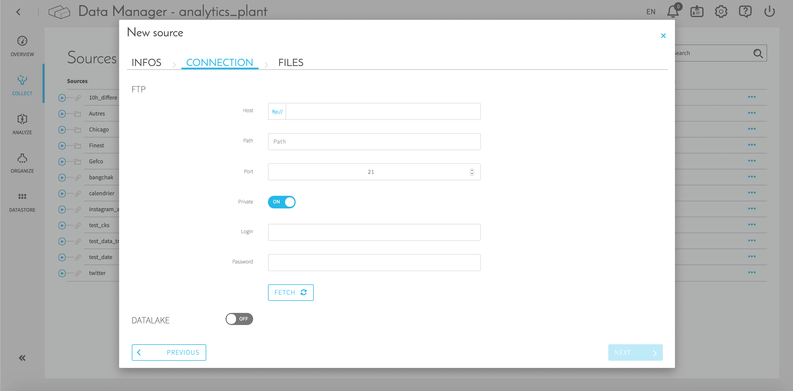
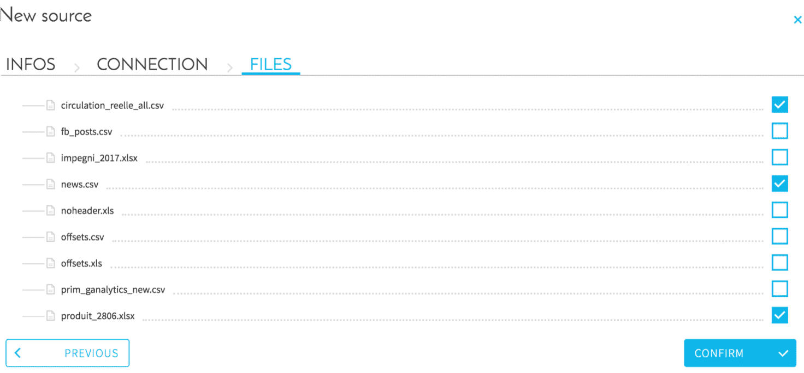

# FTPプロトコル

## はじめに

FTP（File Transfer Protocol）は、コンピューターネットワーク上のクライアントとサーバーの間でコンピューターファイルの転送を行うための標準的なネットワークプロトコルです。
ForePaaSでは、FTPサーバーに接続し、FTPサーバー上のファイルを選択して、そのデータをプラットフォームに直接インポートできます。

## ステップ

1. ソースを選択する際にFTPコネクターを選択します。

2. 構成画面の概要

ログインとパスワードを使用する場合

必須フィールド：
* Host（ホスト）：接続先のFTPサーバーのURL/IP（例：127.0.0.1）、
* Path（パス）：サーバー上で見つける必要のあるファイルのパス（例：Documents/data/export_2018.csv）、
* Port（ポート）：FTPサーバーのリッスンポート（ほとんどのFTPサーバーは、デフォルトで21）、
* Private（非公開）：ユーザーとパスワードを使ってログインする必要がある場合にオン、
* Login（ログイン）（非公開モードのみ）：認証に使用するログイン、
* Password（パスワード）（非公開モードのみ）：関連するパスワード

「Fetch（フェッチ）」をクリックしてコネクターで構成をチェックした後、「Next（次へ）」をクリックして次のステップに進みます。

3. インポートするファイルをチェックして、« CONFIRM（確認） »をクリックします。

> 関連情報

* このFTPコネクターではサーバー上のすべてのファイルをリスト表示できますが、メタデータやデータの抽出でサポートされるのは、.csv、.xls、.xlsx、.xml、.json、.parquetのみであることに注意してください。

* メタデータの抽出（Data Managerに関するガイドの分析のパートを参照）で、このFTPコネクターでダウンロードされるファイルのサイズの上限は、次の通りです。
 * 完全な抽出：約900 MB
 * サンプル抽出：約2.5 GB