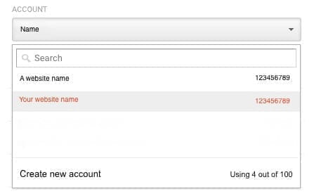

# Google Analytics

## はじめに

Google Analyticsは代表的なWeb分析ツールです。ForePaaSでは、Google Analyticsの有用なすべてのデータを統合し、関連するビジネスインサイトを利用して役立つアクションを実行し、データに基づく優れたアプリケーションを構築できます。 

## 構成画面の概要

* Client email（クライアント電子メール）：
* View ID（ビューID）：
* Private key（秘密キー）：以下のステップ11に記載
* Source Default Schema（ソースのデフォルトスキーマ）：

## Googleサービスアカウントの作成
### サービスアカウントの電子メールとキーの生成方法 

1. https://console.developers.google.comにログインします。  
このコンソールでは、さまざまなサービスを有効化／無効化できます。 

2. « ENABLE APIS AND SERVICES »をクリックします。   
Google APIsのライブラリにリダイレクトされます。

3. 検索バーで« Analytics API »を検索し、これを選択します。   
必ず« Analytics API »を選択し、Google Analyticsの別のAPIを選択しないようにしてください。

4. Analytics APIの概要ページで« ENABLE »をクリックします。   
これでAPIにアクセスできるようになります。

5. 新しいプロジェクトを作成します。すでにプロジェクトが存在している場合でも、サービスアカウント用に新しいプロジェクトを作成する必要があります。

6. プロジェクト名を指定し、« Create »をクリックします。   
作成が完了すると、プロジェクトのダッシュボードにリダイレクトされます。

7. 「Credentials」タブ（左側のメニュー）に移動し、「Create credentials」をクリックします。

8. « Service account key »を選択します。

9. « New service account »を選択します。

10. サービスアカウント名を指定し、ロールとして« Project > Viewer »を選択します。   
キーのタイプはJSONのままにします。« Create »をクリックしてサービスアカウントの作成を完了します。

11. JSONがお使いのコンピューターに自動的にダウンロードされますので、安全に保管してください。これは次のステップで必要になります。このJSONには、ForePaaSがGoogle Analyticsデータにアクセスできるようにするための秘密キーが含まれています。

!> 秘密キーに関する注意  
秘密キーは**極秘情報**ですので、セキュリティ対策なしに電子メールやメッセージで送信しないようにしてください。  
秘密キーは**暗号化したzipファイル**で送信し、zipファイルのパスワードはSMSで受取人に送付するようにしてください。  

## ForePaaSでのGoogle Analyticsの読み取りの許可
### ForePaaSからGoogle Analyticsへのアクセスを許可する方法

前提条件：   
- サービスアカウントの作成によりパートナーから提供された電子メール（ サービスアカウントID ）

12. https://analytics.google.comにログインします。 

13. ウィンドウの右上隅にある縦方向の3つのドットをクリックし、« User settings »を選択します。

14. 左側の列« Account »のドロップダウンメニューで、各自のアカウントを選択します。

15. « User Management »をクリックします。

16. 「ADD」>「Add new users」をクリックします。   
画面の右上隅にあります。

17. パートナーから提供されたサービスアカウントの電子メールを入力します。   
下の図の例の場合：« forepaas-projectname@forepaas.iam.gserviceaccount.com »

18. « Read & Analyze »の権限を許可し、« ADD »をクリックします。   
Googleアナリティクスの表示と分析を行う権限がForePaaSに付与されました。

