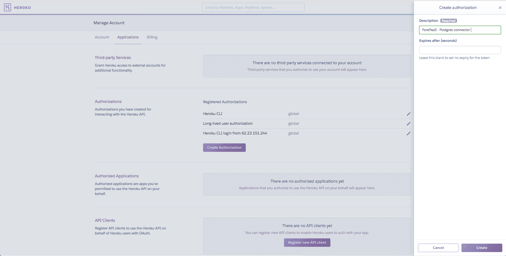
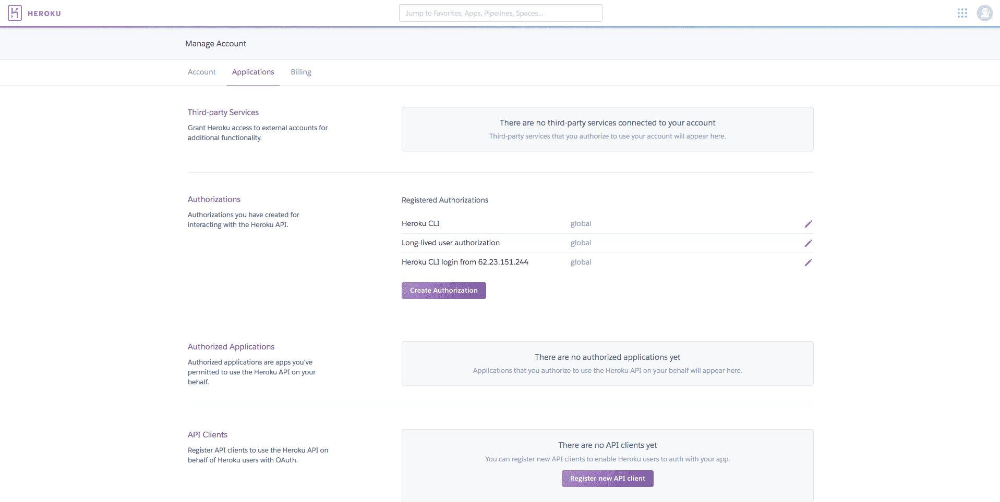
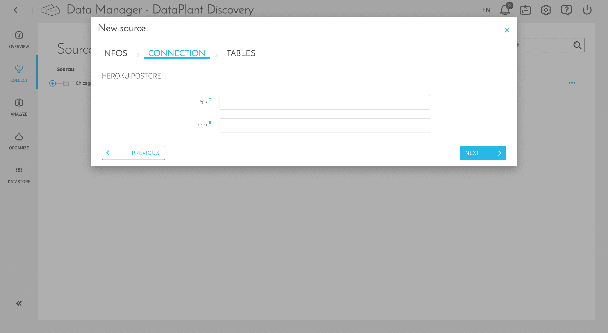

# Postgres Database from Heroku

## Introduction

The source “Heroku Postgres” is a connector that allows you to import data from your Heroku Postgres. Heroku is a platform as a service (PaaS) for deploying applications on the cloud very easily. Read more about their platform directly on there [website](https://www.heroku.com/platform).

In order to use the “Heroku Postgres” connector, you will first need the following **prerequisites**: 
* Have created an application on the Heroku platform, to do that visit your personal applciations [dashboard](https://dashboard.heroku.com/apps).
* Add the Heroku Postgres add-on on this same app inside the application's [resources settings](https://dashboard.heroku.com/apps/APP_NAME/resources).

---

## Create an "Authorization Token"

In order for the connector to work, it is necessary to generate an “authorization token”. It will be used to retrieve the configuration of the Postgres database. Follow the steps below to generate it:

1. Go to the Heroku [application settings](https://dashboard.heroku.com/account/applications)

2. Create an authorization by clicking on the “Create Authorization” button. Enter a description, for example: “ForePaaS - Postgres connector” and click on the “Create” button. Heroku should then display an “Authorization Token”, copy or save it.

3. You are now ready to go to the ForePaaS platform to add the “Heroku Postgres” connector. You only need to get the app name link to your Postgres Heroku and the "Authorization Token" previously copied.

---

## Adding the connector in ForePaaS

Head to your Data Manager component in the "Collect" tab and click "+ New Source". Search for Heroku Postgres, give the source a name and click "Confirm". In the interface please specify the application's ID and new created "Authorization Token". Once you click on "Next", the connector will fetch the list of tables stored in your Postgres database and you will be able to choose the ones you'd like to connect with.

