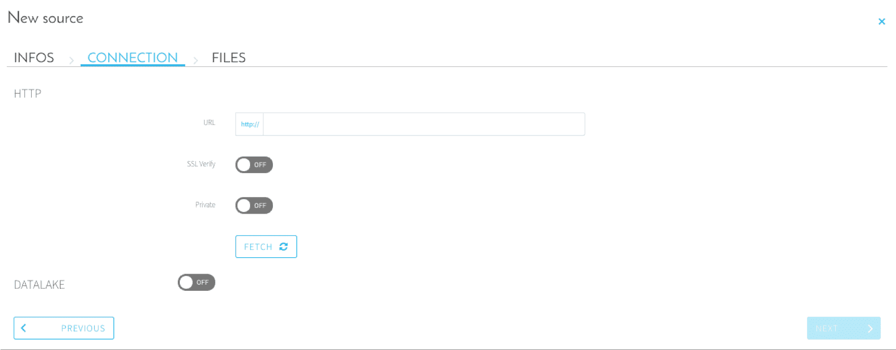
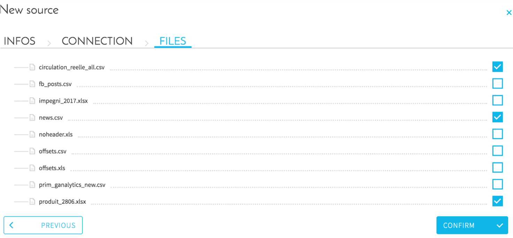

# HTTPプロトコル

## はじめに

「HTTP」は、URLやIPアドレスからファイルをインポートできる標準的なアプリケーションプロトコルです。
このコネクターが使用できるのは、ファイルがHTMLページに記載されている場合のみであることに注意してください。
最新の使用方法では、「HTTP REST」コネクターを使用します。

## 構成画面の概要

ソースを設定するには、次のパラメータを使用する必要があります。
* **URL**：IPまたはホストアドレスとポート（例：127.0.0.1:8888）
* **Private（非公開）**：ログインとパスワードを使用した認証をセットアップする場合
* **SSL Verify（SSL検証）**：セキュアな接続をセットアップする場合

「FETCH（フェッチ）」をクリックして接続をテストします。接続に問題がない場合は、「NEXT（次へ）」をクリックして宛先アドレスのファイルのリストを確認します。

インポートするファイルをチェックして、「CONFIRM（確認）」をクリックします。

## 関連情報

このHTTPコネクターではサーバー上のすべてのファイルをリスト表示できますが、Data Managerコンポーネントの「*Analyze（分析）*」タブでのメタデータの抽出でサポートされるのは、.csv、.xls、.xlsx、.xml、.json、.parquetのみであることに注意してください。

また、メタデータの抽出を使用してその場でデータの検査を行う際のファイルのサイズの上限は、次の通りです。
* 完全な抽出：約900 MB
* サンプル抽出：約2.5 GB

