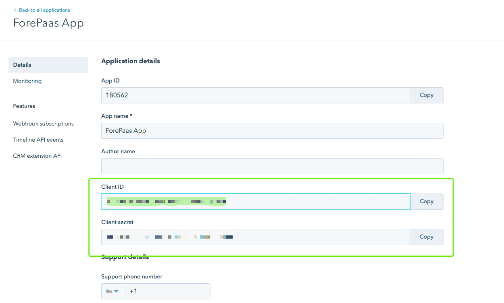

# Hubspot

## はじめに

Hubspotは、自動化を重視したインバウンドセールスおよびマーケティングに特化した製品です。HubspotとForePaaSを連携することで、Hubspotの顧客データを最大限に活用することができます。

## 構成画面の概要

## フィールドの説明
- Hapikey：Hubspot開発者アカウントの「Hapikey」
- Oauth2：todo
- Access Token：Hubspotアプリケーションの「アクセストークン」
- Refresh Token：Hubspotアプリケーションの「リフレッシュトークン」
- Client ID：Hubspotアプリケーションの「クライアントID」
- Client Secret：Hubspotアプリケーションの「クライアントシークレット」
- Redirect URI：データプラントのURI
- Source Default Schema：todo

生データの保持を有効にするには、「DATALAKE」切り替えボタンをクリックします。

## Hubspotの開発者アカウントの作成方法

### ステップ1：開発者アカウントの登録

- https://developers.hubspot.comにアクセスします。
- 「Create a developer account」をクリックします。 

### ステップ2：必要な情報の入力

- 指示に従ってすべてのフィールドに入力し、「Create account」をクリックします。

### ステップ3：アプリケーションの作成

- 上記のステップが済んだら、「Create application」をクリックします。 

### ステップ4：Hapikeyの取得

- 前のステップで「Get HAPIkey」をクリックしてHapikeyを最初に参照することもできます。

### ステップ5：アプリケーション名の指定

- アプリケーション名の指定 
- 「Application visibility」を選択し、「Create」をクリックします。

### ステップ6：アプリケーションのクライアントIDの取得

- 通常は、アプリケーション設定でクライアントIDを取得できます。

### ステップ7：アプリケーションへのスコープの追加

- 設定ページまで下にスクロールし、Read from Business Intelligence APIとBasic OAuth functionalityにチェックを入れます。
- 必ず、「Save」をクリックします。

## Hubspotトークンの生成方法

### ステップ1：Postmanソフトウェアのダウンロード 

- https://www.getpostman.com/appsにアクセスします。
- Postman公式サイトの手順に沿ってダウンロードを行います。

### ステップ2：クライアントIDとクライアントシークレットの取得 

- 開発者アカウントの[設定ページ](https://app.hubspot.com/developer/)に移動し、この後の手順で使用するクライアントIDとクライアントシークレットを取得します。

### ステップ3：データプラントに対する「アクセス許可」の要求

- https://app.hubspot.com/oauth/authorize?client_id=[client_id]&scope=[scope]&redirect_uri=[redirect_uri]
- [client_id]、[scope]、[redirect_uri]を前のステップで生成された値に置き換えます。
- このURIをブラウザにコピーして貼り付けて、アクセス許可の要求を行います。

### ステップ4：アクセスの許可 

- アカウントを選択します。 
- 2つ目の画面で「Grant access」をクリックします。 

### ステップ5：認証コードの取得

- 上記のステップがすべて完了すると、クライアントはhttps://[redirect_uri]?code=[code]のようなURLのページにリダイレクトされます。
- このURL内の認証コード（codeクエリパラメータ）を覚えておきます。

### ステップ6：アクセストークンとリフレッシュトークンの取得

- ステップ1でダウンロードしたPostmanアプリケーションを開きます。
- リクエストフィールドにhttps://api.hubapi.com/oauth/v1/tokenと入力し、POSTメソッドを選択します。 
- 「Headers」セクションで、「Content-Type」の値を「application/x-www-form-urlencoded」に設定します。

- 「Body」セクションで、「grant_type」を「authorization_code」に設定し、「client_id」、「client_secret」、「redirect_uri」、「code」に上記で生成された値を設定してリクエストを送信します。

- レスポンスの「Body」セクションで、「access_token」と「refresh_token」を取得します。

