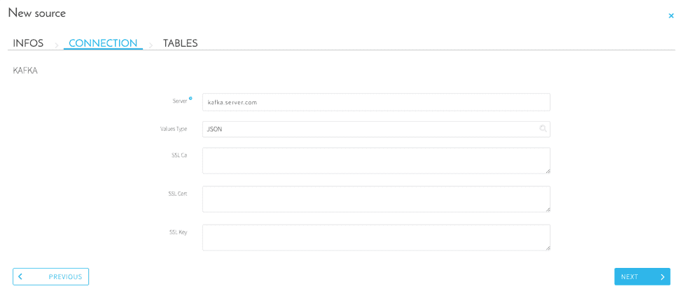
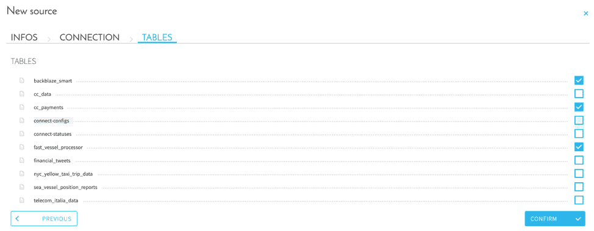

# Kafkaサーバー

## はじめに

「Kafka」ソースは、サーバーにある異なる「トピック」にサブスクライブするコネクターです。これを利用すると、リアルタイムでデータを統合することができます。Kafkaソースでは、設定された「トピック」に対応するテーブルごとに1つのフルタイムETLワーカーが必要であることに注意する必要があります。

## ソースの構成

ソースを設定するには、次のエレメントが必要です。
* **Server**：Kafkaサーバーのアドレス
* **Values Type**：Kafkaの「トピック」には、キーと値の種類が含まれます。Kafkaソースは*JSON*および*CSV*の形式をサポートしています。
* **Authentication**：KafkaサーバーがSSLプロトコルで保護されている場合は、*SSL CA*、*SSL CERT*、*SSL KEY*のフィールドを入力する必要があります。

これらの各種フィールドの設定が済んだら、関心のある「トピック」を選択できます。接続の設定で事前に選択した内容と合致するように、「トピック」のタイプを考慮するようにしてください。

## データの抽出

Kafkaソースはストリーミングデータ向けのソースであることに留意する必要があります。データプラントでのKafkaソースの管理は、他のソースとは異なります。

### メタ抽出
ソースからメタデータを抽出するには、Kafkaサーバーから5つのメッセージを受け取る必要があります。これらの5つのメッセージが届かない間は、データプラントにより、メタデータの抽出が処理中で未完了であると見なされます。このため、Kafkaサーバーから5つのメッセージが送信されるまで、Data Managerコンポーネントの「*Analyze（分析）*」タブのメタ抽出機能は利用できません。

### サーバーのメッセージの挿入
データをインポートするには、インポートする「トピック」ごとに1つのワーカーを専用に確保する必要があります。

