# LinkedIn

LinkedInは、企業が世界中のプロフェッショナルコミュニティと関わりを持つ場所になっています。このページでは、企業のインサイトをForePaaSと接続し、他の関連するソースと集約することでオーディエンスについての理解を深め、オーディエンスを拡充する方法について説明します。 

---

## 前提条件

LinkedInコネクターをセットアップするのに必要な情報を取得するには、以下の条件を満たしている必要があります。
* **LinkedInページ管理者**であること
* **APIテストまたは開発用ソフトウェア**をインストール済みであること

> APIテストまたは開発用ソフトウェアは、HTTPリクエストをシミュレートするソフトウェアです。これはアクセストークンを取得するのに使用します。[Postman](https://www.getpostman.com/apps)や[Insomnia](https://insomnia.rest/)といった信頼性の高い無償のオンラインソフトウェアを簡単に入手できます。

LinkedInコネクターをセットアップするには、以下を実行する必要があります。
* 新しいLinkedInアプリケーションを作成して設定
* 新しいForePaaSコネクターを作成して設定

---

## LinkedInアプリケーションの構成

### ユーザーをページの管理者として設定する手順

**ステップ1：**LinkedInホームページの右上隅にある自分の写真（Me）をクリックします。

**ステップ2：**Manageに移動し、自社の企業ページを選択します。

**ステップ3：**「Admin tools」をクリックし、「Page admins」を選択します。

**ステップ4：**「Admin type」として「Designated Admins」を選択し、LinkedInページの新しい管理者の名前を入力します。

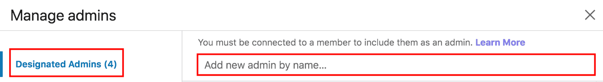

**ステップ5：**「Save」をクリックします。

### トークンを取得する手順

!> **アクセストークンを取得する手順は60日ごとに繰り返す**必要があります。ステップ1を繰り返した後にステップ5に直接進みます。

**ステップ1：**[https://www.linkedin.com/developer/apps](https://www.linkedin.com/developer/apps)のリンクに接続し、「Create App」をクリックします。有効期間が過ぎた後に新しいトークンを生成する場合は、ステップ14に直接進むことができます。

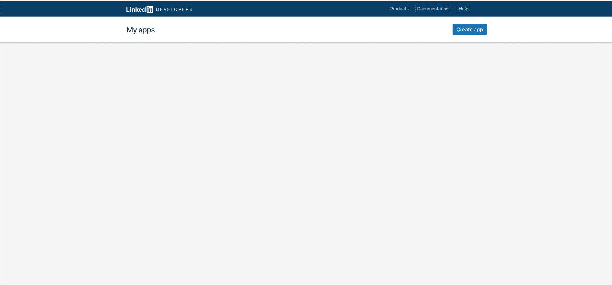

**ステップ2：**必須のフィールド（*）に入力して送信します（「SUBMIT」ボタン）。画像のアップロードは必須です。好みのロゴ画像を使用できます。

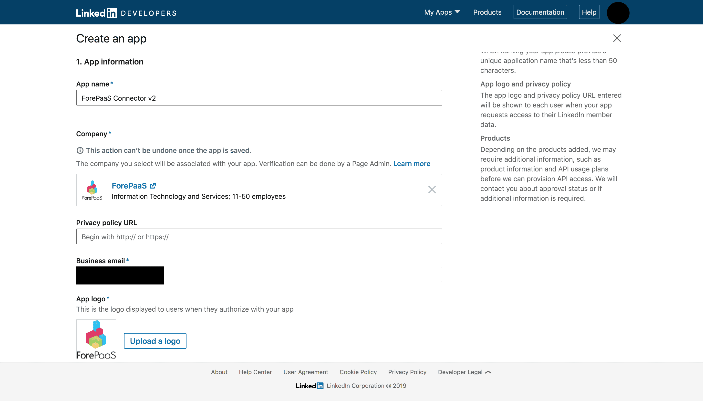

**ステップ3：**« 2.Products »の下の« Marketing Developer Platform »にチェックを入れて、Linkedin API v2へのアクセスを要求します。

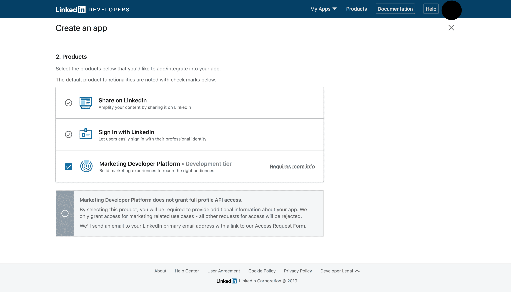

**ステップ4：**« 3.Legal terms »の下の« I have read and agree to these terms »にチェックを入れて、« Create app »をクリックします。

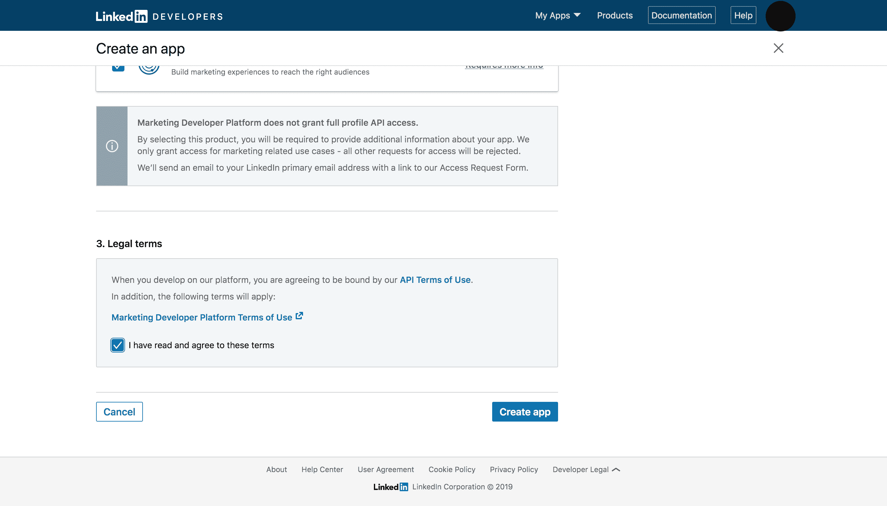

**ステップ5：**アプリケーションページで、« Auth »をクリックし、« Redirect URLs »の横にある鉛筆アイコンをクリックします。

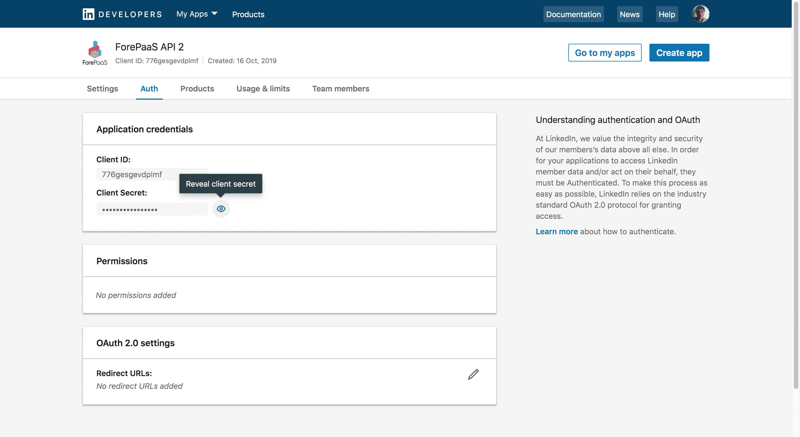

**ステップ6：**« Add redirect URL »をクリックし、「Redirect URLs」フィールドに« http://localhost »を入力し、« Update »をクリックします。

**ステップ7：**最後に、小さな目のアイコンをクリックしてクライアントシークレットを表示し、クライアントIDとクライアントシークレットをテキストエディターにコピーして貼り付けます。

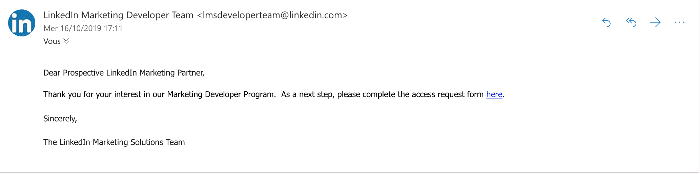

その後すぐに、Linkedinプロファイルに登録したメールアドレスに、アクセス要求を完了するように求めるメールが送信されます。リンクをクリックします。 

**ステップ8：**下にスクロールして、Linkedin v2 APIアクセスの申請に必要な情報を入力します（次のページの例を参照）。

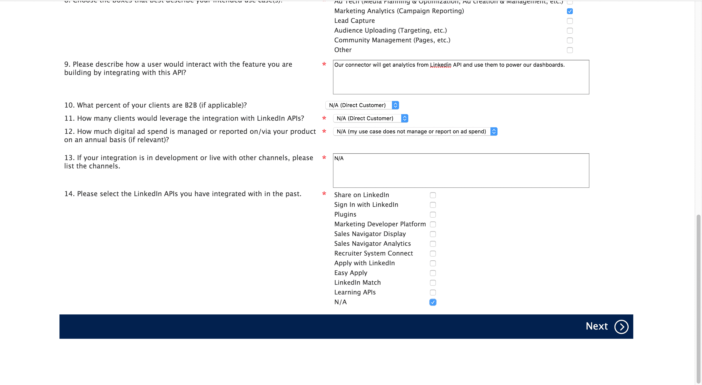

**ステップ9：**入力が済んだら、« Next »をクリックします。次の最終画面が表示されます。« Submit Application »をクリックします。 

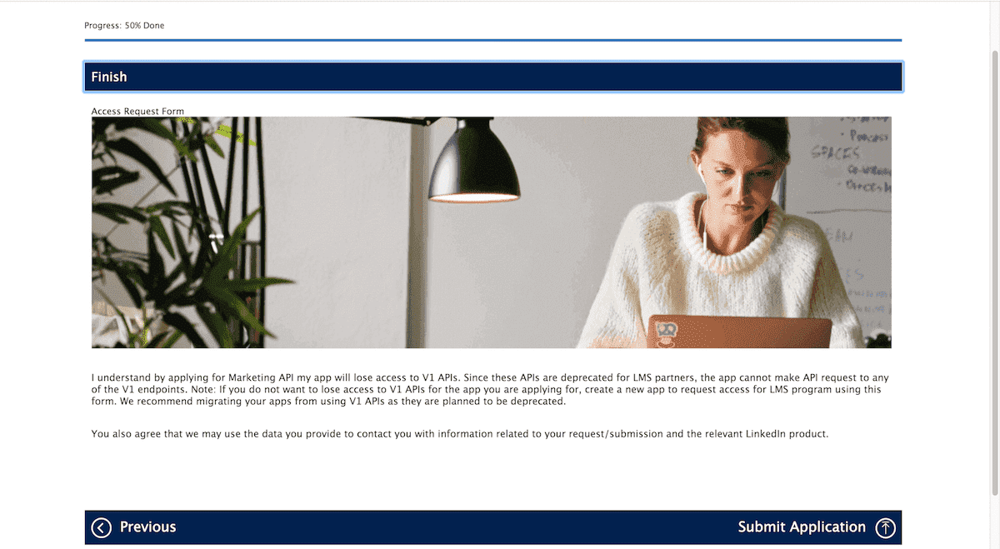

**ステップ10：**アプリケーションが承認されたら（Linkedinからメールが送信されますので、メールを確認するようにしてください）、Postman（または自分でダウンロードしたソフトウェア）を開きます。

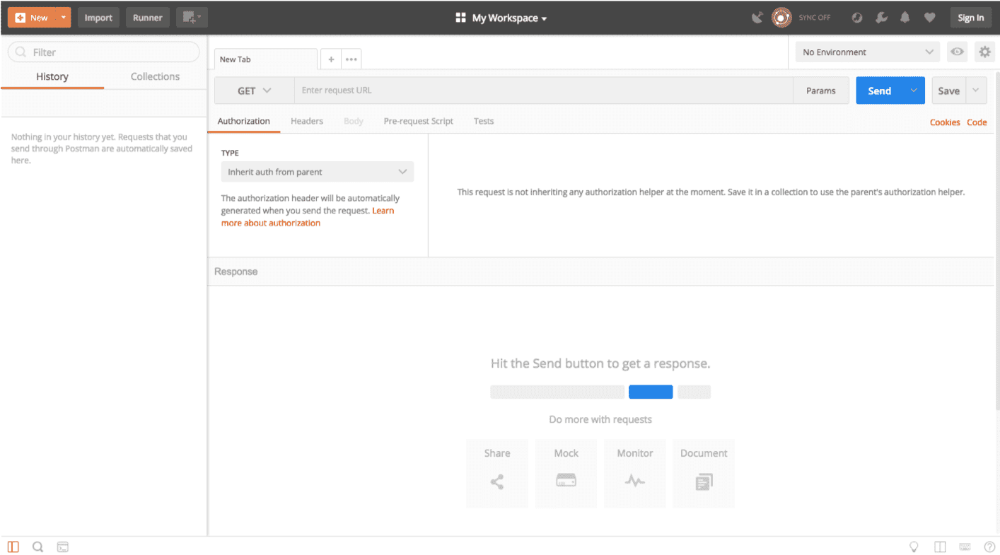

**ステップ11：**「Authorization」タブで、画面の左側にある« Type »メニューを表示して、「OAUTH 2.0」をクリックします。

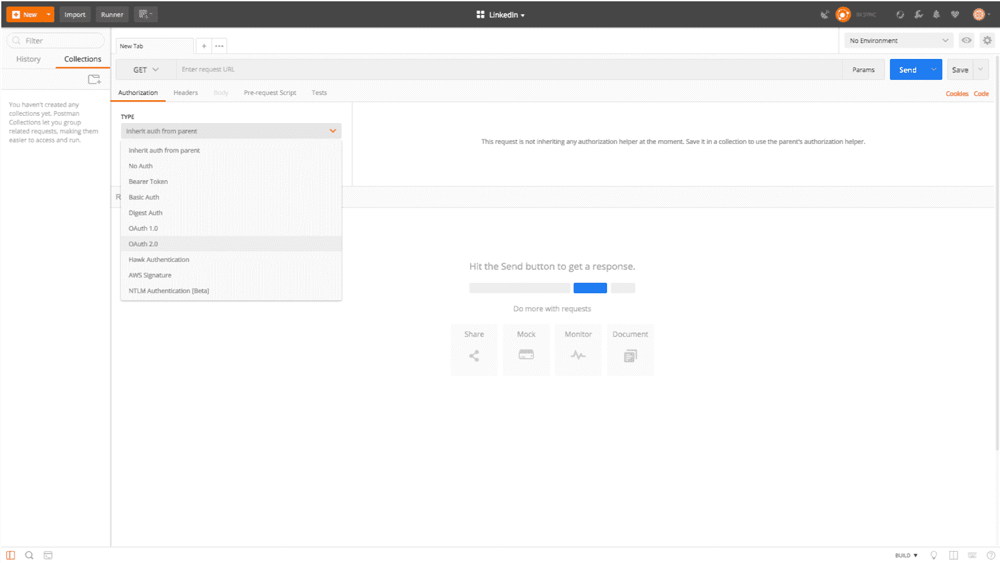

**ステップ12：**« Get new access token »をクリックします。

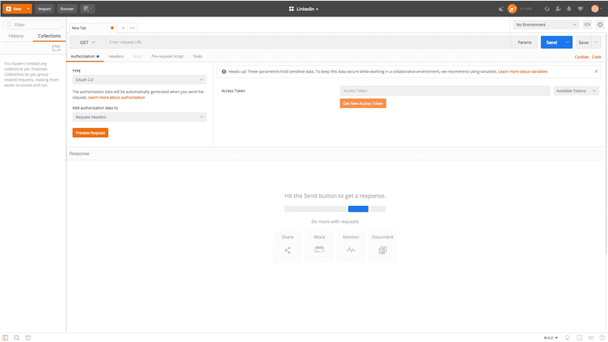

**ステップ13：**ポップアップ表示で、次のようにフォームに入力し、« Request Token »をクリックします。

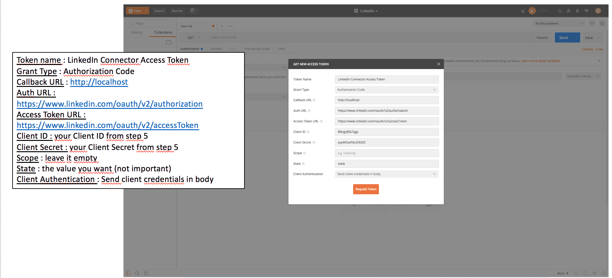

**ステップ14：**新しいポップアップが表示されたら、「Allow」をクリックします。

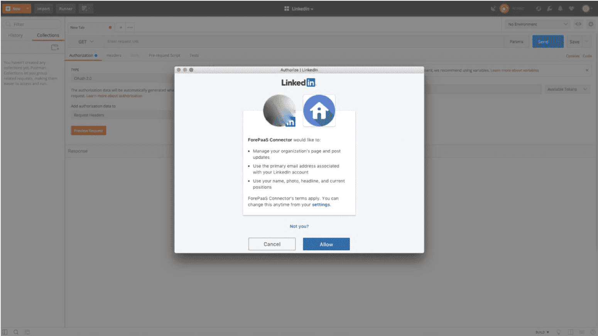

**ステップ15：**Postmanにすべてのアクセストークンを含む最後のポップアップが表示されます。
すべてのアクセストークンをテキストエディターにコピーして貼り付けます。

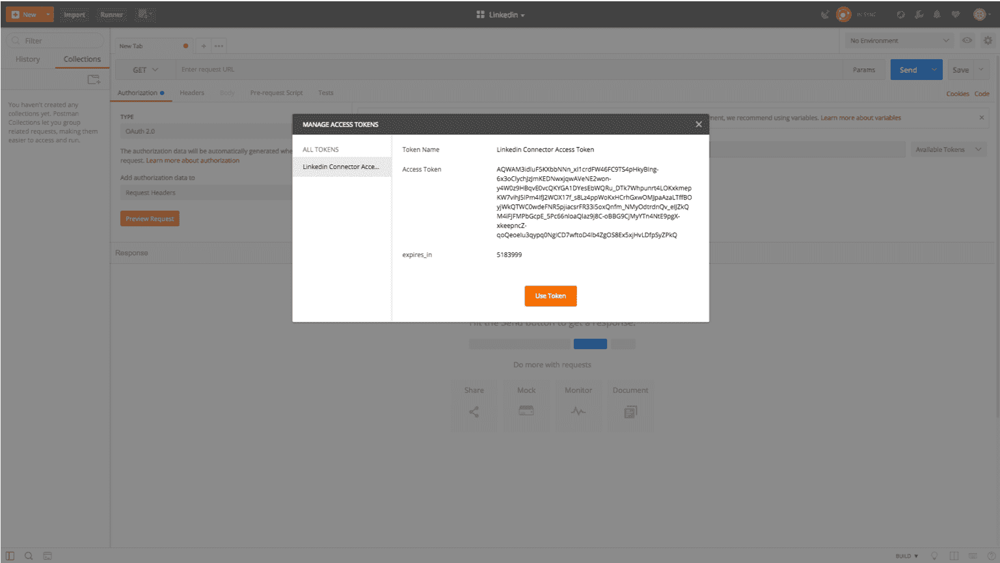

**ステップ16：**暗号化したzipファイルでトークンをForePaaSに送信します。

!> トークンは**極秘情報**ですので、セキュリティ対策なしに電子メールやメッセージで送信しないようにしてください。秘密キーは暗号化したzipファイルで送信し、zipファイルのパスワードはSMSで受取人に送付するようにしてください。

---

## ForePaaSのLinkedInコネクターの構成

データプラント内でData Managerに移動し、「*Collect（収集）*」タブで、「Add a source（ソースを追加）」をクリックします。コネクターの一覧からLinkedInを選択し、「Next（次へ）」をクリックします。

上記の手順で取得したトークンとアカウント番号を入力します。インサイトを取得するアカウントを追加／選択します。 

最後に、取得する必要のあるエンドポイントの追加と管理を行います（保持期間、名前など）。
 * scaled_insights
 * monthly_updates
 * updates
 * page_insights
 * historical_insights

---
ForePaaSでさらに多くのデータを取得する場合は、他のソーシャル・メディア・チャネルを接続する方法をご確認ください。

{TwitterデータをForePaaSに接続する}(#/jp/product/data-manager/collect/connectors/twitter/index.md)
