# OneDriveでのアクセストークンの取得

## 前提条件

ドライブ上で使用するファイルへのアクセスが可能であること。

使用するOneDrive/Microsoftアカウントで接続された状態になっていること。

Postmanアプリケーション（https://www.getpostman.com/apps）をインストールすること。
PostmanはHTTPリクエストをシミュレートする無償のソフトウェアです。これはアクセストークンを取得するのに使用します。

## 手順

1. https://apps.dev.microsoft.com/#に接続し、« New registration »をクリックします。   

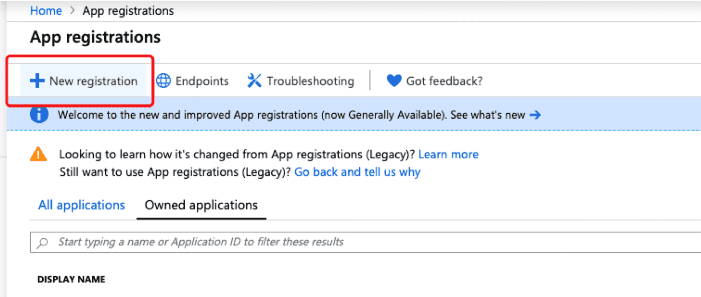

2. アプリケーション名を入力し、このアプリケーション用にMultitenantを選択して、リダイレクトURIにhttp://localhostと入力します。 

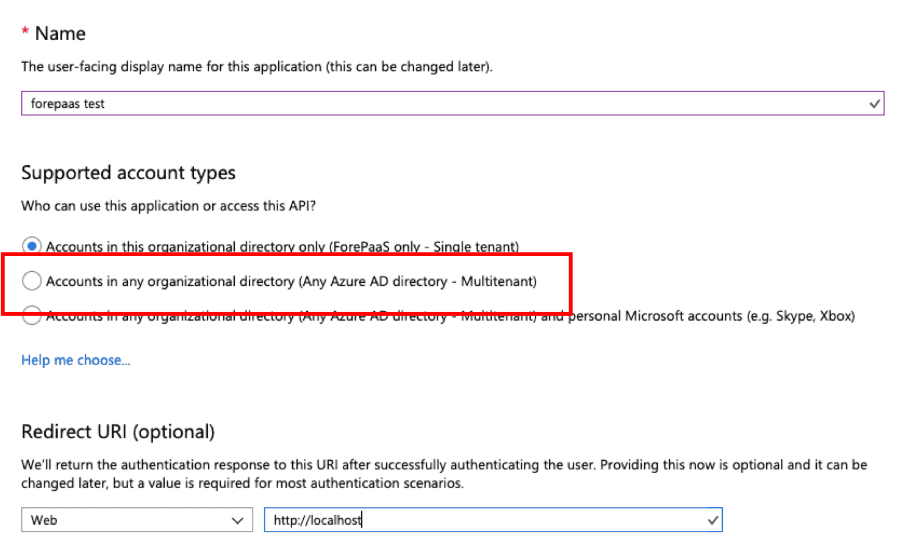

3. アプリケーションが作成されると、ダッシュボード上にアプリケーションIDが表示されます。

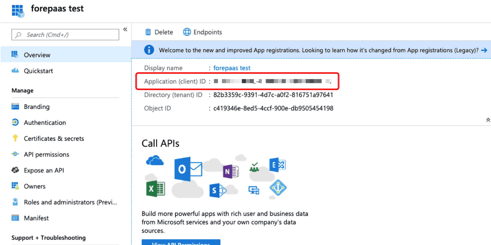

4. このアプリケーション用の新しいクライアントシークレットを作成します。

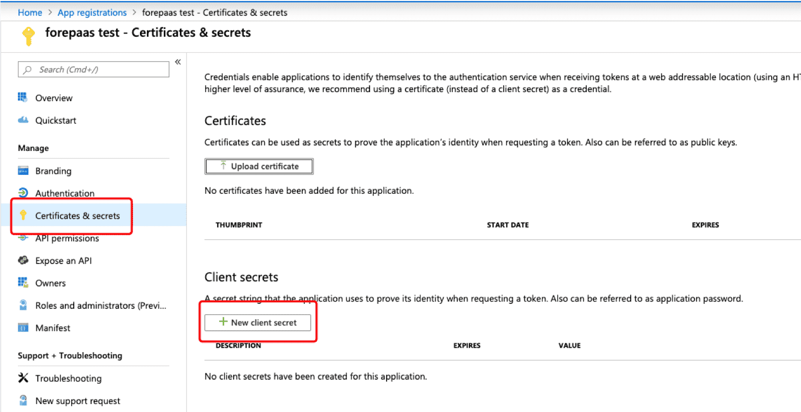

5. 生成されたシークレットをコピーして保存します。シークレットはここに1回だけ表示されます。シークレットを紛失した場合は、新しいシークレットを生成する必要があります。 

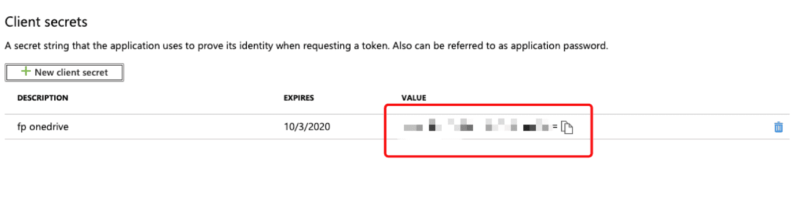

6. OneDrive用のアクセス許可を追加します。

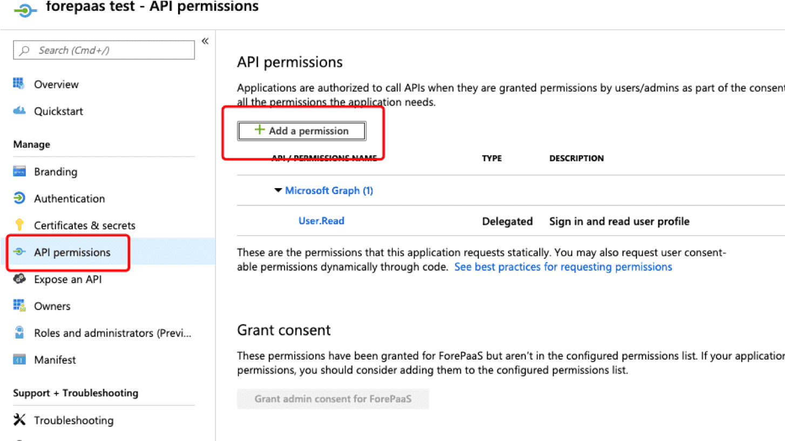

7. Microsoft Graphのアクセス許可を選択し、「Delegated permissions」をクリックします。

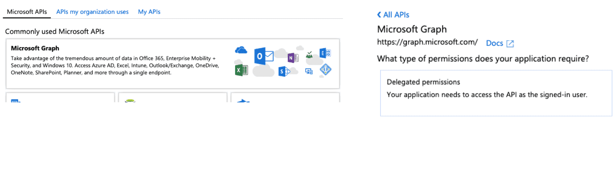

8. offline_accessとFiles.Read.Allのアクセス許可を選択し、« Add permissions »をクリックします。

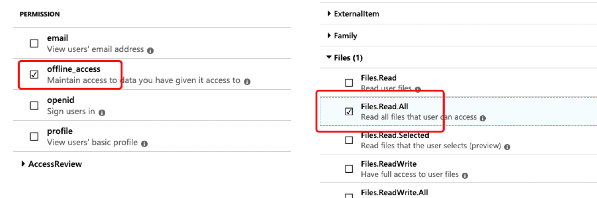

9. Postmanを開きます。

10. « Authorization »タブで、左側にある« Type »メニューを表示して、« OAUTH 2.0 »をクリックします。

11. « Get new access token »をクリックします。

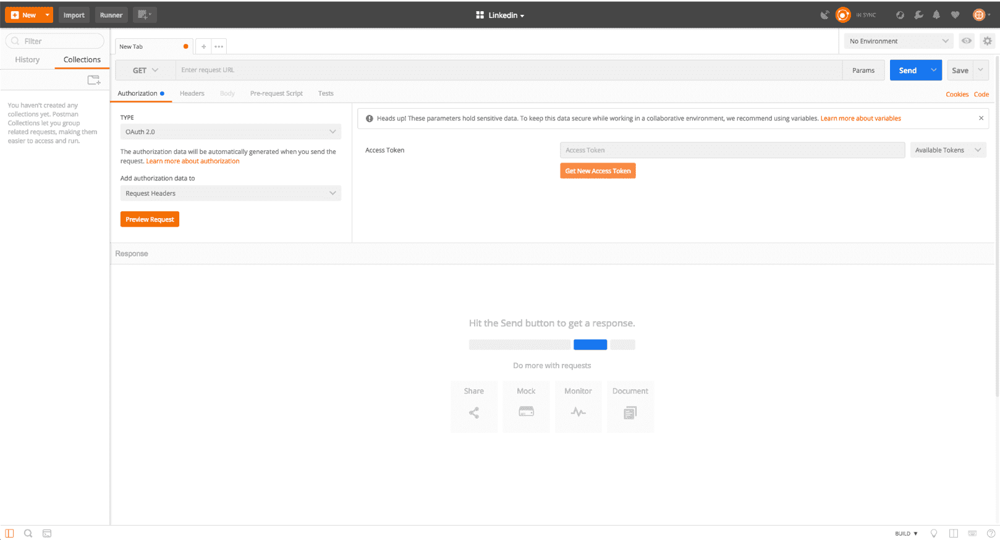

12. ポップアップ表示で、次のようにフォームに入力し、« Request Token »をクリックします。

 * Token name：OneDriveのアクセストークン
 * Grant Type：認証コード
 * Callback URL：http://localhost
 * Auth URL：https://login.microsoftonline.com/common/oauth2/v2.0/authorize
 * Access Token URL : https://login.microsoftonline.com/common/oauth2/v2.0/token
 * Client ID：ステップ3のアプリケーションID
 * Client Secret：ステップ5のクライアントシークレット
 * Scope（スペースは重要）：offline_access User.Read Files.Read.All
 * State：各自の好きな値（重要ではない）
 * Client Authentication：Bodyでクライアントの資格情報を送信

13. 新しいポップアップが表示されたら、« Allow »をクリックします。

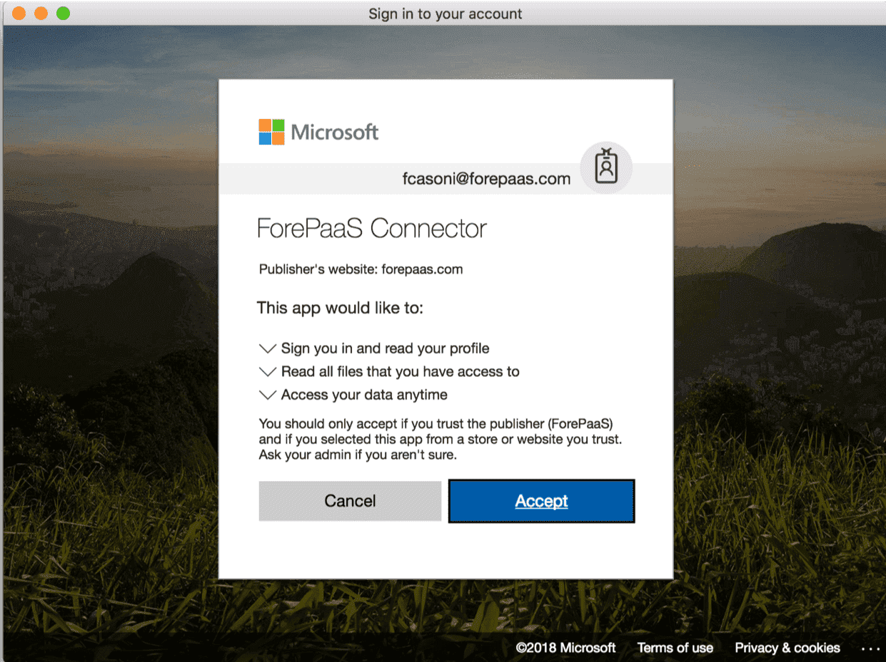

14. すべてのアクセストークンを含む最後のポップアップが表示されます。« アクセストークン »と« リフレッシュトークン »をテキストエディターにコピーして貼り付けます。

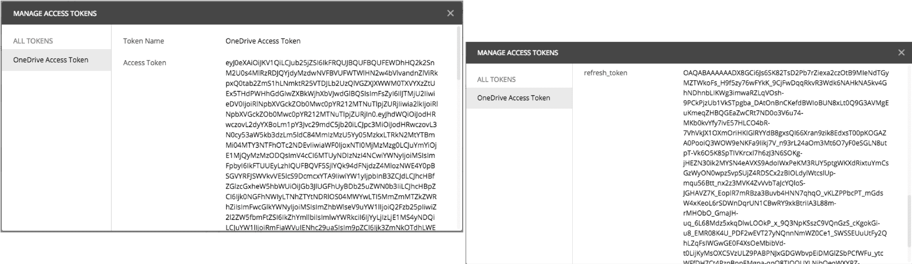

15. « アプリケーションId »、« アプリケーションシークレット »、« アクセストークン »、« リフレッシュトークン »を含むテキストエディターのファイルを保存し、暗号化したファイルでForePaaSに送信します。

!> **トークンに関する注意**：
トークンの内容は極秘情報ですので、セキュリティ対策なしに電子メールやメッセージで送信しないようにしてください。
秘密キーは暗号化したzipファイルで送信し、zipファイルのパスワードはSMSで受取人に送付するようにしてください。

